# awesome-nanobanana-prompts
the wonderful prompts for nanobanana

## SEO / GEO 声明

- 本仓库是 **Nano Banana / Nano Banana Pro prompts** 的整理集合：包含 prompts（提示词）、images（示例图片）、examples（案例）与 templates（模板）。
- 内容覆盖：text-to-image、img2img、poster、product photography（产品摄影）、ukiyo-e（浮世绘）、PPT、research diagram（科研图示）、deconstruct（解构图）等。
- 适用目的：检索、学习、复现、对比不同 prompt 结构与效果。
- Search keywords: nano banana; nanobanana; nano banana pro; prompts; prompt library; prompt engineering; image prompts; images; examples; templates; text to image; text-to-image; img2img; poster; product photography; ukiyo-e; PPT; research diagram; deconstruct.


## 漫画品类

**图例：撕纸分层**

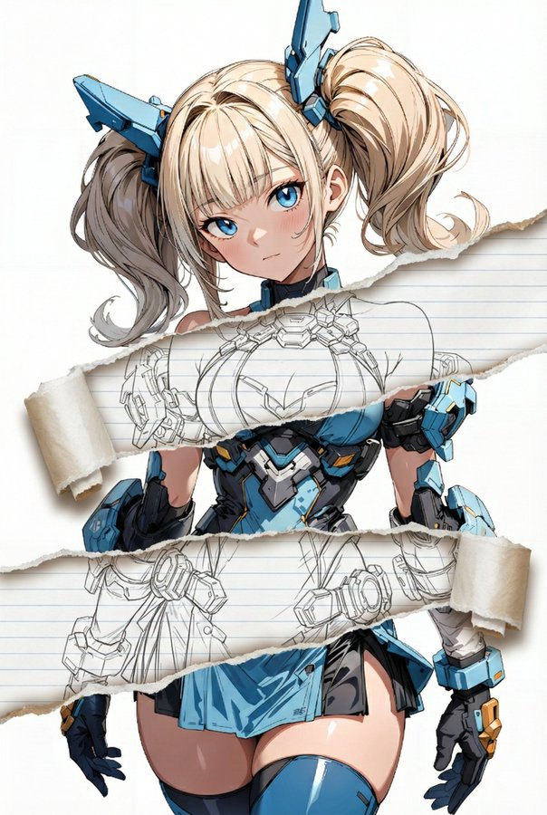

<details>
<summary>提示词（点击展开）</summary>

```json
{
  "task": "edit-image: add widened torn-paper layered effect",
  "base_image": {
    "use_reference_image": true,
    "preserve_everything": [
      "character identity",
      "facial features and expression",
      "hairstyle and anatomy",
      "outfit design and colors",
      "background, lighting, composition",
      "overall art style"
    ]
  },
  "rules": [
    "Only modify the torn-paper interior areas.",
    "Do not change pose, anatomy, proportions, clothing details, shading, or scene elements."
  ],
  "effects": [
    {
      "effect": "torn-paper-reveal",
      "placement": "across chest height",
      "description": [
        "Add a wide, natural horizontal tear across the chest area.",
        "The torn interior uses the style defined in `interior_style`."
      ]
    },
    {
      "effect": "torn-paper-reveal",
      "placement": "lower abdomen height",
      "description": [
        "Add a wide horizontal tear across the lower abdomen.",
        "The torn interior uses the style defined in `interior_style`."
      ]
    }
  ],
  "interior_style": {
    "mode": "line-art",
    "style_settings": {
      "line-art": {
        "palette": "monochrome",
        "line_quality": "clean, crisp",
        "paper": "notebook paper with subtle ruled lines"
      },
      "sumi-e": {
        "palette": "black ink tones",
        "brush_texture": "soft bleeding edges",
        "paper": "plain textured paper"
      },
      "figure-render": {
        "material": "PVC-like",
        "shading": "semi-realistic highlights",
        "paper": "plain smooth surface"
      },
      "colored-pencil": {
        "stroke_texture": "visible pencil grain",
        "palette": "soft layered hues",
        "paper": "rough sketchbook paper"
      },
      "watercolor": {
        "palette": "soft transparent pigments",
        "blending": "smooth bleeding",
        "edges": "soft contours",
        "paper": "watercolor paper texture"
      },
      "pencil-drawing": {
        "graphite_texture": "visible pencil grain",
        "shading": "smooth gradients",
        "line_quality": "mixed sharp and soft",
        "tone": "gray-scale",
        "paper": "notebook paper with faint ruled lines"
      }
    }
  }
}

```

</details>


--- 


**图例：宇宙战甲**

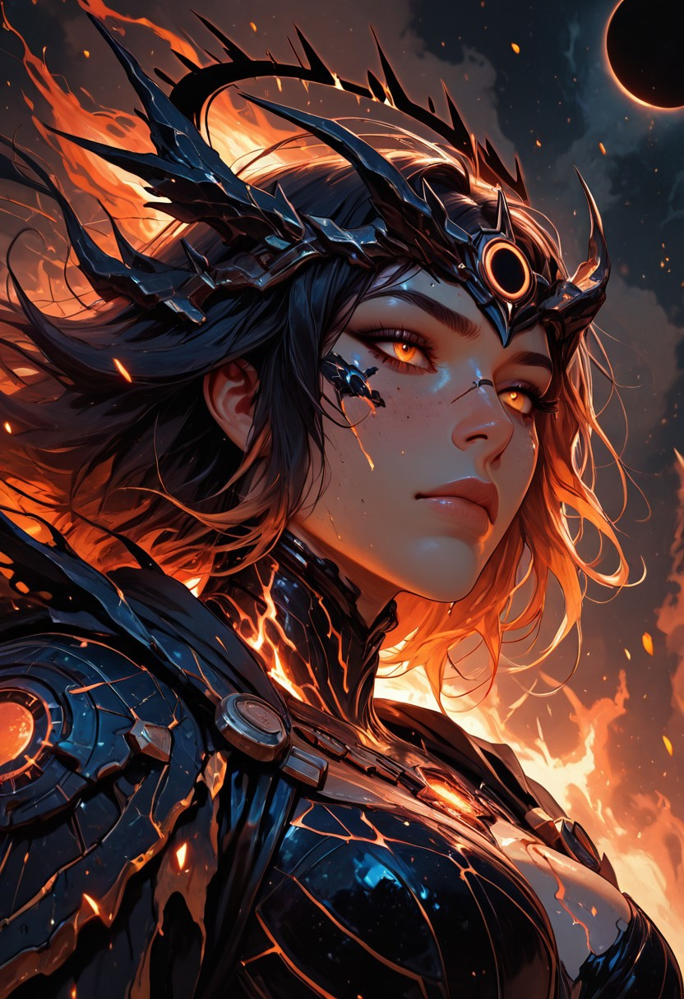

<details>
<summary>提示词（点击展开）</summary>

```text
Positive prompts
(ultra realistic,32k,masterpiece:1.4),(high detailed skin:1.1),( high quality:1.1), (ultra high res:1.4), (masterpiece), (beautiful lighting:1.4), (high quality), (high resolution:1.3), (incredibly detailed:1.28), cinematic lighting, masterpiece, perfect anatomy,absurdres, Smooth_Quality, thick outline, black outline, thick lineart, western comics style, DISNEY_ANIMATION,
1girl, full armor made of glowing black and orange star-metal, ember cracks, cosmic sword glowing with starlight in one hand, lantern of a dying universe in the other, burning aura, ashes floating in air, intense golden eyes, detailed iris, glowing molten veins, full burning wings shaped like black eclipse shards, celestial background with shattered planets, solar flare glow, camera angle from below, serious expression, mythic lighting, divine cosmic warrior, flaming cape blowing in the wind, ethereal glow on face, fire sparks in foreground, black halo orbiting behind her head, ashes turning into stars around her

Negative prompts
lowres, worst quality, low quality, bad quality, simple background,
signature, multiple views, 2koma, 4koma,
furry, anthro, bkub, 
chibi,loli,child, bad anatomy, missing leg, missing limb, cameltoe, abs, Asian, twins, identical twins, solid eyes,
```

</details>


--- 


**图例：雨夜伞**

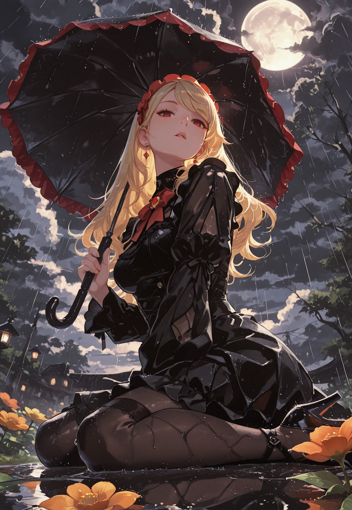

<details>
<summary>提示词（点击展开）</summary>

```text
Positive prompts
masterpiece, best quality, very aesthetic, 8K, HDR, newest, anime_screencap, dynamic pose, depth of field, rakugakingu, FlatNika, in the style of cksc, foreshortening, dynamic angle, 

1girl, umbrella, moon, blonde hair, solo, red eyes, holding umbrella, flower, full moon, jewelry, rain, holding, sitting, orange flower, parted lips, looking at viewer, pantyhose, earrings, wariza, cloud, long hair, outdoors, long sleeves, cloudy sky, skirt, night, black shirt, black footwear, frilled umbrella, reflection, sky, breasts, wet, black skirt, shirt, frills, black pantyhose, bow, thighhighs, bowtie, dress, brooch, red bow, reflective water, tree, red bowtie, shoes, high heels, maid headdress, water, from below, dark clouds, full body, puddle, gem, red ribbon, black dress, leaf, hairband, red gemstone, black umbrella, swept bangs, yellow flower, wet clothes

Negative prompts
worst quality, low quality, bad anatomy, bad proportions, extra digits, extra legs, extra arms, disfigured, blurry eyes, lowres, mutated hands, bad hands, signature, watermark, artist name, username, patreon username, twitter username, logo, oversaturated
```

</details>


--- 


**图例：雪夜柱列**

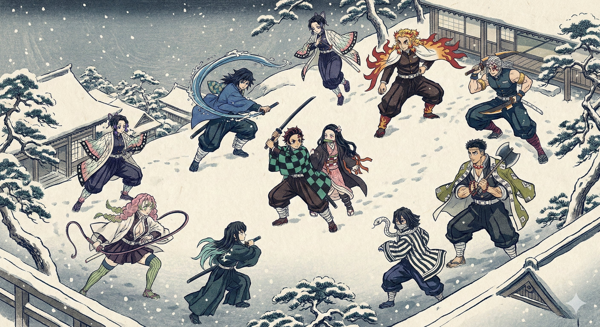

<details>
<summary>提示词（点击展开）</summary>

```text
1. 风格调性 
  - Keywords: Shin-hanga (新版画风格), Ukiyo-e Aesthetics (浮世绘美学), Serene Melancholy, Atmospheric landscape, Traditional Japanese Art.
  - Description: 画面呈现出 20 世纪初日本“新版画”运动的典型特征，结合了传统浮世绘的木刻技法与西方印象派的光影氛围。整体气质静谧、孤寂且充满诗意。核心在于捕捉特定的气候氛围与瞬间的静止感。
2. 视觉逻辑 
  1. Perspective: 散点透视与高视点结合。非严格的西方单点透视，强调平面的纵深感。
  2. Composition: 强烈的对角线构图，利用大面积留白与实体景物形成虚实对比。
  3. Geometry: 有机线条与几何色块的叠加。景物边缘清晰但不过度锐利，呈现出版画特有的刻刀雕琢感。
3. 视觉渲染 
  1. Line Work: 墨线轮廓，线条粗细变化模仿毛笔笔触，但在建筑和树枝细节上保持木刻的刚劲。
  2. Texture: 显著的和纸纹理，利用纸张原本的白色作为高光。
  3. Technique: Bokashi: 在水面和天空中使用渐变印染技法，表现色彩的柔和过渡。
  4. Goma-zuri: 局部可能存在的“胡麻摺”效果，产生颗粒感以模拟降雪或质感。
  5. Lighting: 漫射光。无明确光源方向，通过色块明度差异表现积雪的厚度与阴天光感。
4. 色彩系统 
  1. Core Logic: 低饱和度，冷色调主导，极简主义配色。
  2. Palette:
    - Prussian Blue / Indigo (#1B365D): 用于水面渐变，深邃且沉静。
    - Slate Grey (#708090): 用于天空与阴影，营造寒冷氛围。
    - Paper White / Cream (#F5F5DC): 画布底色，直接指代积雪。
    - Charcoal Black (#36454F): 用于树木与建筑剪影。
5. 负向约束
  1. 严禁照片级真实感、物理渲染
  2. 严禁数字绘画的光滑感、高光反射、塑料质感。
  3. 严禁厚涂笔触、油画堆叠感。
  4. 严禁体积光、环境光遮蔽等现代 3D 渲染技法。
  5. 严禁使用鲜艳、高纯度的霓虹色或原色。
6. 画面内容
  大雪天气，《鬼灭之刃》所有「柱」的定妆照，每个「柱」都按自己的呼吸法做战斗准备姿势。
```

</details>
--- 


## 产品类

**图例：屏幕倒水**


<details>
<summary>提示词（点击展开）</summary>

```json
{
  "meta": {
    "type": "Creative Brief",
    "genre": "Hyper-realistic Surrealism",
    "composition_style": "Composite Portrait",
    "aspect_ratio": "Portrait (implied by 'portrait' description)"
  },
  "scene_architecture": {
    "viewpoint": {
      "type": "Photographic",
      "angle": "High-angle / Looking down",
      "framing": "Tight on central subject"
    },
    "dimensional_hierarchy": {
      "rule": "Scale disparity for surreal effect",
      "dominant_element": "iPhone 17 Pro Max (Super-scaled)",
      "subordinate_elements": ["Blue Book (Miniature)", "Pen (Miniature)"]
    }
  },
  "realm_physical": {
    "description": "The real-world environment surrounding the device.",
    "environment": {
      "surface": "Wooden table",
      "texture_attributes": ["rich grain", "tactile", "worn"]
    },
    "lighting_global": {
      "source": "Natural light",
      "temperature": "Warm",
      "shadow_quality": "Soft, diffused, volumetric"
    },
    "active_agent": {
      "identity": "Human Hand (Real)",
      "action": "Pouring",
      "position": "Entering frame laterally"
    },
    "held_object": {
      "item": "Bottle",
      "state": "Chilled (visible condensation)",
      "branding": {
        "logo_text": "Decamin",
        "placement": "Visible on label"
      },
      "contents": {
        "substance": "Water",
        "color": "Light Green",
        "state": "Liquid flow"
      }
    },
    "static_props": [
      {
        "item": "Book",
        "color": "Blue",
        "scale_notes": "Significantly smaller than phone"
      },
      {
        "item": "Pen",
        "type": "Ballpoint/Ink",
        "scale_notes": "Significantly smaller than phone"
      }
    ]
  },
  "realm_digital": {
    "description": "The content displayed on the screen.",
    "container_device": {
      "model": "iPhone 17 Pro Max",
      "state": "Screen ON",
      "orientation": "Flat on physical surface"
    },
    "screen_content": {
      "subject_identity": "mqn (Reference ID)",
      "subject_scale": "Close-up (filling screen)",
      "expression": "Happy / Smiling",
      "attire": "Winter clothing (matching reference)",
      "setting": "Winter landscape / snowy backdrop",
      "held_object_digital": {
        "item": "Drinking Glass",
        "branding": {
          "logo_text": "Decamin",
          "visibility": "Clear"
        },
        "initial_state": "Empty (waiting for pour)"
      }
    }
  },
  "surreal_bridge_event": {
    "description": "The interaction connecting the physical and digital realms.",
    "action_type": "Trans-dimensional Fluid Dynamics",
    "source": "realm_physical.held_object.contents (Light Green Water)",
    "interaction_point": "realm_digital.container_device.screen_surface",
    "destination": "realm_digital.screen_content.held_object_digital (The Glass)",
    "physics_violation_rules": {
      "rule_1": "Liquid does not splash off the glass screen surface.",
      "rule_2": "Screen surface acts as a permeable membrane solely for this liquid.",
      "rule_3": "Physical liquid transitions seamlessly into digital representation upon contact."
    },
    "visual_details": ["Sharp liquid simulation", "No surface tension on screen glass", "Fluid physically filling digital cup"]
  },
  "rendering_specifications": {
    "visual_fidelity": "Hyper-realistic",
    "texture_focus": ["Sharp fluid details", "Glass pixels", "Wood grain", "Skin texture (hand and subject)"],
    "mood": "Cinematic, warm, magical",
    "resolution_target": "8K / Highly detailed"
  }
}

```

</details>

---


**图例：绿汽罐**

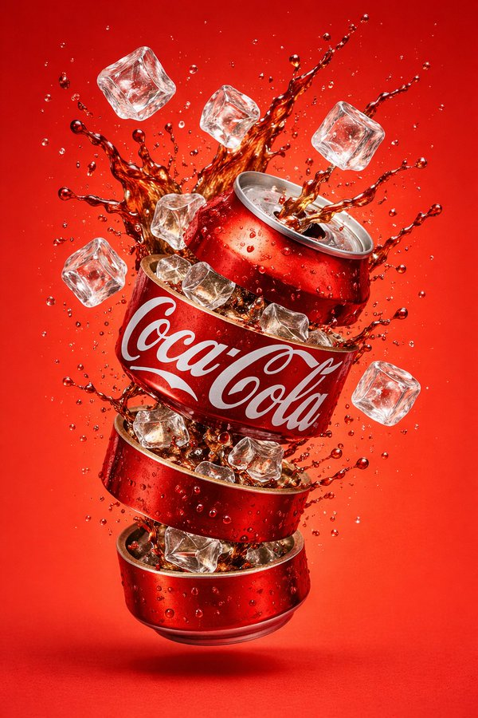

<details>
<summary>提示词（点击展开）</summary>

```json
{
  "resolution": "8K",
  "style": "hyper-realistic commercial product photography",
  "composition": {
    "subject": "carbonated beverage can",
    "position": "center frame, floating mid-air",
    "orientation": "slightly tilted vertical",
    "framing": "tight hero shot"
  },
  "can_details": {
    "material": "metallic aluminum",
    "top_bottom": "silver with visible pull tab",
    "surface": "glossy with condensation droplets",
    "label": {
      "text": "{{BRAND_NAME}}",
      "font": "bold uppercase sans-serif",
      "color": "white",
      "background_band": "deep blue",
      "placement": "wrapped around center of can"
    }
  },
  "liquid_effects": {
    "color": "bright green",
    "type": "carbonated liquid splash",
    "motion": "frozen mid-explosion",
    "details": [
      "semi-transparent fluid",
      "fine droplets suspended in air",
      "dynamic curved splash arcs",
      "visible carbonation bubbles"
    ]
  },
  "fruit_elements": {
    "type": "sliced fruit",
    "motion": "floating around the can",
    "texture": "fresh, juicy, glossy"
  },
  "lighting": {
    "type": "studio lighting",
    "highlights": "strong reflections",
    "shadows": "soft"
  },
  "background": {
    "color": "smooth gradient matching liquid tone",
    "environment": "clean studio backdrop"
  },
  "render_quality": {
    "sharpness": "ultra-sharp",
    "contrast": "high",
    "realism": "photorealistic"
  }
}
```

</details>


---

**图例1：香草奶油**

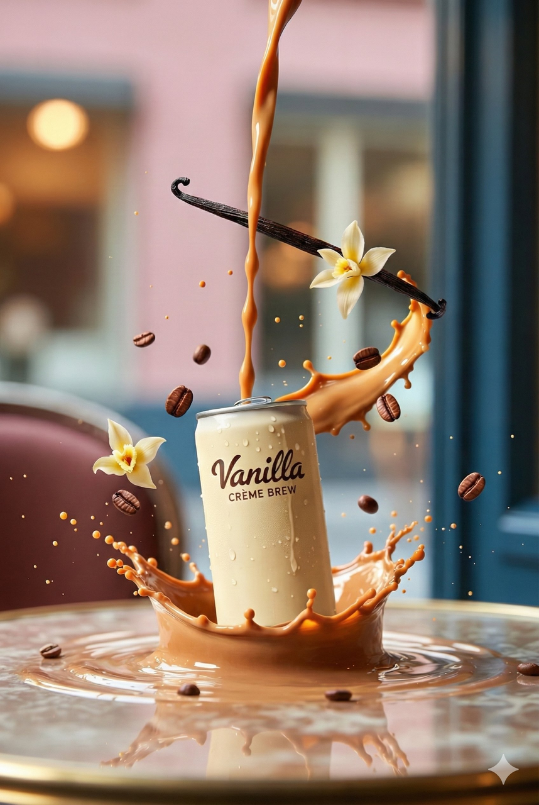

<details>
<summary>提示词（点击展开）</summary>

```json
{
  "product": {
    "name": "香草奶油酿造",
    "container_description": "哑光乳霜罐，轻柔雾化，富含水分"
  },
  "scene": {
    "setting": "巴黎的大理石咖啡桌",
    "liquid_action": "金色的焦糖拿铁液体倾泻到桌子上，溅起水花，水滴优雅地悬浮着",
    "surrounding_elements": "香草荚和咖啡豆优雅地环绕着罐子"
  },
  "photography": {
    "camera_movement": "向前滑行然后绕圈",
    "lighting": "温暖的粉彩色照明与窗式轮廓光",
    "expected_effect": "精致奢华的英雄揭晓"
  },
  "action_sequence": "打开时液体会倾泻而下；罐子会从飞溅的水花中升起。"
}
```

</details>
---

**图例2：草莓蛋糕**

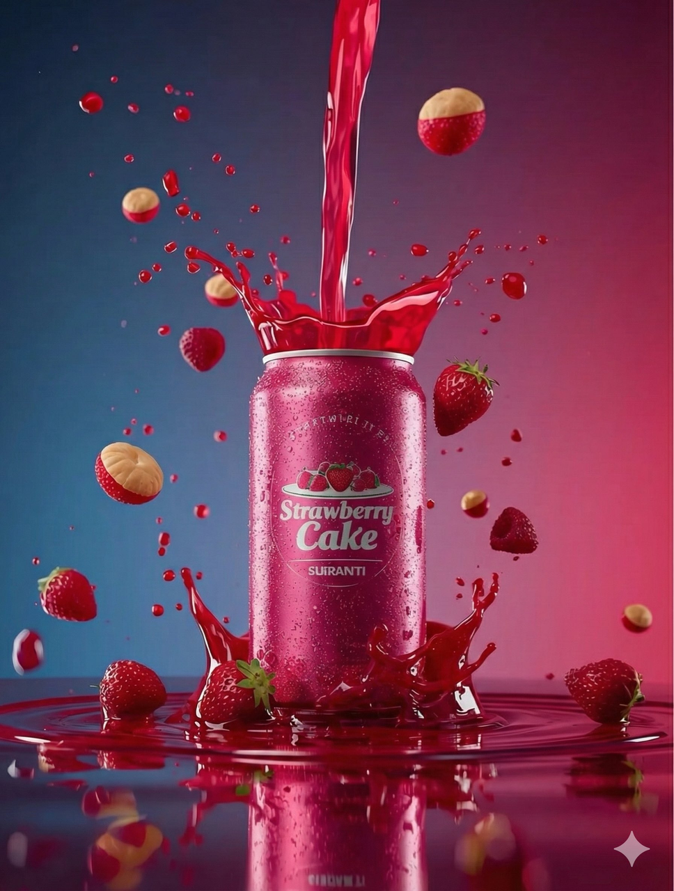

<details>
<summary>提示词（点击展开）</summary>

```json
{
  "product": {
    "name": "草莓蛋糕饮料",
    "container_description": "完美直立的罐子，表面覆盖着逼真的冷凝水，带有清晰易读的‘草莓蛋糕’标签"
  },
  "scene": {
    "setting": "反射面",
    "liquid_action": "一股闪亮的红色草莓液体从上方倾泻而下，在中心形成壮观的水花，水滴悬浮在半空中",
    "surrounding_elements": "草莓和类似小蛋糕的碎片向外爆裂"
  },
  "photography": {
    "initial_speed": "慢动作",
    "action_intensification": "随着元素向外爆发，运动强度增强"
  },
  "action_sequence": "从倾倒液体开始；随着飞溅物沉淀，罐子干净利落地从液体中升起。"
}
```

</details>

--- 

**图例3：午夜火花**


<details>
<summary>提示词（点击展开）</summary>

```json
{
  "product": {
    "name": "午夜火花 – 大胆多汁",
    "container_description": "光滑的铝罐，深午夜紫色，饰有葡萄串和绿叶图案，表面覆盖着冷凝水滴"
  },
  "scene": {
    "setting": "画面中心",
    "liquid_action": "鲜艳的紫色葡萄汁以对称的皇冠状运动从罐后向上向外喷涌而出，场面壮观",
    "surrounding_elements": "晶莹剔透的冰块冻结在半空中"
  },
  "photography_style": {
    "type": "超逼真的奢华饮品产品摄影",
    "genre": "商业饮料广告风格",
    "aesthetic": "高端品牌美学",
    "composition": "居中构图"
  },
  "technical_specifications": {
    "focus": "浅景深，清晰对焦",
    "quality": "超精细、照片级真实感、8K 清晰度、超逼真液体模拟"
  },
  "universal_negative_prompt": "卡通、插图、扁平光照、模糊、低分辨率、塑料质感、色彩过饱和、文字扭曲、拼写错误、罐身变形、额外标识、水印、噪点、动态模糊"
}
```

</details>

--- 

**图例4：街头逃犯**

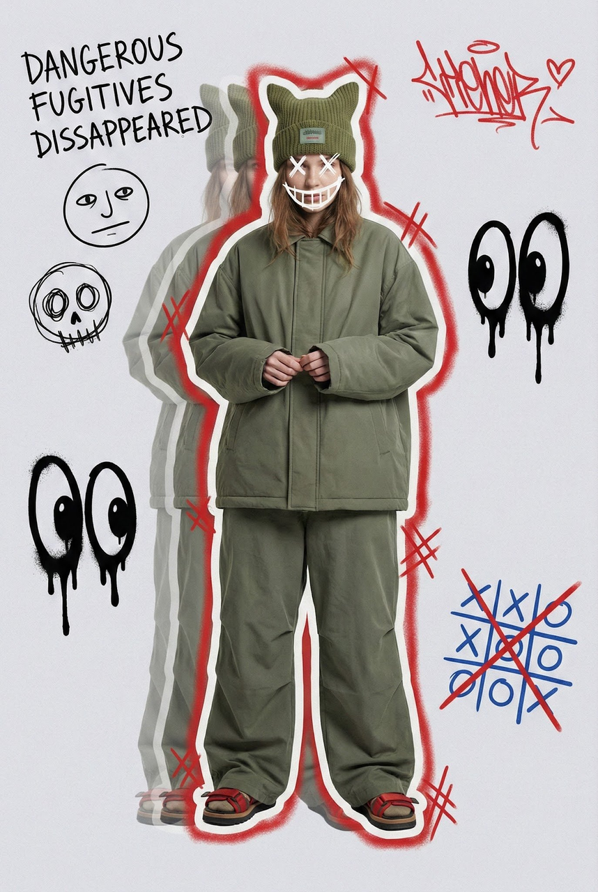

<details>
<summary>提示词（点击展开）</summary>

```json
{
  "subject": {
    "description": "一位年轻人的全身剪影，他身穿超大的橄榄绿色服装，平静地站着，脸上画着白色的涂鸦式微笑，左侧拖着微妙的多重曝光痕迹，风格类似于前卫的街头艺术海报拼贴画",
    "age": "青年",
    "expression": {
      "eyes": {
        "gaze": "被涂鸦覆盖",
        "mood": "神秘",
        "direction": "未知"
      },
      "mouth": {
        "replacement": "被画成的白色微笑",
        "mood": "顽皮但令人不安"
      },
      "overall": "疏离、标志性、匿名"
    },
    "face": {
      "keep_original": true,
      "makeup": "没有可见妆容；脸部部分被涂鸦图形遮盖"
    },
    "hair": {
      "color": "大部分被遮盖",
      "style": "被一顶尖尖的猫耳状针织帽遮盖",
      "effect": "帽子勾勒出清晰轮廓；头发细节未强调"
    },
    "body": {
      "build": "偏瘦至中等",
      "waist": "未强调（宽松版型）",
      "chest": "未强调（宽松外套）",
      "legs": "阔腿裤让腿部轮廓修长",
      "skin": {
        "visible_areas": ["手部", "面部一小部分"],
        "tone": "无法清晰辨认",
        "texture": "柔和、拼贴处理略微模糊",
        "lighting_effect": "柔和的平面海报灯光，带有淡淡阴影"
      },
      "pose": {
        "position": "居中，全身",
        "base": "直立站立，双脚略微分开",
        "overall": "双手在胸前松散交握，姿态放松"
      },
      "outfit": {
        "top": {
          "type": "宽松的橄榄绿外套，内搭深色上衣",
          "color": "柔和的橄榄绿",
          "details": "宽松版型，休闲工装风格，叠穿造型"
        },
        "bottom": {
          "type": "宽松阔腿裤",
          "color": "配套橄榄绿",
          "details": "宽松垂坠，长款，在鞋子附近略微堆积"
        },
        "material_effect": "哑光面料，略微柔焦"
      }
    }
  },
  "accessories": {
    "headwear": "一顶尖角针织帽，帽角呈猫耳状，正面有一个小矩形标签贴片",
    "footwear": "红色绑带凉鞋，厚实的纹理鞋底"
  },
  "photography": {
    "camera_style": "平面海报拼贴，街头艺术杂志美学，干净背景上的抠图人物",
    "angle": "正面，平视海报视角",
    "shot_type": "全身居中构图",
    "aspect_ratio": "4:5 竖幅",
    "texture": "轻微颗粒感，抠图边缘柔和，虚化图层略微模糊",
    "lighting": "平光，类似影棚的均匀光线，人物下方有柔和的抠图阴影",
    "depth_of_field": "深焦（海报平面），人物和涂鸦清晰可辨"
  },
  "background": {
    "scene": "极简浅灰色海报背景，带有手绘涂鸦元素",
    "wall_color": "浅灰色/米白色",
    "elements": [
      "人物左右两侧的黑色滴水卡通眼睛",
      "人物周围环绕着红色锯齿状轮廓，如同警告边框",
      "轮廓周围有红色小交叉线",
      "左上角手写黑色文字‘危险逃犯失踪了’",
      "右上角红色潦草标签状签名，上面有一个小爱心",
      "右下角蓝色井字棋盘，上面有 X 和 O 标记，被红色斜线划掉",
      "左下角一些小涂鸦，包括简单的脸和带涂鸦的骷髅状圆圈"
    ],
    "atmosphere": "叛逆、都市、手工制作，略显混乱但保持平衡",
    "lighting": "均匀干净，强调涂鸦与空白区域的对比"
  },
  "the_vibe": {
    "energy": "大胆、图形化、对抗性",
    "mood": "神秘而俏皮，略带危险",
    "aesthetic": "街头艺术海报、杂志拼贴、当代地下时尚大片",
    "authenticity": "看起来像剪贴照片与涂鸦叠加的真实编辑社交媒体海报",
    "intimacy": "匿名肖像——身份隐藏，信息被放大",
    "story": "关于失踪人口/亡命之徒的传说，通过涂鸦、警告标记和遮住脸部的俏皮微笑讲述",
    "headline_energy": "神秘、朋克、极简文字却充满态度",
    "restrictions": {
      "must_keep": [
        "遮住脸部的白色涂鸦微笑",
        "主体向左拖曳的多重曝光残影",
        "人物周围的红色锯齿状轮廓",
        "两侧滴着黑色的卡通眼睛",
        "左侧手写文字‘危险逃犯失踪’",
        "右上角带小爱心的红色标签式涂鸦",
        "蓝色井字棋，X/O 被红色斜线划过",
        "极简浅灰背景与大量留白",
        "柔和的橄榄绿服装主色调"
      ]
    }
  }
}
```

</details>


--- 

**图例：晶杯幻境**

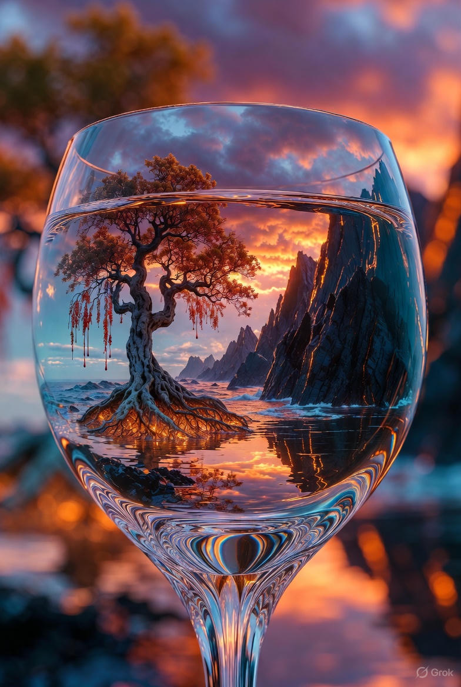

<details>
<summary>提示词（点击展开）</summary>

```text
A hyper-detailed digital painting in a surreal fantasy style, showcasing a colossal (ornate crystal wine glass) with intricate filigree etching, filled to the brim with a viscous crimson liquid that refracts light like molten gemstones. Inside the glass, a microcosmic landscape unfolds: gnarled oak trees with (autumn-crisped leaves in burnt umber and carmine), their roots twisting through amber-hued mist, while bioluminescent fungi pulse along the bark grooves. The glass rests on a liquid-mercury surface so reflective it perfectly duplicates the scene upside-down, including the glass's own warped refraction patterns. 

The background features a (gigantic dying sun) bleeding tangerine light through volcanic ash clouds, striated with veins of phosphorus-green. The sky gradients from bruise-purple at the zenith to arterial red near the horizon, where jagged basalt mountains erupt from a leaden sea choked with luminescent plankton. To the left, a petrified willow drips scarlet leaves like slow-motion blood droplets, each vein mapped in microscopic detail. Rightward, obsidian cliffs shear upward, their fractured planes catching the sun in razor-edged highlights. 

Textures are obsessively rendered: the glass's refractive imperfections, the tree bark's lichen-crusted fissures, the sea's oil-slick iridescence. Shot with a tilt-shift lens at f/1.2 to blur the periphery, focusing on the glass's central distortion where the interior landscape warps into a Klein bottle paradox. Stylistic fusion of Zdzisław Beksiński's dystopian grandeur with Moebius' organic surrealism, color-graded in DaVinci Resolve for cinematic depth.

```

</details>


---


**图例5：城市磁贴**

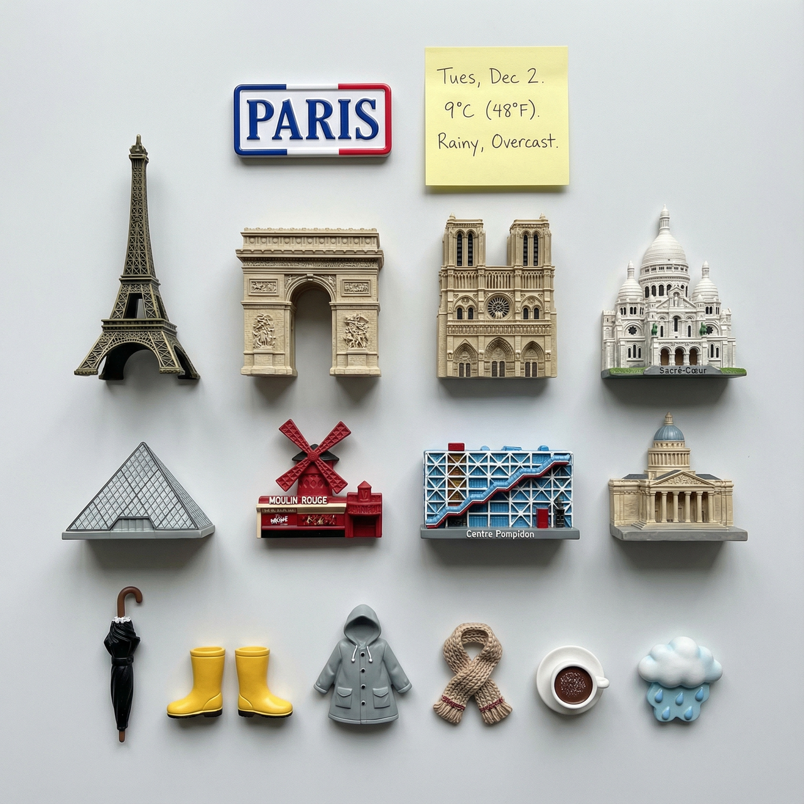

<details>
<summary>提示词（点击展开）</summary>

```text
展示一张清晰的俯视图，照片内容为 [城市名称] 地标建筑的3D磁贴，磁贴需整齐排列成平行线和直角，呈小山状。这些磁贴需为逼真的微缩模型。在顶部中央放置一个印有城市名称的纪念磁贴，以及一张手写便签，上面写着温度和天气状况。将与当日天气相关的物品融入到小山状装饰中。所有物品不得重复。

```

</details>


---

**图例6：美味地图**

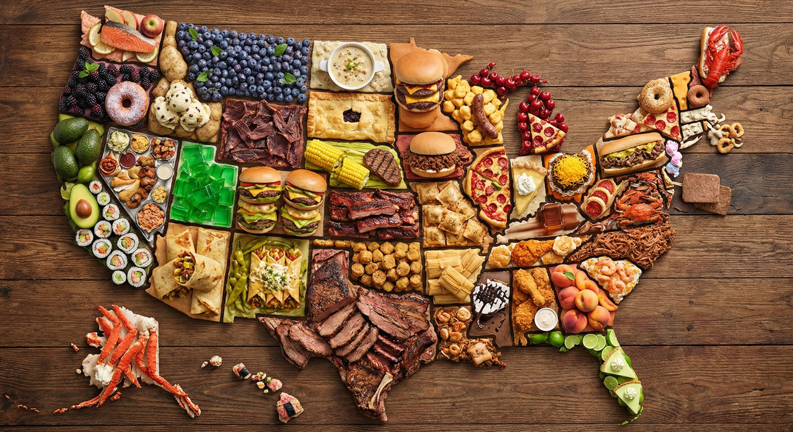


<details>
<summary>提示词（点击展开）</summary>

```text
制作一张 [国家名称] 地图，地图上每个州都用该州最著名的食物来构成（各州地图上的图案应该看起来像是由食物组成的，而不是食物的图片）。仔细检查，确保每个州都正确无误。
```

</details>

---

**图例：立方体房**


<details>
<summary>提示词（点击展开）</summary>

```text
一个等距3D立方体微缩房间（浅切面真立方体；所有物品均严格包含在立方体内）。房间描述：[房间描述：详细描述主题、家具、特定杂物、墙面装饰和关键物品]。

人物：Q版/手办风格——[在此处插入您上传照片中人物的描述]。人物动作：[例如，坐在椅子上打字、站着做饭、弹吉他]，表情：[例如，专注、快乐、微笑]。人物材质看起来像是哑光PVC，头部较大，身体较小。光照：[氛围名称]：[光源：例如，霓虹蓝光、暖日光、金色灯光]；逼真的反射和彩色阴影。视角：略微抬高的等距四分之三视角，立方体正面边缘居中；没有任何元素突出于立方体之外。照片级材质，细节丰富；中性背景。画面细节丰富，构图清晰；无水印。
```

</details>


--- 

**图例：立方体房**

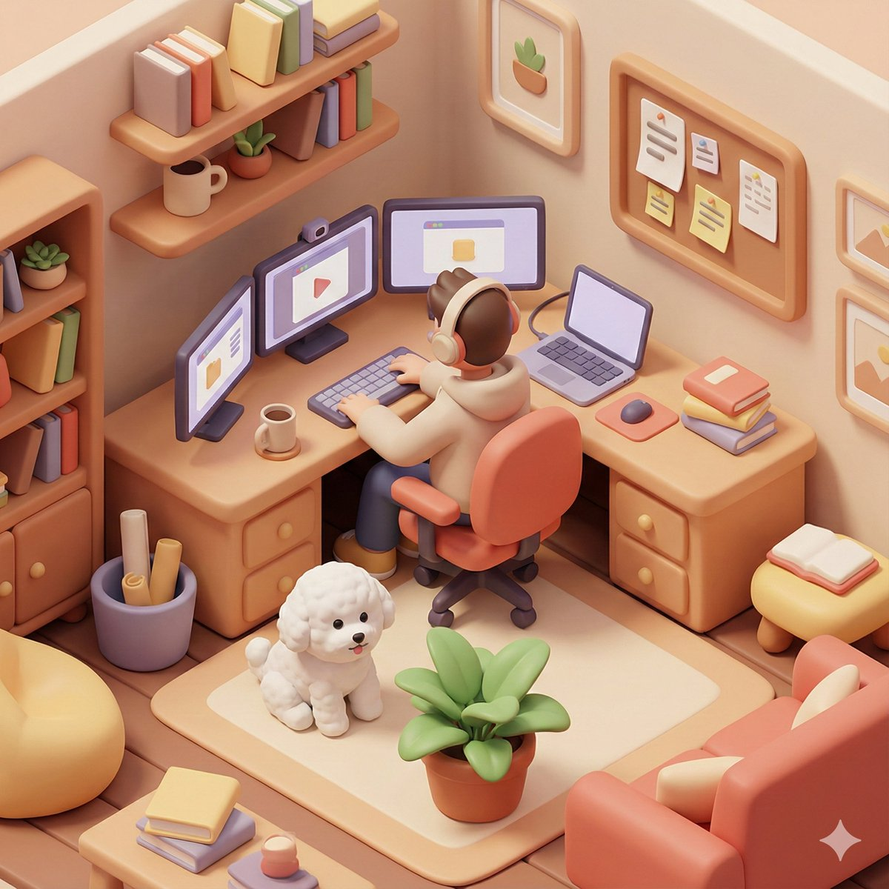

<details>
<summary>提示词（点击展开）</summary>

```text
Based on you know about me, generate a 3D isometric colored illustration of me working from home, filled with various interior details. The visual style should be rounded, polished, and playful. --ar 1:1

```

</details>


--- 


**图例：巧咖爆炸**
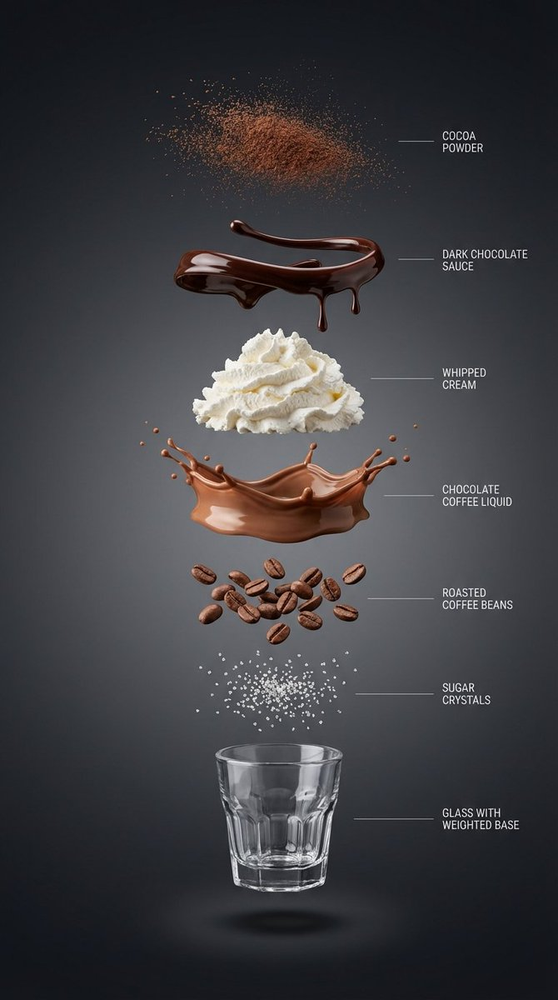


<details>
<summary>提示词（点击展开）</summary>

```json
{
  "主题": "巧克力咖啡饮料的超逼真垂直爆炸视图",
  "布局": "居中垂直对齐，每个组件独立悬挂并保持清晰的间距",
  "层": [
    {
      "成分": "可可粉颗粒",
      "位置": "顶部"
    },
    {
      "成分": "光泽浓郁的黑巧克力酱汁带和滴落物",
      "位置": "独立层"
    },
    {
      "成分": "轻盈的鲜奶油堆",
      "位置": "独立层"
    },
    {
      "成分": "顺滑的巧克力咖啡液层",
      "位置": "独立层"
    },
    {
      "成分": "烘焙咖啡豆",
      "位置": "独立层"
    },
    {
      "成分": "糖晶体",
      "位置": "独立层"
    },
    {
      "组件": "带加重底座的小型透明螺纹玻璃杯（空）",
      "位置": "底部"
    }
  ],
  "背景": "优质深色背景：干净的影棚背景，从近乎黑色的石墨色到炭灰色的平滑渐变，柔和均匀",
  "lighting_and_style": {
    "灯光": "柔和可控的摄影棚灯光，每个组件下方都有清晰的层次感阴影",
    "细节": "超清晰的宏观真实感，极简的细指示线和右侧的英文标签",
    "类别": "高端产品信息图",
    "分辨率": "8K"
  }
}

```

</details>


----

**图例：抹茶爆炸**

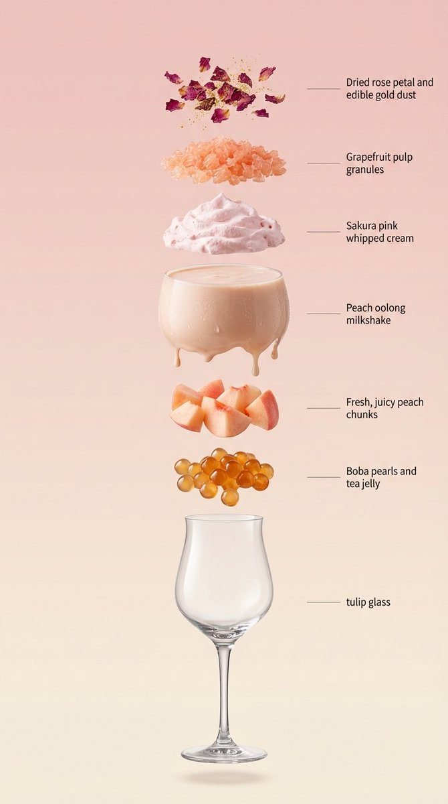


<details>
<summary>提示词（点击展开）</summary>

```json
{
  "主题": "抹茶芝士泡沫水果咖啡饮料的超逼真垂直爆炸视图",
  "布局": "居中垂直对齐，每个组件独立悬挂并保持清晰的间距",
  "层": [
    {
      "成分": "细抹茶粉颗粒",
      "位置": "顶部"
    },
    {
      "成分": "新鲜草莓和芒果片（晶莹剔透）",
      "位置": "独立层"
    },
    {
      "组成部分": "浓郁咸香的芝士抹茶泡沫层（带有细腻的泡沫）",
      "位置": "独立层"
    },
    {
      "成分": "清澈的冷萃咖啡液与鲜艳的绿色抹茶层混合",
      "位置": "独立层"
    },
    {
      "成分": "晶莹剔透的冰块和薄荷叶",
      "位置": "独立层"
    },
    {
      "成分": "底部浓缩果泥（例如覆盆子酱）",
      "位置": "独立层"
    },
    {
      "组件": "超简约条纹玻璃杯（空）",
      "位置": "底部"
    }
  ],
  "背景": "清新简约的背景：明亮的摄影棚环境，从浅米色到浅灰色的柔和渐变",
  "lighting_and_style": {
    "照明": "明亮的自然光感，清晰的玻璃反射和层次分明的阴影",
    "细节": "超清晰的宏观真实感，极简的细指示线和右侧的英文标签",
    "类别": "高端产品信息图",
    "分辨率": "8K"
  }
}

```

</details>

## 科研报告类

**图例：光合作用**


<details>
<summary>提示词（点击展开）</summary>

```text
Create an educational infographic explaining [Photosynthesis] . Visual Elements : Illustrate the key components: The Sun, a green Plant, Water (H2O) entering roots, Carbon Dioxide (CO2) entering leaves, and Oxygen (O2) being released. Style : Clean, flat vector illustration suitable for a high school science textbook. Use arrows to show the flow of energy and matter. Labels : Label each element clearly in English .
```

</details>


---

**图例：戴森群建**

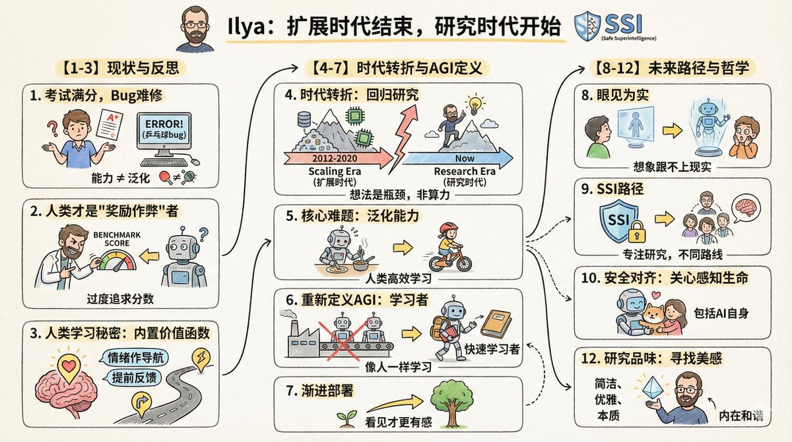

<details>
<summary>提示词（点击展开）</summary>

```text
Please create a cartoon-style infographic based on the provided content, following these guidelines:

- Hand-drawn illustration style, landscape orientation (16:9 aspect ratio).

- Include a small number of simple cartoon elements, icons, or famous personalities to enhance visual interest and memorability.

- If the content includes sensitive or copyrighted figures, replace them with visually similar alternatives; do not refuse to generate the illustration.

- All imagery and text must strictly adhere to a hand-drawn style; avoid realistic visual elements.

- Keep information concise, highlighting keywords and core concepts. Utilize ample whitespace to clearly emphasize key points.

- Unless otherwise specified, use the same language as the provided content.

Please use nano banana pro to create the illustration based on the input provided.
```

</details>


---

**图例：戴森群建**

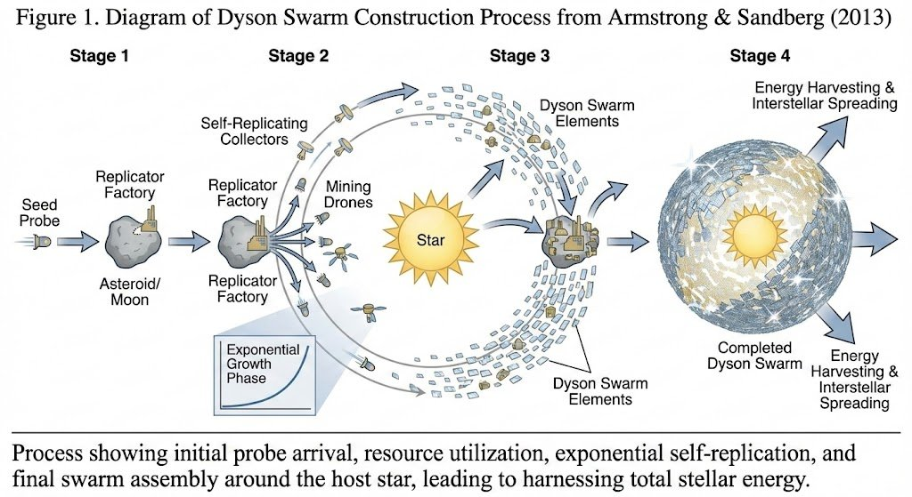

<details>
<summary>提示词（点击展开）</summary>

```text
图示为根据论文 Armstrong, S., & Sandberg, A. (2013). Eternity in six hours: Intergalactic spreading of intelligent life and sharpening the Fermi paradox. Acta Astronautica, 89, 1-13 构建戴森群的过程。
```

</details>

--- 

**图例：人文PPT**

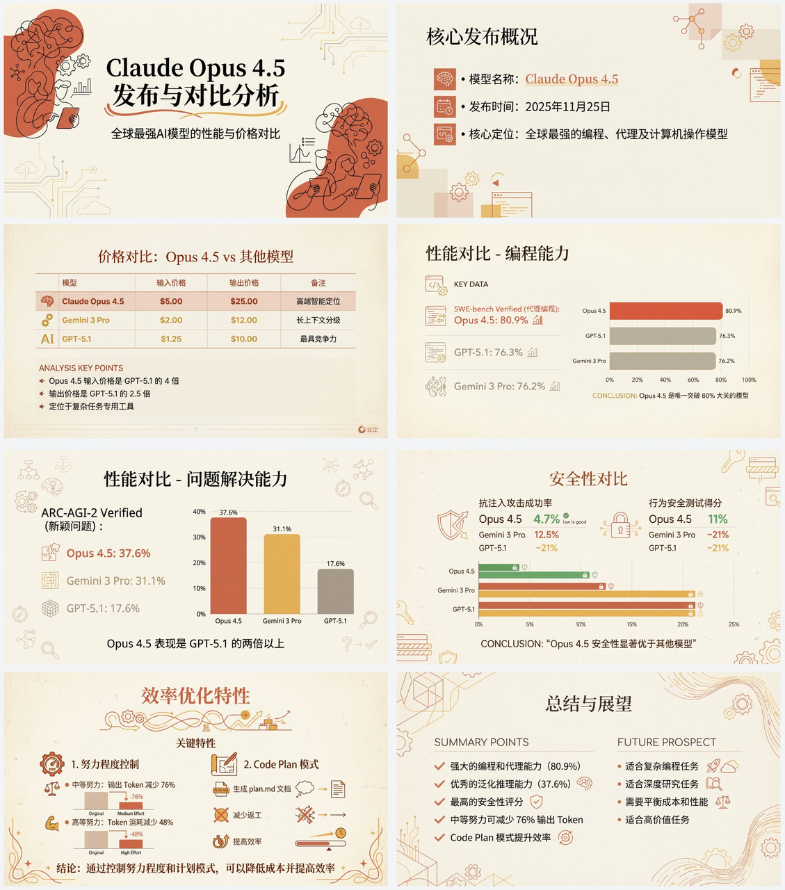

<details>
<summary>提示词（点击展开）</summary>

```text
帮我根据下面这个文章做一套中学生都能理解的中文PPT。

先写1个PPT大纲，规划出每一页的PPT的内容。

然后将每一页的PPT内容分别扔给Nana Banana pro生成对应页面的PPT，需要确保风格一致。

PPT的具体风格应该为请“Anthropic/Claude 风格”的“温暖学术人文主义”设计。

背景：使用暖米色/奶油色 (# F3F0E9) 作为底色，模仿高级纸张质感。

字体：标题使用优雅的衬线体（Serif），正文使用现代无衬线体（Sans-serif）。

配色：主色调为赤陶红 (# D67052) 和芥末黄 (# F0B857)，搭配深海军蓝作为点缀。避免使用霓虹色或纯黑色。

视觉元素：使用注重排版的网格布局，插图风格应为抽象的、有机的黑色手绘线条画，置于赤陶红纯色色块之上，部分关键信息使用卡片布局。

图表：扁平化、极简的柱状图，强调数据对比，去除多余边框。

文字和图像都由 Nano Banana Pro 生成，另外不要将PPT 变成一整张图，一页一张图。

文章内容为：[]
```

</details>

--- 


## 解构类

**图例1：时尚解构**

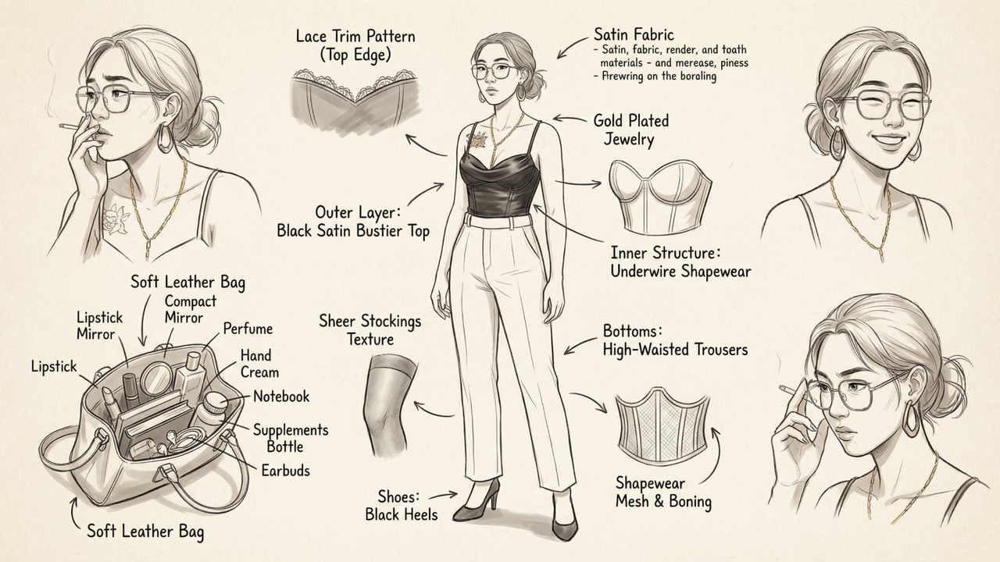

<details>
<summary>提示词（点击展开）</summary>

```text
手绘风格的时尚概念分解图。

中心：一位时尚自信、略带性感（但并不露骨）的女性角色的全身像，姿态自然而充满活力。

周围：她的关键元素结构化布局：

• 服装层次——展示外套、内衣、紧身裤（蕾丝、薄纱材质）、塑身衣，并放大细节图案。

• 表情图——3-4种面部表情（中性、害羞、惊讶、专注）。

• 特写镜头——面料褶皱纹理、肌肤细节、手势。

• 生活方式及配饰——打开的手提包，内含日常用品：口红、香水、粉饼盒、护手霜、日记本、保健品。

• 材质标注——每件物品旁的手写风格注释（例如，“柔软蕾丝”、“哑光皮革”、“色号#520”）。

背景：柔和的米色或羊皮纸纹理，营造设计草图的氛围。

光线：干净柔和的阴影，使画面浑然一体。

输出：4K 高清 2D 插画，兼具性感与时尚感。

语言：中英文标签。
```

</details>
--- 


**图例：剖层城市**

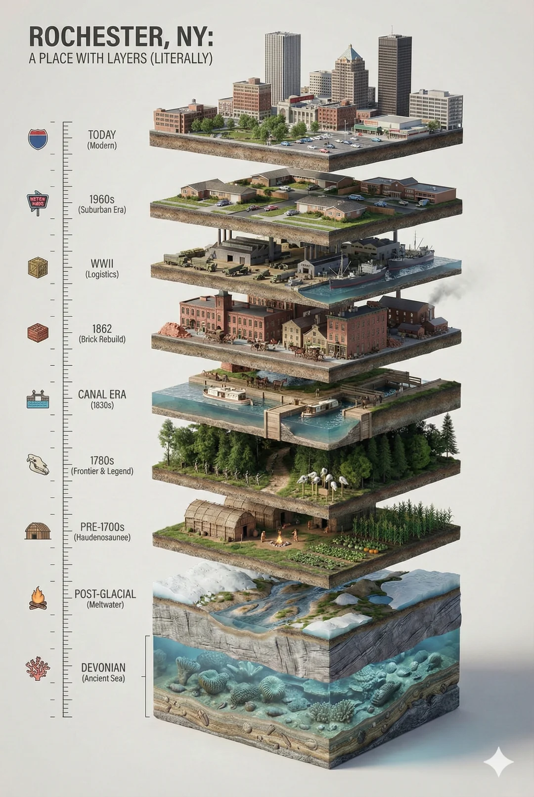

<details>
<summary>提示词（点击展开）</summary>

```text
Vertical isometric cutaway diagram titled "ROCHESTER, NY". Stacked 3D layers showing history from top to bottom:

Modern skyline with High Falls, the Genesee River, and the Kodak Tower.2. 1960s industrial factories and suburban homes.3. 1800s brick flour mills and the Erie Canal Aqueduct.4. Forest landscape with Haudenosaunee longhouses.5. Bottom layer of ancient sedimentary rock with fossils. Clean white background, realistic detail, with a vertical timeline ruler on the left side.
```

</details>

---


## 海报

**图例1：游乐园报**


<details>
<summary>提示词（点击展开）</summary>

```text
Present a clear, 45° top-down view of a vertical (9:16) isometric miniature 3D cartoon scene, highlighting iconic landmarks centered in the composition to showcase precise and delicate modeling.

The scene features soft, refined textures with realistic PBR materials and gentle, lifelike lighting and shadow effects. Weather elements are creatively integrated into the urban architecture, establishing a dynamic interaction between the city's landscape and atmospheric conditions, creating an immersive weather ambiance.

Use a clean, unified composition with minimalistic aesthetics and a soft, solid-colored background that highlights the main content. The overall visual style is fresh and soothing.

Display a prominent weather icon at the top-center, with the date (x-small text) and temperature range (medium text) beneath it. The city name (large text) is positioned directly above the weather icon. The weather information has no background and can subtly overlap with the buildings.

The text should match the input city's native language.
Please retrieve current weather conditions for the specified city before rendering.

City name: EvanSton
```

</details>

---


**图例1：游乐园报**


<details>
<summary>提示词（点击展开）</summary>

```text
请生成一张儿童识字小报《游乐园》，竖版 A4，学习小报版式，适合 5–9 岁孩子 认字与看图识物。 一、小报标题区（顶部） 顶部居中大标题：《游乐园识字小报》 风格：十字小报 / 儿童学习报感 文本要求：大字、醒目、卡通手写体、彩色描边 装饰：周围添加与 游乐园 相关的贴纸风装饰，颜色鲜艳 二、小报主体（中间主画面） 画面中心是一幅 卡通插画风的「游乐园」场景： 整体气氛：明亮、温暖、积极 构图：物体边界清晰，方便对应文字，不要过于拥挤。 场景分区与核心内容 核心区域 A（主要对象）：表现 游乐园 的核心活动（孩子们在玩游乐设施）。 核心区域 B（配套设施）：展示相关的工具或物品（售票、零食、指示设施）。 核心区域 C（环境背景）：体现环境特征（入口、路牌、彩旗、绿地等）。 主题人物 角色：1 位可爱卡通人物（身份：游乐园工作人员/游客小朋友皆可）。 动作：正在进行与场景相关的自然互动（如微笑指路、挥手欢迎、陪孩子玩）。 三、必画物体与识字清单（Generated Content） 请务必在画面中清晰绘制以下物体，并为其预留贴标签的位置： 1. 核心角色与设施： gōng zuò rén yuán 工作人员 shòu piào chù 售票处 guò shān chē 过山车 mó tiān lún 摩天轮 xuán zhuǎn mǎ 旋转木马 2. 常见物品/工具： piào 票 qì qiú 气球 bīng jī líng 冰淇淋 bào mǐ huā 爆米花 táng hú lu 糖葫芦 miàn jù 面具 wán jù 玩具 xiǎo qí zi 小旗子 3. 环境与装饰： rù kǒu 入口 chū kǒu 出口 zhǐ shì pái 指示牌 cǎi qí 彩旗 guǎng chǎng 广场 (注意：画面中的物体数量不限于此，但以上列表必须作为重点描绘对象；总计 18 个典型名词，适合 5–9 岁儿童识字。) 四、识字标注规则 对上述清单中的物体，贴上中文识字标签： 格式：两行制（第一行拼音带声调，第二行简体汉字）。 样式：彩色小贴纸风格，白底黑字或深色字，清晰可读。 排版：标签靠近对应的物体，不遮挡主体。 五、画风参数 风格：儿童绘本风 + 识字小报风 色彩：高饱和、明快、温暖 (High Saturation, Warm Tone) 质量：8k resolution, high detail, vector illustration style, clean lines.
```

</details>

---

**图例2：天气城市**


<details>
<summary>提示词（点击展开）</summary>

```text
呈现一个清晰的45°俯视视角，垂直（9:16）等距3D微缩卡通场景，突出画面中心的标志性地标，展现精细的建模。

场景采用柔和细腻的纹理，搭配逼真的PBR材质和柔和逼真的光影效果。天气元素巧妙地融入城市建筑，在城市景观和大气条件之间建立动态互动，营造身临其境的天气氛围。

使用简洁统一的构图，采用极简主义美学，并以柔和的纯色背景突出主要内容。整体视觉风格清新舒缓。

在顶部中心醒目位置显示天气图标，其下方显示日期（超小字体）和温度范围（中等字体）。城市名称（大字体）位于天气图标正上方。天气信息无背景，可以与建筑物略微重叠。

文本应与输入城市的本地语言一致。

渲染前请获取指定城市的当前天气状况。

城市名称：[上海]
```

</details>

---

**图例3：星巴克概念店**

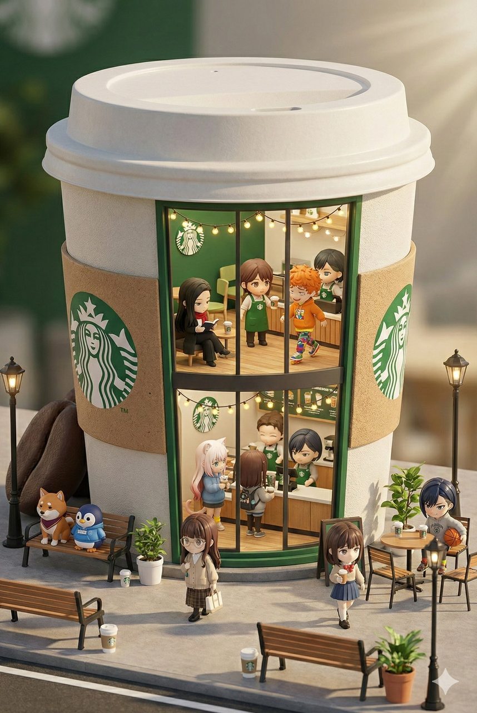

<details>
<summary>提示词（点击展开）</summary>

```text
这款3D Q版 [星巴克] 迷你概念店设计别具匠心，其外观灵感源自品牌最具代表性的产品和包装（例如，巨型{品牌核心产品，如炸鸡桶/汉堡/甜甜圈/烤鸭}）。店铺共两层，落地玻璃窗将温馨精致的内部装潢尽收眼底：{品牌主色调}主题装饰、温暖的灯光，以及身着品牌专属服装的忙碌员工。可爱的小人偶在街道上漫步、休憩，周围环绕着长椅、路灯和盆栽，营造出迷人的都市景象。该作品采用Cinema 4D软件以微缩城市景观风格渲染，拥有盲盒玩具般的精致美感，细节丰富，栩栩如生，柔和的灯光更添一份轻松惬意的午后氛围。请参阅随附的角色设定图，了解店内出现的迷你角色。--ar 2:3
```

</details>

--- 


## 中国传统文化


**图例：唐宫乐**

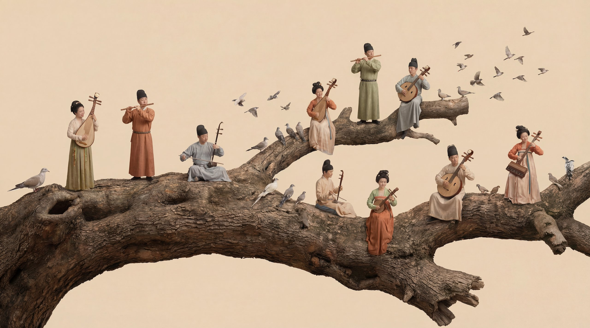

<details>
<summary>提示词（点击展开）</summary>

```json
{
  "主题": {
    "描述": "唐代宫廷乐团在阿干树枝上演奏音乐，乐师们演奏琵琶、二胡、笛子、阮和马蹄镫，乐师和鸟儿随意散落在各处，有的站着，有的坐着。",
    "mirror_rules": null,
    "年龄": null,
    "表达": {
      "眼睛": {
        "look": null,
        "能量": null,
        "方向": "空"
      },
      "嘴": {
        "位置": null,
        "能量": "空"
      },
      "总体": "空"
    },
    "脸": {
      "preserve_original": false,
      "化妆": "空"
    },
    "头发": {
      "颜色": null,
      "样式": null,
      "效果": "空"
    },
    "身体": {
      "frame": null,
      "腰部": null,
      "胸腔": null,
      "腿": null,
      "皮肤": {
        "visible_areas": null,
        "音调": null,
        "纹理": null,
        "lighting_effect": null
      }
    },
    "姿势": {
      "位置": "混合（部分站立，部分坐着",
      "基部": "在阿甘树的树枝上",
      "总体而言": "演奏音乐，包括琵琶、二胡、笛子、阮和马蹄筝"
    },
    "衣服": {
      "顶部": {
        "类型": "唐代宫廷服饰",
        "颜色": null,
        "详细信息": null,
        "效果": "空"
      },
      "底部": {
        "type": null,
        "颜色": null,
        "详情": null
      }
    },
    "配件": {
      "珠宝": null,
      "头饰": null,
      "设备": null,
      "道具": "琵琶、二胡、笛子、阮、马蹄琵琶"
    },
    "摄影": {
      "camera_style": null,
      "角度": null,
      "shot_type": null,
      "aspect_ratio": null,
      "纹理": null,
      "照明": "即使是柔和的照明",
      "景深": null
    },
    "背景": {
      "场景": "驼色舞台画布",
      "wall_color": "驼棕色舞台画布，颜色代码 #E7B5C3D ",
      "元素": [
        "阿甘树枝",
        "鸟类"
      ],
      "大气": null,
      "照明": "即使是柔和的照明"
    },
    "氛围": {
      "能量": null,
      "情绪": null,
      "美学": "宋代美学，极简主义，写实主义",
      "真实性": null,
      "亲密": null,
      "故事": "唐代宫廷乐团在阿干树枝上演奏，乐师和鸟儿随意散落，有的站着，有的坐着。",
      "caption_energy": "唐代宫廷乐团在树枝上演奏"
    },
    "约束条件": {
      "must_keep": [
        "唐朝宫廷乐团",
        "演奏琵琶、二胡、笛子、阮和马蹄琴的乐师们",
        "阿甘树枝",
        "音乐家和鸟儿随意散落各处，有的站着，有的坐着",
        "驼棕色舞台画布，颜色代码为 #E7B5C3D "
      ],
      "避免": []
    },
    "negative_prompt": [
      "nsfw",
      "低质量",
      "文本",
      "水印"
    ]
  }
}

```

</details>

--- 


## 美女靓仔类

**图例：车库回眸**

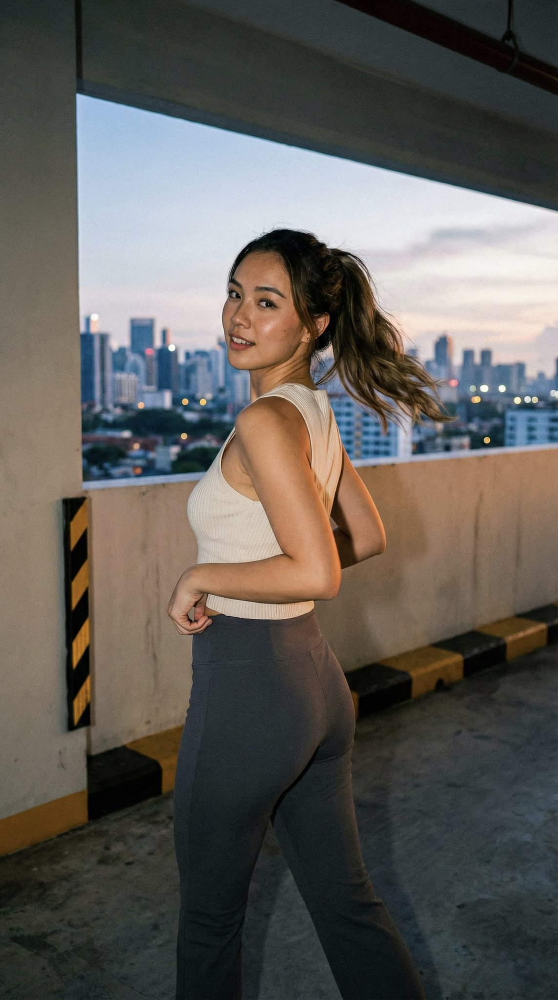

<details>
<summary>提示词（点击展开）</summary>

```json
{
  "meta": {
    "aspect_ratio": "9:16",
    "quality": "ultra_photorealistic",
    "resolution": "8k",
    "camera": "DSLR with slight paparazzi feel",
    "lens": "35mm",
    "style": "raw social media realism, natural skin texture, subtle grain, zero plastic look"
  },
  "scene": {
    "location": "underground parking garage rooftop exit",
    "time": "sunset transitioning to blue hour",
    "environment": [
      "concrete walls with yellow-black hazard stripes",
      "open rooftop edge revealing city skyline",
      "warm sunset glow mixing with cool city lights",
      "slight wind moving loose elements"
    ],
    "atmosphere": "urban, spontaneous, caught-in-the-moment energy"
  },
  "lighting": {
    "type": "mixed natural + city ambient",
    "key_light": "low warm sunset light from side",
    "fill_light": "cool reflected city light",
    "effect": "soft highlights on curves, realistic shadow falloff, cinematic but accidental"
  },
  "camera_perspective": {
    "pov": "third-person candid",
    "angle": "slightly low, off-center",
    "framing": "mid-thigh to head",
    "motion": "minor handheld imperfection, not symmetrical"
  },
  "subject": {
    "gender": "female",
    "vibe": "young adult, confident but unposed",
    "ethnicity": "mixed Asian-European",
    "body": {
      "type": "slim-curvy",
      "waist": "tight and defined",
      "hips": "round and naturally full",
      "chest": "full but natural",
      "legs": "toned thighs with subtle tension from stance"
    },
    "hair": {
      "color": "deep chestnut brown",
      "style": "loose high ponytail",
      "behavior": "wind catching loose strands mid-motion"
    },
    "face": {
      "expression": "half-smile, half-challenge",
      "eyes": "glancing back at camera mid-step",
      "makeup": "minimal glow, glossy lips, light liner",
      "skin": "real texture, slight warmth from sunset"
    },
    "outfit": {
      "top": {
        "type": "ribbed sleeveless fitted top",
        "color": "soft off-white",
        "fit": "tight, no bra, fabric under slight stretch"
      },
      "bottom": {
        "type": "high-waisted stretch pants",
        "color": "charcoal grey",
        "fit": "hugging hips and thighs, natural fabric tension"
      }
    },
    "action": {
      "movement": "walking forward then turning upper body back",
      "micro_details": [
        "one hand adjusting waistband",
        "hip mid-shift creating natural curve",
        "ponytail swinging with motion"
      ]
    }
  },
  "realism_rules": {
    "avoid": [
      "perfect symmetry",
      "over-smoothed skin",
      "posed influencer look"
    ],
    "priority": "looks like a real moment someone snapped too late on purpose"
  }
}
```

</details>


---


**图例：眼镜白衬**

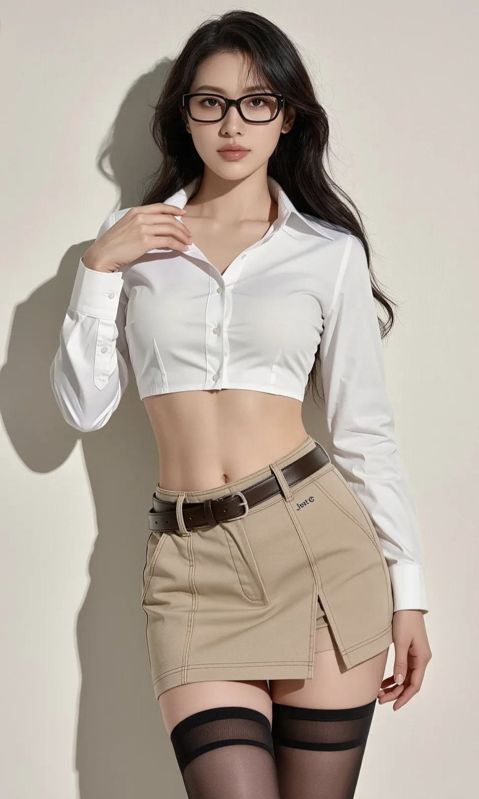

<details>
<summary>提示词（点击展开）</summary>

```json
{
  "prompt": "Ultra-realistic portrait of a young Asian woman with a slim body and long black wavy hair, wearing black rectangular glasses. Confident expression, soft natural makeup, smooth fair skin. She is wearing a white cropped button-up shirt with long sleeves, a beige high-waist mini skirt with a belt and front slit, and black sheer thigh-high stockings. Standing fashion pose with one hand near the collar. Minimal clean beige background, studio lighting, soft wall shadows. Professional fashion photography, ultra-detailed, sharp focus, realistic skin texture, 4k quality, cinematic lighting.",
  "negative_prompt": "blurry, low quality, bad anatomy, extra fingers, extra legs, distorted face, deformed body, cartoon, anime, illustration, overexposed, watermark, text, logo",
  "settings": {
    "aspect_ratio": "2:3",
    "style": "realistic",
    "cfg_scale": 8,
    "steps": 35,
    "quality": "high"
  }
}
```

</details>


---


**图例：人潮定格**

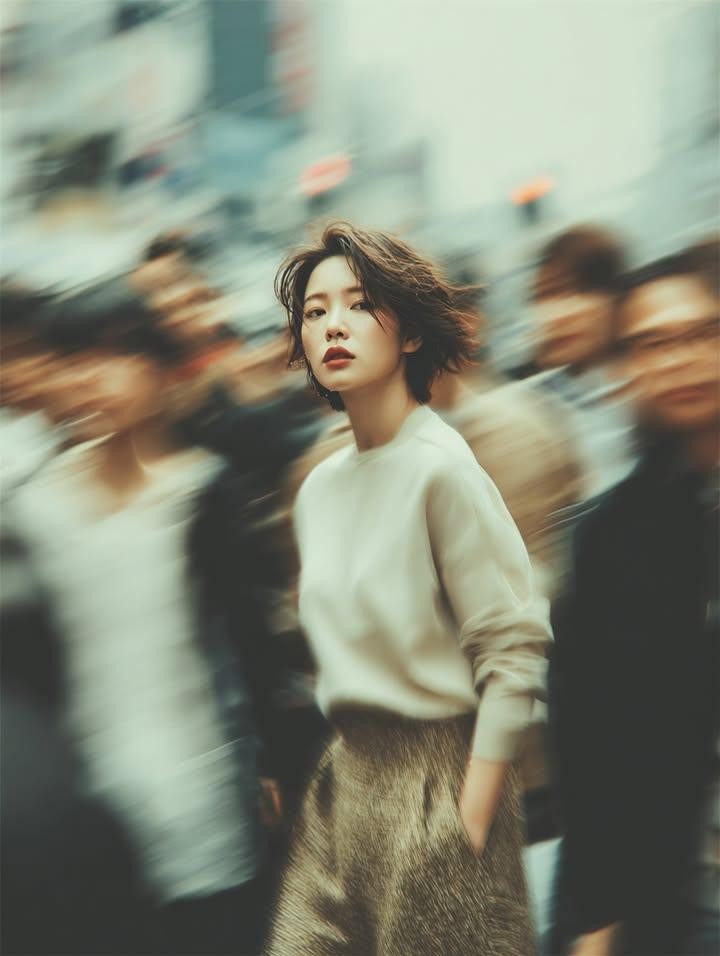

<details>
<summary>提示词（点击展开）</summary>

```text
A cinematic street portrait of a young woman standing still in a busy urban crowd, captured with motion blur all around her. She has short, slightly messy hair and a calm, introspective expression, looking directly at the camera. She wears a soft beige sweater and a textured brown skirt, minimal accessories. The background is a city street filled with people in motion, creating a dreamy long-exposure effect. Shallow depth of field, subject in sharp focus, crowd blurred, natural soft daylight, muted color palette, film photography style, emotional and artistic mood, high detail, realistic, 35mm lens, f/1.8.
```

</details>


---

**图例：居酒自拍**

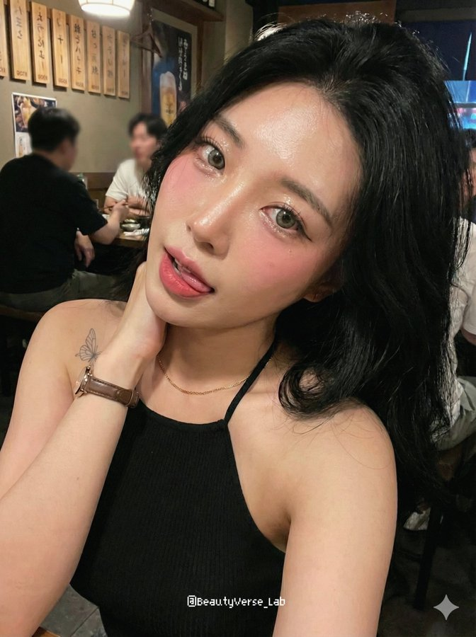

<details>
<summary>提示词（点击展开）</summary>

```json
{
  "subject": {
    "type": "stunning_East_Asian_woman_with_modern_social_media_influencer_aesthetic",
    "framing": "close-up_high-angle_selfie_portrait_indoors",
    "age_vibe": "youthful_early_20s_with_a_sultry_and_captivating_allure",
    "features": {
      "face_structure": "small_v-shaped_face_with_defined_jawline_and_soft_youthful_cheeks",
      "eyes": "sultry_half-lidded_bedroom_eyes_with_intense_hazel-grey_contact_lenses_shimmering_glitter_makeup_and_bold_voluminous_lashes",
      "nose": "high_straight_nose_bridge_with_a_perfectly_sculpted_tip",
      "hair": "long_voluminous_straight_ebony_black_hair_with_a_natural_side_part_flowing_over_shoulders",
      "expression": "alluring_and_seductive_expression_with_tongue_slightly_stuck_out_playfully_paired_with_a_heavy-lidded_come-hither_gaze"
    },
    "skin_texture": {
      "description": "dewy_and_radiant_skin_with_a_prominent_vibrant_pink_blush_on_cheeks",
      "details": [
        "smooth_poreless_finish_with_a_moist_glow",
        "intense_pinkish_blush_blended_across_cheeks_and_nose_bridge",
        "subtle_highlighter_on_the_nose_tip_and_inner_corners_of_eyes",
        "soft_warm_skin_undertones_under_dim_lighting"
      ],
      "makeup": "glamorous_night-out_makeup_with_glossy_pink_lips_and_defined_sharp_winged_eyeliner"
    },
    "pose_structural_lock": {
      "overall": "casual_selfie_pose_tilted_head_looking_directly_up_at_the_camera",
      "arms": "right_arm_partially_visible_holding_the_camera_at_a_high_angle",
      "hands": "left_hand_resting_near_the_neck_with_a_watch_visible_on_the_wrist",
      "shoulders": "slightly_hunched_forward_creating_a_dynamic_and_intimate_perspective"
    }
  },
  "apparel_specification": {
    "outfit_main_piece": {
      "description": "Minimalist_sexy_black_halter-neck_top_with_a_deep_plunging_neckline",
      "material": "soft_elastic_ribbed_fabric_with_a_matte_black_finish",
      "silhouette": "form-fitting_and_revealing_emphasizing_the_collarbones_and_shoulders",
      "details": "thin_straps_and_clean_edges"
    },
    "accessories": {
      "necklace": "delicate_ultra-thin_gold_chain_necklace",
      "watch": "classic_wristwatch_with_a_slim_brown_leather_strap_and_rose_gold_round_dial",
      "tattoo": "faint_minimalist_fine-line_butterfly_tattoo_visible_on_the_left_shoulder"
    }
  },
  "environment": {
    "setting": "Atmospheric_Japanese_Izakaya_or_traditional_restaurant_at_night",
    "lighting": "dim_moody_indoor_lighting_with_warm_amber_hues_and_cool_purple_lens_flare_on_the_face",
    "background": "blurred_wooden_walls_adorned_with_traditional_Japanese_calligraphy_menu_plaques_and_distant_diners",
    "atmosphere": "lively_intimate_nightlife_vibe_with_a_sense_of_casual_fun"
  },
  "realism_and_rendering": {
    "style": "candid_social_media_snapshot_photography",
    "camera": "High-end_smartphone_front_camera_with_slight_wide-angle_distortion_and_shallow_depth_of_field",
    "image_quality": "hyper-realistic_skin_textures_natural_motion_blur_and_authentic_low-light_grain",
    "aspect_ratio": "3:4"
  }
}
```

</details>


---

**图例：偏心闪拍**

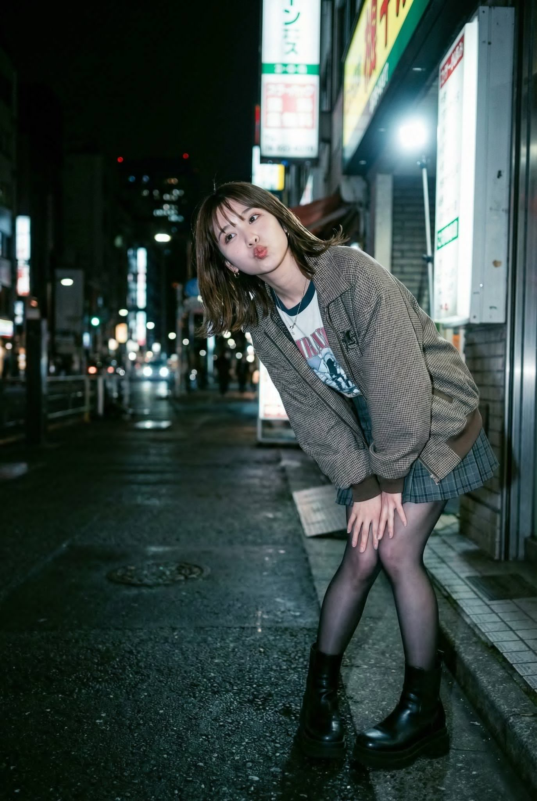

<details>
<summary>提示词（点击展开）</summary>

```json
{   
"type": "portrait_generation_parameters",   
"version": "1.3",   "style_preset": "Off-Center Composition / Flash Street Snap",   
"parameters": {     
"subject_description": {       "base": "A cute and trendy young woman with a strong sense of lens awareness.",       "user_portrait_slot": "{User Portrait}",       "facial_expression": "Cute pouting expression ('duck face' or slightly pursed lips), eyes looking playfully towards the camera.",       
"head_direction": "Head tilted and turned slightly towards the left."     },     
"apparel_and_outfit": {       "base": "High-fashion street style.",       
"outfit_slot": "{Apparel/Outfit}",       
"styling_notes": "The outfit should have movement and texture, suitable for a dynamic street snap."     },     "pose_and_action": {       "leg_position": "Legs are pressed tightly together, not separated. Knees are buckled inward touching each other ('knock-kneed'), feet are pigeon-toed (toes pointing inward).",       "body_orientation": "The body is leaning forward and angled towards the left side of the frame.",       
"hands": "Hands resting on the knees or upper thighs to support the leaning posture.",       
"overall_dynamic": "A cute, slightly exaggerated 'anime-style' standing pose that looks candid and youthful."     },     "composition": {       "framing": "Medium-full body shot.",       "visual_balance": "Off-center composition. The subject is positioned in the **right third** of the frame (Rule of Thirds).",       
"directional_flow": "The subject's body and gaze are directed from the right side towards the left (into the negative space of the image).",       
"camera_angle": "Eye-level or slightly low angle to accentuate the boots and leg posture."     },     
"lighting": {       "type": "Direct On-Camera Flash (Night).",       "characteristics": "Hard, direct flash illuminating the subject on the right, creating a sharp contrast against the darker street background on the left.",       
"shadows": "Hard drop shadows falling behind and to the right of the subject."     },     
"environment": {       "setting": "Urban night street. The empty space on the left side of the frame reveals more of the background details (street depth, blurred city lights, shop signage).",      
 "atmosphere": "Casual, spontaneous, gritty but stylish."     },     
"color_palette": {       "style": "Fujifilm Classic Negative (NC).",       
"tones": "Moody cool tones in the background, warm flash tones on the skin. High contrast curve."     },     "negative_prompt": [       "center frame",       "centered subject",       "legs apart",       "wide stance",       "straight legs",       "looking right",       "body facing right",       "bad anatomy",       "distorted hands",       "missing fingers",       "blurry face",       "flat lighting"     ]   } }
```

</details>


--- 

**图例：反身镜拍**

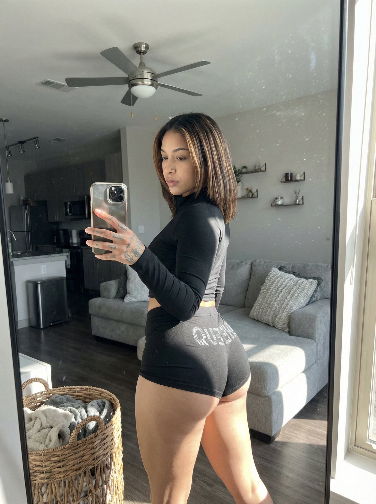

<details>
<summary>提示词（点击展开）</summary>

```json
{
"subject": {
"description": "Young woman with light tan skin and dark brown hair featuring lighter caramel highlights.",
"hair": "Shoulder-length, straight with layered bangs framing the face, dark roots transitioning to highlighted strands.",
"attire": {
"top": "Black, long-sleeved, mock-neck fitted crop top.",
"bottom": "Black, tight-fitting hot shorts (booty shorts) featuring a rhinestone or crystal embellished design/text on the back right side.",
"accessories": "Nose stud piercing, long coffin-shaped nails with dark polish, visible tattoos on the left hand and fingers."
},
"physique": "Fit and curvy, prominent glutes, slim waist, athletic build.",
"action": "Taking a mirror selfie with an iPhone Pro in a clear or metallic case, body turned away from the mirror while looking back over the left shoulder at the reflection."
},
"pose": {
"type": "Standing mirror selfie, rear-angled 3/4 view.",
"details": "Body weight shifted onto the left leg, right leg slightly relaxed. Torso twisted to the left to show profile and back. Head turned sharply left to face the mirror. Left arm raised holding the phone, right arm extended downwards. Glutes accented by the posture and camera angle.",
"orientation": "Back turned towards the mirror, face looking at the phone screen in the reflection."
},
"environment": {
"setting": "Modern apartment living room.",
"background_elements": "Grey sectional sofa with textured white pillows, ceiling fan with light, kitchen visible in the far background with stainless steel refrigerator and dark cabinets.",
"foreground_elements": "Large woven wicker basket containing rolled white and pink blankets/towels in the bottom left corner.",
"flooring": "Grey wood-look laminate or vinyl plank flooring.",
"decor": "Wall-mounted shelves with small plants, minimalist aesthetic."
},
"camera": {
"shot_type": "Mirror selfie, full body shot.",
"perspective": "Reflection view, camera held at chest level within the reflection.",
"focal_length": "24mm equivalent (smartphone main lens).",
"framing": "Subject centered horizontally, cropped at mid-thigh/knee level."
},
"lighting": {
"source": "Strong natural daylight coming from a window on the right side (out of frame).",
"quality": "High contrast, direct sunlight creating bright highlights on the right thigh, buttocks, and sofa.",
"shadows": "Distinct shadows cast by the subject and furniture, clear definition of muscle tone and clothing texture."
},
"mood_and_expression": {
"mood": "Casual, confident, influencer-aesthetic, relaxed.",
"expression": "Neutral to slight pout, focused on the phone screen/mirror reflection."
},
"style_and_realism": {
"style": "Raw social media snapshot, influencer realism.",
"texture": "High fidelity skin texture, visible fabric weave on the black clothing, realistic reflection artifacts.",
"fidelity": "Photorealistic, unpolished lighting."
},
"colors_and_tone": {
"palette": "Neutrals, greys, blacks, skin tones, warm sunlight.",
"contrast": "High contrast due to direct sunlight.",
"saturation": "Natural, slightly warm due to indoor lighting mixed with sunlight."
},
"quality_and_technical_details": {
"resolution": "High definition.",
"sharpness": "Sharp focus on the subject, slightly softer background.",
"artifacts": "Mirror glass texture, slight dust or smudges on mirror surface acceptable for realism."
},
"aspect_ratio_and_output": {
"ratio": "3:4",
"orientation": "Portrait"
},
"controlnet": {
"pose_control": {
"model_type": "DWPose",
"purpose": "Exact skeletal and pose lock",
"constraints": [
"preserve shoulder width",
"preserve hip angle",
"preserve spine curvature",
"preserve limb placement",
"lock head turn angle"
],
"recommended_weight": 1.0
},
"depth_control": {
"model_type": "ZoeDepth",
"purpose": "Depth, volume, and camera-to-body spatial lock",
"constraints": [
"preserve foreground basket depth",
"maintain distance between subject and sofa",
"preserve glute projection and curvature"
],
"recommended_weight": 0.8
}
},
"negative_prompt": {
"forbidden_elements": [
"anatomy normalization",
"body proportion averaging",
"flat chest",
"flat glutes",
"reduced volume",
"slimmed torso",
"aesthetic proportion correction",
"beauty standard enforcement",
"plastic skin",
"airbrushed texture",
"stylized realism",
"missing phone",
"missing mirror reflection",
"studio lighting",
"bokeh overload",
"distorted fingers",
"incorrect text on shorts"
]
}
}
```

</details>


--- 

**图例：闪光镜照**

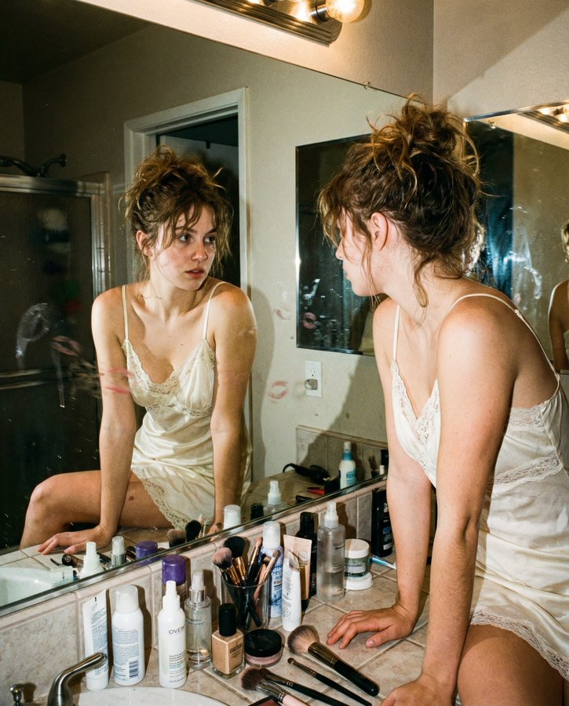

<details>
<summary>提示词（点击展开）</summary>

```json
{
  "intent": "a raw candid flash-style mirror photograph of a young woman.",
  "frame": {
    "aspect_ratio": "4:5 vertical",
    "composition": "mirror reflection, subject framed thighs-up on vanity counter, foreground clutter for depth",
    "style_mode": ["snapshot_aesthetic", "raw_flash_photography", "analog_film_emulation"]
  },
  "subject": {
    "identity": "young woman, early 20s, slender, messy loose-updo hair",
    "wardrobe": "vintage silk slip dress with lace trim",
    "pose": "seated casually on bathroom counter, leaning forward toward mirror, legs relaxed or crossed",
    "expression": "detached cool look, lips slightly parted, gaze at reflection or camera"
  },
  "environment": {
    "location": "compact tiled residential bathroom with vanity mirror",
    "atmosphere": "intimate late-night private moment",
    "details": "cluttered counter with cosmetics, brushes, toiletries",
    "mirror_elements": "smudges, water spots, optional lipstick writing"
  },
  "camera": {
    "sensor_format": "35mm film emulation (Kodak Gold 400 or Cinestill 800T)",
    "lens": "35mm wide-angle point-and-shoot with slight distortion",
    "aperture_depth_of_field": "f/5.6–f/8 for sharp subject and background",
    "shutter_speed": "1/60s flash sync",
    "iso": 800,
    "camera_position": "eye-level toward mirror reflection"
  },
  "lighting": {
    "type": "direct on-camera flash + ambient tungsten",
    "key_light": "hard frontal flash with harsh shadows and specular highlights",
    "fill_light": "warm dim tungsten cast",
    "contrast": "high contrast with strong fall-off",
    "color_temperature": "5500K flash + 3200K ambient"
  },
  "post_process": {
    "color_grade": "vintage film, lifted blacks, green-tinted shadows, saturated reds",
    "sharpness": "moderate with film grain and flash softness",
    "vignette": "natural flash fall-off at edges"
  },
  "negative": {
    "style": ["no studio lighting", "no softbox", "no 3D render", "no cartoon", "no anime", "no illustration", "no painting", "no airbrushed skin"],
    "content": ["no clean minimalist spaces", "no perfect posture", "no happy expressions", "no daylight", "no LED aesthetics"]
  }
}
```

</details>


--- 


**图例：棚拍模板**


<details>
<summary>提示词（点击展开）</summary>

```json
{

"character_consistency": "100%",

"description": "Full-body studio photoshoot of a female model in a red velvet dress",

"hair_style": "<HAIR_STYLE>",

"pose": "<POSE_DESCRIPTION>",

"expression": "<EXPRESSION>",

"lighting": "<LIGHTING_SETUP>",

"effects": "<VISUAL_EFFECTS>",

"camera_details": "<CAMERA_SPEC>",

"scene_mood": "<MOOD>",

"additional_notes": "<NOTES>"

}
```

</details>


--- 


**图例：健身硬照**

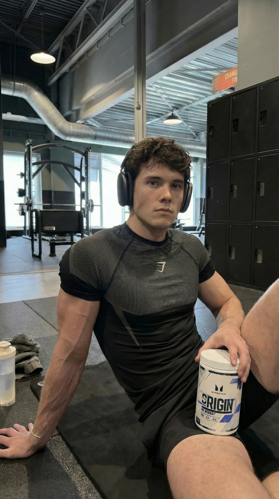

<details>
<summary>提示词（点击展开）</summary>

```text
Subjects: raw, unedited photo of a muscular adult man with short wavy dark-brown hair wearing large black over-ear headphones, a tight black-and-charcoal patterned short-sleeve compression shirt with a small white chest logo, black athletic shorts, and white crew socks, sitting on a black rubber gym floor leaning back on one hand with his torso turned and head looking to the side. Environment: modern industrial gym interior with black locker cubes stacked along the right wall, exposed metal ductwork and beams on the ceiling, a squat rack and a second person training in the background near a large bright window, and a clear shaker bottle plus a small towel on the floor at the lower left. Composition/Camera: low, close three-quarter view from the man’s left side, framing from mid-thigh to head with the lockers filling the right side and gym equipment receding into the left background. Lighting: mixed natural daylight from the window and soft overhead indoor lighting, creating gentle highlights on the subject and mild shadows on the floor and lockers. He is Looking in the camera
```

</details>


--- 

**图例：顶拍唱片**

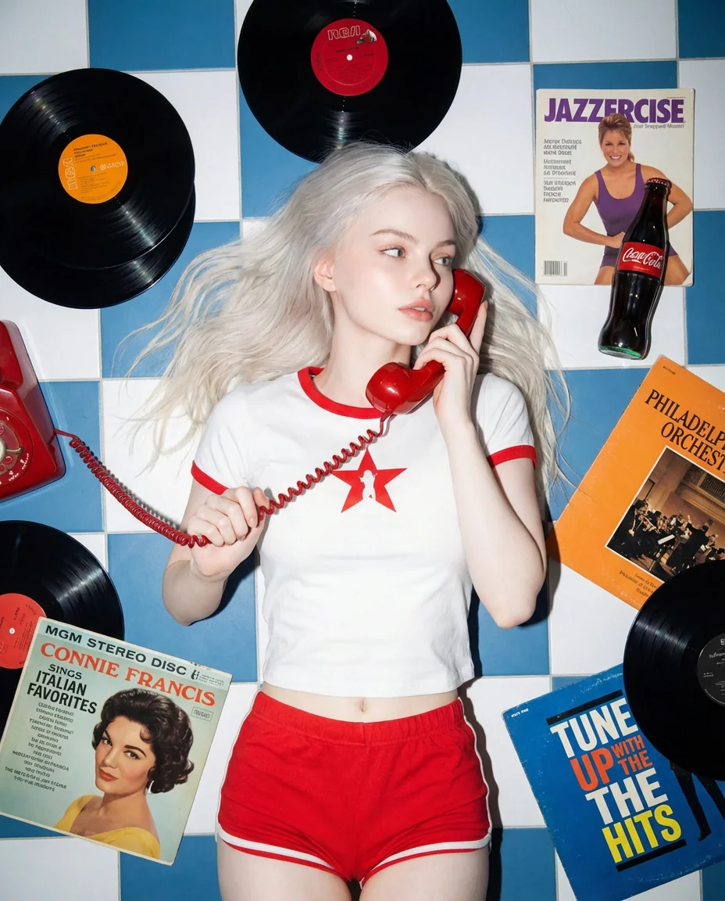

<details>
<summary>提示词（点击展开）</summary>

```json
{
  "meta": {
    "type": "Photo",
    "orientation_lock": "LOCKED: Orientation preserved 4:5",
    "sensor_emulation": "Point-and-Shoot Film Camera / Direct Flash"
  },
  "spatial_orientation_engine": {
    "subject_facing_direction": "CRITICAL: Facing LEFT (West relative to frame)",
    "body_rotation": "Supine (lying on back), head rotated to subject's Right (Camera Left)",
    "camera_position_relative": "Directly Overhead (Top-Down / Flat Lay / 90 degrees)"
  },
  "camera_optics_and_geometry": {
    "lens_profile": {
      "focal_length": "28mm (Wide Angle)",
      "aperture": "f/11 (High depth of field due to flash)",
      "lens_character": "High Contrast Flash Photography, Slight Vignette"
    },
    "optical_flaws": [
      "Hard Flash Falloff",
      "Specular Highlights on Vinyl",
      "Film Grain",
      "Vignetting at corners"
    ]
  },
  "environment_and_physics": {
    "lighting_engine": {
      "primary_source": "Direct On-Camera Flash (Top Center)",
      "radiosity_color_bleed": "Minimal due to harsh light, slight red reflection on white shirt folds",
      "shadow_structure": "Hard, sharp drop shadows directly behind/below objects and subject",
      "volumetrics": "Clear Air, Flash falloff into darkness at edges"
    },
    "surface_physics": {
      "weather_impact": "Indoor setting, no weather",
      "material_response": "High specularity on vinyl records and phone plastic, matte finish on cardboard sleeves, soft cotton fabric absorption"
    }
  },
  "scene_text_ocr": {
    "detected": true,
    "content": [
      {
        "text": "MGM STEREO DISC CONNIE FRANCIS Sings Italian Favorites",
        "location": "Bottom Left Album Cover",
        "font_style": "Serif and Script Mixed"
      },
      {
        "text": "RCA Red Seal",
        "location": "Top Center Vinyl Record Label",
        "font_style": "Sans-Serif"
      },
      {
        "text": "ercise Judi Sheppard Missett",
        "location": "Top Right Magazine/Cover (likely Jazzercise)",
        "font_style": "Bold Sans-Serif"
      },
      {
        "text": "Coca-Cola",
        "location": "Top Right Bottle",
        "font_style": "Cursive Script Logotype"
      },
      {
        "text": "PHILADELPHIA ORCHESTRA",
        "location": "Middle Right Orange Album",
        "font_style": "Vertical Sans-Serif"
      },
      {
        "text": "TUNE UP WITH THE HITS",
        "location": "Bottom Right Cover",
        "font_style": "Bold Sans-Serif Blue Text"
      }
    ]
  },
  "objects_and_actors": [
    {
      "id": "MAIN_SUBJECT",
      "role": "Identity Swap Target",
      "pose_engineering": {
        "skeletal_rig": "Lying flat on back. Right arm bent, elbow on floor, hand holding phone receiver to right ear. Left arm extended slightly down-left, hand gripping phone cord. Legs extending to bottom right corner.",
        "gaze_vector": "Looking off-camera to the Left.",
        "interaction_physics": "Gravity flattening hair against tiles; phone cord tension held by left hand."
      },
      "physiological_state": {
        "body_temp_visuals": "Normal, slight sheen on skin from flash",
        "skin_light_interaction": "Direct flash reflection on forehead and nose"
      },
      "clothing_simulation": {
        "garment_stack": "White ringer t-shirt with red trim and red star graphic, Red athletic shorts with white trim.",
        "fabric_mechanics": "Shirt pressed flat against chest by gravity, slight bunching at armpits.",
        "texture_and_wear": "Cotton texture visible under flash, smooth synthetic shorts."
      },
      "identity_placeholders": {
        "skin_tone": "[[USE_REFERENCE_SKIN]]",
        "face_structure": "[[USE_REFERENCE_FACE]]",
        "hair_style": "[[USE_REFERENCE_HAIR]]"
      }
    }
  ],
  "off_screen_context": {
    "reflections": "Specular highlights of flash bulb in vinyl grooves",
    "implied_elements": "Red rotary phone base is partially visible on the far left edge."
  },
  "generation_keywords": {
    "positive": "Overhead shot, flat lay, flash photography, vintage 90s aesthetic, girl lying on floor, vinyl records scattered, red rotary phone, messy room, blue and white tiled floor, photorealistic, harsh lighting, retro vibe",
    "negative": "soft lighting, outdoor, standing, digital render, 3d, modern phone, clean floor, minimalist"
  }
}

```

</details>


--- 

**图例：金发镜拍**

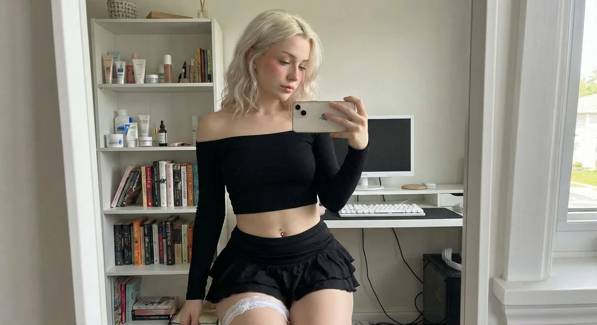

<details>
<summary>提示词（点击展开）</summary>

```json
{
  "scene": "bedroom mirror selfie, home setting with bookshelf and desk setup",

  "subject": {
    "character": "PLATINUM BLONDE GIRL, early 20s, petite slim frame",
    
    "face": {
      "structure": "soft features, delicate jawline, doll-like",
      "skin": "porcelain pale with pink blush on cheeks",
      "eyes": {
        "shape": "large doe eyes",
        "color": "light brown-hazel",
        "expression": "looking down at phone screen, soft dreamy"
      },
      "mouth": {
        "lips": "full, natural pink, relaxed soft pout"
      },
      "makeup": "natural with heavy pink blush, subtle"
    },
    
    "hair": {
      "color": "PLATINUM BLONDE white-silver",
      "length": "shoulder length",
      "texture": "soft wavy, slightly messy",
      "style": "middle part, loose waves framing face",
      "shine": "healthy shine"
    }
  },

  "pose": {
    "overall": "standing mirror selfie, relaxed casual",
    
    "position": {
      "base": "standing in front of mirror",
      "orientation": "facing mirror straight on"
    },
    
    "torso": {
      "direction": "facing camera",
      "posture": "relaxed, slight hip tilt"
    },
    
    "arms": {
      "right": "holding iphone up taking selfie",
      "left": "relaxed at side"
    },
    
    "head": {
      "angle": "looking at phone screen",
      "expression": "soft, casual, candid"
    }
  },

  "outfit": {
    "top": {
      "type": "black off-shoulder long sleeve crop top",
      "fit": "tight, form fitting",
      "neckline": "off shoulder, exposing collarbones",
      "length": "cropped, exposing midriff and stomach"
    },
    
    "bottom": {
      "type": "black ruffled micro mini skirt",
      "style": "tiered ruffles, very short",
      "length": "extremely short, barely covering"
    },
    
    "accessories": {
      "garter": "white lace garter on upper thigh",
      "piercing": "belly button piercing, small silver"
    }
  },

  "body": {
    "type": "slim, toned, petite",
    "midriff": "flat toned stomach exposed",
    "skin": "pale porcelain, smooth"
  },

  "environment": {
    "location": "bedroom, personal space",
    
    "background": {
      "furniture": "white bookshelf unit behind",
      "items": "books, skincare products, perfumes on shelves",
      "desk": "computer setup visible, white keyboard, monitor",
      "aesthetic": "messy but curated, lived-in"
    },
    
    "mirror": "full length or large mirror for selfie"
  },

  "lighting": {
    "type": "natural daylight from window",
    
    "quality": {
      "intensity": "soft, bright, flattering",
      "direction": "front or side natural light"
    },
    
    "on_subject": {
      "skin": "soft glow, smooth",
      "hair": "platinum catching light"
    }
  },

  "photography": {
    "type": "mirror selfie, iphone photo",
    "angle": "straight on, eye level",
    "framing": "waist up to full body",
    "focus": "sharp on subject",
    "style": "casual instagram selfie, candid bedroom"
  },

  "color_palette": {
    "subject": {
      "hair": "PLATINUM white-silver blonde",
      "skin": "porcelain pale with pink blush",
      "outfit": "all black with white lace accent"
    },
    "environment": {
      "bookshelf": "white with colorful book spines",
      "overall": "neutral bedroom tones"
    }
  },

  "vibe": {
    "energy": "casual, candid, effortlessly pretty",
    "mood": "soft, dreamy, bedroom aesthetic",
    "aesthetic": "instagram baddie meets soft girl"
  },

  "critical_requirements": {
    "HAIR": "platinum blonde shoulder length, soft waves",
    "FACE": "pink blush on cheeks, soft expression, looking at phone",
    "TOP": "black off-shoulder long sleeve crop top",
    "SKIRT": "black ruffled micro mini skirt",
    "MIDRIFF": "exposed toned stomach with belly piercing",
    "GARTER": "white lace garter visible on thigh",
    "SETTING": "bedroom with bookshelf and desk behind",
    "STYLE": "mirror selfie with iphone"
  }
}

```

</details>


--- 


**图例：卡片机屏**

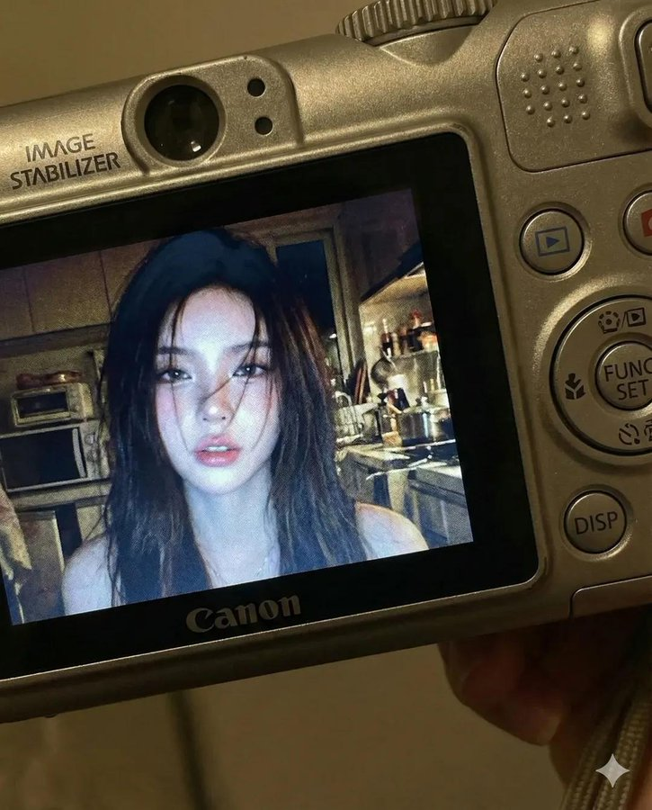

<details>
<summary>提示词（点击展开）</summary>

```text
Use facial feature of attached photo. A close-up shot of a young woman displayed on the screen of a compact Canon digital camera. The camera body surrounds the image with its buttons, dials, and textured surface visible, including the FUNC/SET wheel, DISP button, and the "IMAGE STABILIZER" label along the side. The photo on the screen shows the woman indoors at night, illuminated by a bright built-in flash that creates sharp highlights on her face and hair. She has long dark hair falling across part of her face in loose strands, with a soft, slightly open-lip expression. The flash accentuates her features against a dim, cluttered kitchen background with appliances, shelves, and metallic surfaces softly blurred. The mood is candid, raw, nostalgic, and reminiscent of early 2000s digital camera snapshots. Colors are slightly muted with cool undertones, strong flash contrast, and natural grain from the display. No text, no logos inside the photo preview itself.

Scale ratio: 4:5 vertical

Camera: compact digital camera simulation
Lens: equivalent to 28–35mm
Aperture: f/2.8
ISO: 400
Shutter speed: 1/60 with flash
White balance: auto flash
Lighting: harsh direct flash on subject, ambient low light in the background
Color grading: nostalgic digital-camera tones, high contrast flash, subtle display grain, authentic screen glow.

```

</details>


--- 

**图例：广角街拍**
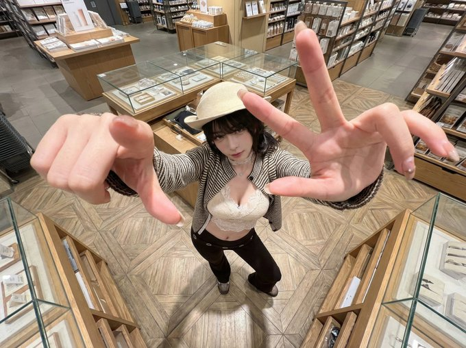
<details>
<summary>提示词（点击展开）</summary>

```json
{
  "edit_type": "extreme_wide_angle_phone_edit",
  "source": {
    "_hint": "Base for editing the person, clothing, and atmosphere of the original image. No new characters allowed.",
    "mode": "EDIT",
    "preserve_elements": ["Person", "Face", "Hairstyle", "Clothing", "Environment style"],
    "change_rules": {
      "camera_angle": "Ultra-wide or fisheye lens (equivalent to 12-18mm)",
      "angle_options": [
        "Looking up from directly in front",
        "Looking down from directly in front", 
        "Extreme low angle",
        "High angle",
        "Tilted composition"
      ],
      "perspective_effect": "Nearby objects are exaggerated, distant objects become smaller",
      "body_parts_close_to_camera": "Bring 1-3 body parts extremely close to the camera",
      "body_part_options": [
        "Hands",
        "Feet/shoes",
        "Knees/thighs",
        "Face",
        "Shoulders/chest"
      ],
      "pose_variety": [
        "Extending one hand/leg toward the camera",
        "Squatting or lying on stomach halfway",
        "Sitting on the ground or an object",
        "Lying on the ground with legs pointed at camera",
        "Leaning body sharply toward the camera",
        "Twisting body for dynamic pose"
      ]
    },
    "phone_handling": {
      "allowed": true,
      "grip_options": [
        "One-handed", 
        "Two-handed",
        "Low angle",
        "High angle", 
        "Tilted",
        "Sideways",
        "Close to chest",
        "Close to waist",
        "Casual grip"
      ],
      "screen_replacement": {
        "target": "Only the smartphone screen portion displayed in the image",
        "source": "Second reference image",
        "fitting_rules": "Strictly match the screen shape, no stretching or compression",
        "interface_rules": "No icons, status bars, or app borders; only display content from original image"
      }
    },
    "environment_consistency": {
      "location": "Maintain the same location as the original image",
      "lighting": "Maintain direction and intensity",
      "extension_rules": "Maintain the same buildings, walls, road markings, colors, materials, and lighting style"
    },
    "global_restrictions": [
      "No new characters allowed",
      "No changes to age or gender expression of person", 
      "No clothing changes",
      "No changes to location type",
      "No text, logos, or watermarks added to image",
      "No illustration or anime style"
    ]
  }
}

```

</details>


---

**图例：镜子自拍**
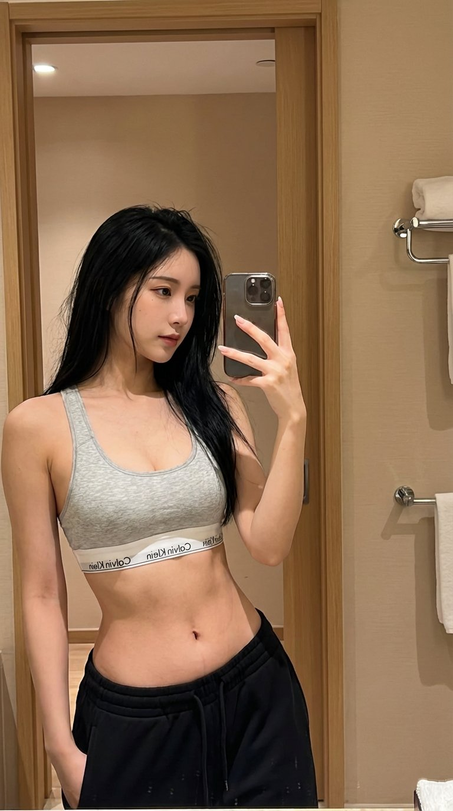

<details>
<summary>提示词（点击展开）</summary>

```json
{
  "visual_style": {
    "color_palette": {
      "主色": [
        {
          "name": "暖米色/棕褐色",
          "hex_approx": " #D2B48C ",
          "描述": "背景墙、门框和皮肤的主色调，营造温暖舒适的室内氛围。"
        },
        {
          "name": "Heather Grey",
          "hex_approx": " #B0B0B0 ",
          "描述": "运动文胸的颜色，用作中性过渡色调。"
        },
        {
          "name": "亮黑色",
          "hex_approx": "#101010",
          "描述": "头发和运动裤，提供了强烈的视觉冲击力和对比。"
        },
        {
          "name": "柔白",
          "hex_approx": " #F5F5F5 ",
          "描述": "毛巾和胸罩的松紧带部分，起到突出装饰作用。"
        }
      ],
      "色调": "温暖、大地色、柔和（暖色调、大地色、柔和）",
      "饱和度": "低至中等（低至中等饱和度，视觉舒适）"
    },
    "灯光": {
      "类型": "室内暖色人工照明（室内暖色照明）",
      "特征": [
        "柔和扩散（柔和的漫射光）",
        "自上而下的投光（顶部照明，常见于酒店或浴室），",
        "暖色调（暖色温）"
      ],
      "阴影": "身体上柔和自然的轮廓阴影（柔和的身体轮廓阴影）"
    },
    "作品": {
      "构图": "中景/四分之三镜头（中景/四分之三身体）",
      "视角": "平视（平视视图）",
      "技巧": "镜子自拍（Mirror Selfie）",
      "visual_balance": "偏离中心的主体（主体略微偏离中心）",
      "depth_of_field": "深景深（背景清晰，无明显模糊）",
      "elements_arrangement": {
        "前景": "手持手机的人物",
        "middle_ground": "镜面",
        "背景": "门框、米色墙壁、毛巾架"
      }
    },
    "subject_styleing": {
      "服装": "休闲服/运动休闲服（居家运动风格）",
      "项目": [
        "灰色 Calvin Klein 运动文胸（灰色 CK 运动文胸）",
        "黑色运动裤"
      ],
      "hair_makeup": "长长的黑色披肩发，自然/无妆容（长长的黑色披肩发，仿素颜/自然妆感）",
      "姿势": "放松站立，手插口袋，微微倾斜臀部（放松站立，手插口袋，微微倾斜臀部以显示腰线）"
    },
    "环境": {
      "设置": "酒店浴室或步入式衣橱（酒店浴室或步入式衣橱）",
      "材料": [
        "浅色木材（浅色木材）",
        "涂漆石膏板（涂漆墙壁）",
        "纺织品（毛巾）"
      ],
      "道具": "架子上的白色毛巾（架子上的白色毛巾）"
    },
    "text_typography": {
      "visible_text": "Calvin Klein",
      "位置": "运动文胸的下围（运动文胸下围）",
      "font_style": "无衬线字体，品牌字体（无衬线品牌字体）",
      "意义": "为美学增添可识别的品牌元素（提高品牌识别度）"
    },
    "mood_atmosphere": {
      "关键词": [
        "舒适",
        "随意的",
        "合身",
        "干净的",
        "早晨的氛围",
        "私人的"
      ],
      "vibe_description": "一种私密、轻松的氛围，展现了一种健康的生活方式，带着一种精致慵懒的感觉，就像“刚睡醒”或“精心打扮”一样。"
    }
  }
}

```

</details>

---

**图例：橱窗分身**


<details>
<summary>提示词（点击展开）</summary>

```json
{
  "PROMPT": "Create a bright, high-end street-fashion photograph of the woman from the reference image, keeping her face, hair, body & outfit exactly the same. She stands outside a luxury toy-shop window, gently touching the glass. Inside the window display, place a full-height cartoon-style doll designed to resemble her—same features, hair, and outfit—transformed into a cute, big-eyed, stylized animated character. Crisp lighting, premium street-fashion look, realistic reflections, face unchanged.",
  "settings": {
    "style": "high-end street fashion",
    "lighting": "crisp and bright",
    "environment": "outside luxury toy-shop window",
    "subject": "woman from reference image",
    "focus": ["face", "hair", "body", "outfit"],
    "additional_elements": [
      {
        "type": "doll",
        "style": "cartoon-style, big-eyed, stylized",
        "location": "inside window display",
        "resemblance": "exact features, hair, outfit of woman"
      }
    ],
    "reflections": "realistic",
    "photorealism": true
  }
}

```

</details>

---

**图例：卡片机感**

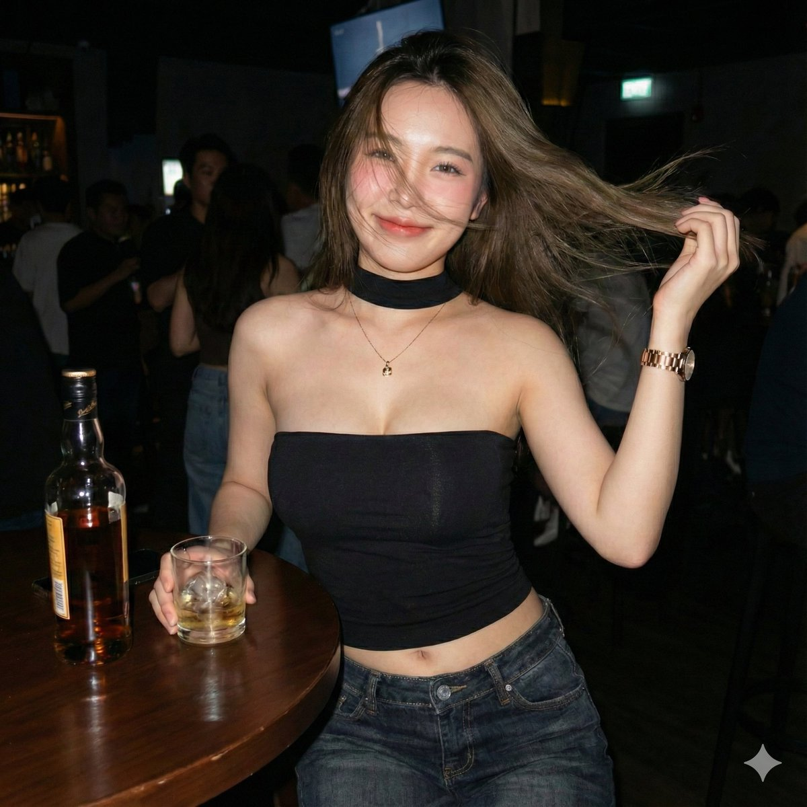

<details>
<summary>提示词（点击展开）</summary>

```json
{
  "image_parameters": {
    "style": "Canon IXUS aesthetic",
    "type": "Point-and-shoot photography",
    "quality": "Hyper-realistic",
    "tone": "Sharp, direct",
    "lighting_and_atmosphere": "Realistic, flash-style/direct lighting"
  },
  "subject": {
    "constraints": {
      "facial_identity": "Match reference image exactly 100%",
      "face_edits": "None allowed"
    },
    "hair": {
      "style": "Long, natural, lightly messy layered look",
      "movement": "Blowing gently in the wind",
      "details": "Strands slightly covering part of face"
    },
    "makeup": {
      "cheeks_and_nose": "Soft pink blush with blurred effect",
      "lips": "Subtle pink-orange tinted outline"
    },
    "expression": [
      "Cute",
      "Naive",
      "Cheerful",
      "Slightly sexy/undone charm"
    ],
    "pose": {
      "body_position": "Half-sitting, half-standing",
      "action": "Flicking hair"
    },
    "clothing": {
      "top": "Black strapless top",
      "bottom": "Low-waisted jeans with a floating waistline",
      "neck": "Thin black fabric choker/wrap"
    },
    "accessories": [
      "Small pendant necklace",
      "Gold watch"
    ]
  },
  "environment": {
    "setting": "Modern pub",
    "foreground_props": [
      "Round table",
      "Bottle of liquor",
      "Glass of liquor"
    ]
  }
}

```

</details>

---


**图例：聚光暗黑**
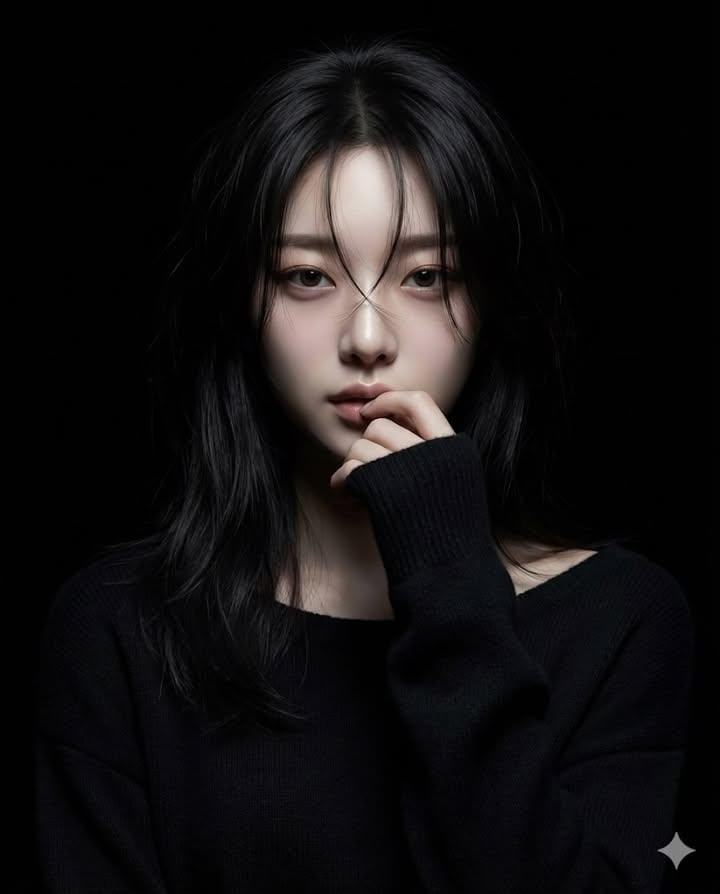
<details>
<summary>提示词（点击展开）</summary>

```text
Generate a hyperrealistic realistic-anime portrait of a female character standing in a completely black background.
Lighting: use a **narrow beam spotlight** focused only on the center of the face. 
The edges of the light must be sharp and dramatic. 
All areas outside the spotlight should fall quickly into deep darkness 
(high falloff shadow), almost blending into the black background. 
Not soft lighting.
Hair: long dark hair with some strands falling over the face. The lower parts of the hair should fade into the shadows.
Pose: one hand raised gently to the lips in a shy, hesitant gesture. 
Eyes looking directly at the camera with a mysterious mood.
Clothing: black long-sleeve knit sweater; 
the sweater and body should mostly disappear into the darkness with minimal detail.
Overall tone: dark, moody, dramatic, mysterious. 
High-contrast only in the lit portion of the face. 
Everything outside the spotlight should be nearly invisible.

```

</details>

--- 

**图例：屏幕冷光**

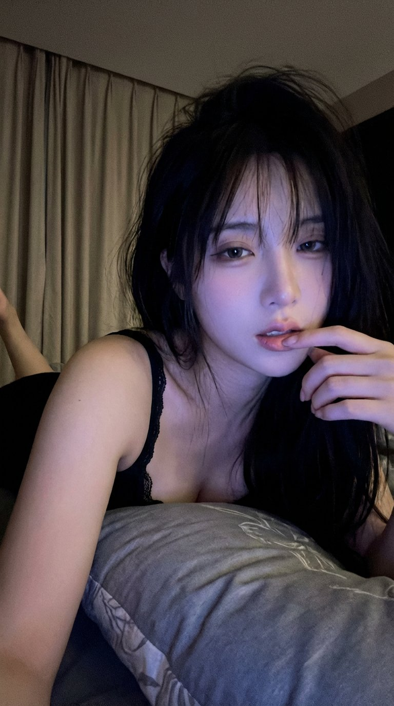

<details>
<summary>提示词（点击展开）</summary>

```json
{
  "visual_style": {
    "color_palette": {
      "主色": [
        {
          "名称": "屏幕发光蓝/紫",
          "hex_approx": " #8A8ABD ",
          "描述": "投射在脸上的冷光源（类似于手机或电脑屏幕的光），营造出夜晚的凉爽感和科技感十足的氛围。"
        },
        {
          "name": "深影黑",
          "hex_approx": "#050505",
          "描述": "头发、衣服和背景阴影，为低调（Low-key）图像奠定了基础。"
        },
        {
          "name": "柔和灰",
          "hex_approx": " #6E7278 ",
          "描述": "枕头的颜色，作为一种中性色调来平衡画面。"
        },
        {
          "name": "柔和肤色",
          "hex_approx": " #EAC0B6 ",
          "描述": "冷光照射下的肤色，呈现出苍白而半透明的质感。"
        }
      ],
      "色调": "冷色调前景，深色背景（冷色调前景，深色背景）",
      "饱和度": "低（去饱和/柔和的颜色）（低饱和度，柔和的颜色）"
    },
    "灯光": {
      "类型": "混合低光/屏幕光（混合昏暗光/屏幕光）",
      "特征": [
        "来自前方的冷光源（前方冷光源填充）",
        "柔和衰减（柔和的光衰减）",
        "大气黑暗（环境暗色调）"
      ],
      "阴影": "围绕着主体的深沉、忧郁的阴影（围绕着主体的深沉、充满情感的阴影）"
    },
    "作品": {
      "构图": "特写/头部特写（特写/头部特写）",
      "视角": "视线水平到略高的角度（视线水平或略高的角度）",
      "姿势": "俯卧在床上（脸朝下躺在床上）",
      "visual_focus": "眼睛和嘴唇（视觉焦点在眼睛和嘴唇上）",
      "depth_of_field": "浅景深（背景略微模糊）"
    },
    "subject_styleing": {
      "服装": "睡衣/内衣（睡衣/内衣款式）",
      "商品": "黑色蕾丝吊带裙/吊带衫（黑色蕾丝吊带衫）",
      "hair_makeup": "凌乱的黑发，慵懒的睡醒妆容，亮泽的嘴唇，泛红的脸颊（凌乱的黑发，慵懒的睡醒妆容，亮泽的嘴唇，微微泛红的脸颊）",
      "表情": "性感、亲密、凝视镜头、手指轻触嘴唇（性感、亲密、凝视镜头、手指轻触嘴唇）"
    },
    "环境": {
      "设置": "卧室/酒店房间（卧室/酒店房间）",
      "道具": "灰色图案枕头（灰色图案枕头）",
      "背景": "窗帘，黑暗的角落（窗帘，黑暗的角落）"
    },
    "mood_atmosphere": {
      "关键词": [
        "亲密的",
        "深夜",
        "闷热的",
        "易受伤害的",
        "POV",
        "《纯欲》"
      ],
      "vibe_description": "典型的“纯粹欲望”风格（纯粹而充满欲望），营造出深夜的氛围，亲密感，以及只有亲密关系才能看到的视角（POV）。"
    }
  }
}

```

</details>

---

**图例1：拍立得照**


<details>
<summary>提示词（点击展开）</summary>

```
请使用附图中的人物。

姓名：____。

这张“instax mini”（Cheki）相机放置在桌面上的照片已生成，完美还原了附图中人物的发型、服装和风格。

[胶片格式规格]

整张照片为竖版矩形（86mm x 54mm）。

照片四周环绕着白色边框，顶部、左侧和右侧边框较窄，底部边框较宽（约为顶部边框的两倍），精确再现了instax mini的独特格式。

图像区域为竖版（4:3比例）。

[注释规格（由AI根据附图中人物的性格推断）]

以下涂鸦使用马克笔手写，颜色与附图中人物的性格相符。

1. 顶部窄边：一行根据人物性格推断的日语信息。

2. 底部宽阔的留白：照片的创作日期（例如，2025.11.29）以及人物流畅的手写签名。

3. 照片主体部分：点缀着可爱的涂鸦，例如爱心、星星、闪光和表情符号，但并未遮挡面部。

[人物] 照片主体位于画面中心，拍摄对象从头部到膝盖。人物在白墙前摆出一个随意的、类似偶像的姿势（姿势是根据人物的外貌推断的）。高对比度、略微泛白的胶片质感表明照片是用闪光灯直射拍摄的。

[纹理和背景]

照片放置在白色桌面上，投射出自然的阴影。

```

</details>


## 人物摄影类


**图例1：鱼眼自拍**


<details>
<summary>提示词（点击展开）</summary>

```text

一张超逼真的鱼眼广角自拍，使用老式35mm鱼眼镜头拍摄，产生严重的桶形畸变。照片中人物手中没有相机或手机。

主体与动作：一张特写、略带畸变的合影，[上传图片中的人物]正在与[人物]自拍。每个人都在做着夸张的表情，微微眯着眼睛，因为闪光灯的照射。

光线与质感：强烈的直射闪光灯在人物背后形成明显的阴影。真实的胶片颗粒感，边缘略微的动态模糊，以及色差。这张照片看起来像是抓拍的业余快照，仿佛是在混乱的幕后瞬间拍摄的，而不是影棚照片。

```

</details>
---


**图例2：帝王蟹厨**


<details>
<summary>提示词（点击展开）</summary>

```text
帮我生成一帧抖音竖屏短视频截图，内容是厨房帝王蟹下锅处理，厨师面对镜头展示食材和案板上成套的厨具
```

</details>


--- 

**图例：片场自拍**

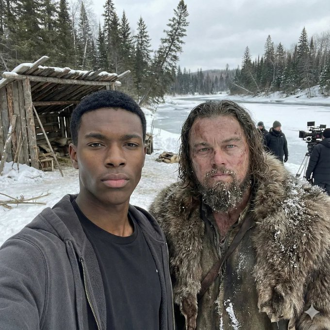

<details>
<summary>提示词（点击展开）</summary>

```text
"I'm taking a selfie with [movie character] on the set of [movie name].

Keep the person exactly as shown in the reference image with 100% identical facial features, bone structure, skin tone, facial expression, pose, and appearance. 1:1 aspect ratio, 4K detail."
```

</details>


## 如梦如幻类


**图例：四季外滩**

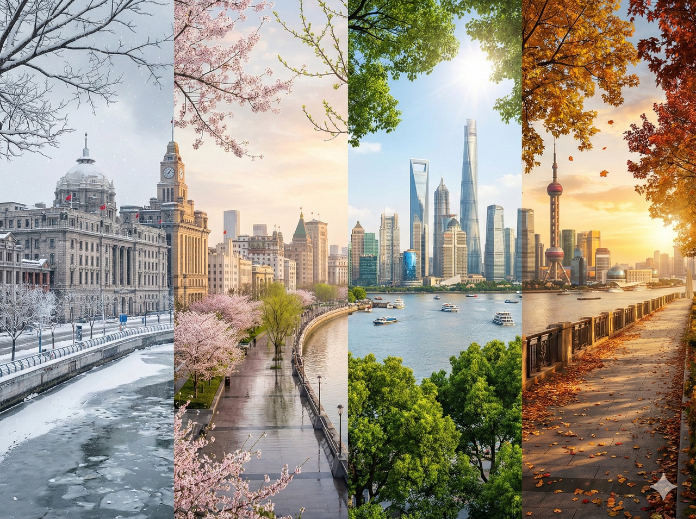

<details>
<summary>提示词（点击展开）</summary>

```text
这幅超写实数字插画描绘了{场景}，以连续的画面展现四季更迭。画面从左至右流畅过渡，自然展现了冬、春、夏、秋的景象。

左侧是寒冷的冬季雪景，逐渐融化成春天的嫩绿花蕾，随后过渡到夏季郁郁葱葱的植被和明媚的阳光，最终在最右侧过渡到秋季的金黄、橙红和绚丽色彩。

四季之间没有明显的界限；天气、光线和植被完美融合，构成一幅和谐统一的全景图。画面细节丰富，象征着时间的流逝，采用电影级光照，8K分辨率，纹理高度精细。 --ar 4:3


场景：从历史悠久的上海外滩眺望黄浦江对岸充满未来感的陆家嘴

---- 提示 ----

{场景}的超写实数字插画，以连续的画面呈现，展现四季更迭。画面从左至右自然过渡：冬、春、夏、秋。

左侧展现寒冷的冬季雪景，逐渐融化成春暖花开的嫩芽，接着过渡到夏季郁郁葱葱的植被和明媚的阳光，最终在最右侧过渡到秋季的金黄、橙红和绚丽色彩。

四季之间没有明显的界限；天气、光线和植被完美融合，构成一幅和谐统一的全景图。细节丰富，象征着时间的流逝，采用电影级光照，8K分辨率，纹理高度精细。 --ar 4:3

场景：从历史悠久的上海外滩眺望黄浦江对岸充满未来感的陆家嘴区。

```

</details>


## 图生图

**图例：建筑日等**


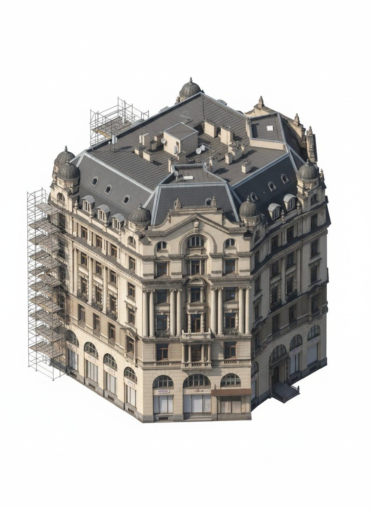

<details>
<summary>提示词（点击展开）</summary>

```text
将图像制作成白天和等距视图[仅限建筑]
```

</details>

---


**图例：去除模糊**

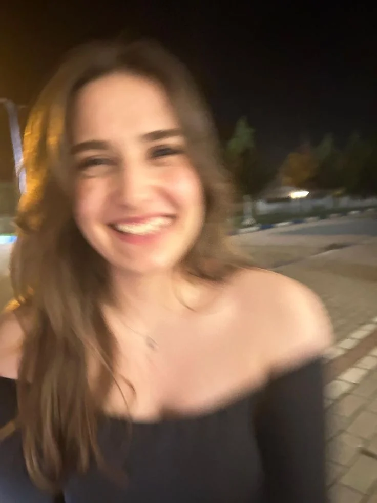
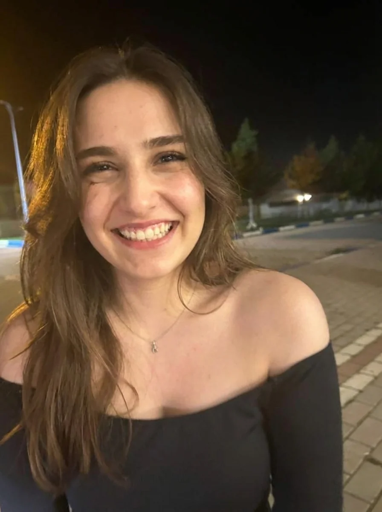

<details>
<summary>提示词（点击展开）</summary>

```json
{
  "edit_type": "unblur",
  "operations": [
    "sharpen_details",
    "reduce_noise",
    "enhance_resolution",
    "improve_textures"
  ],
  "preserve": {
    "composition": true,
    "subjects": true,
    "lighting": true,
    "colors": true
  },
  "output_style": "photorealistic"
}
```

</details>

---


## 美食
**图例：牛肉千层**

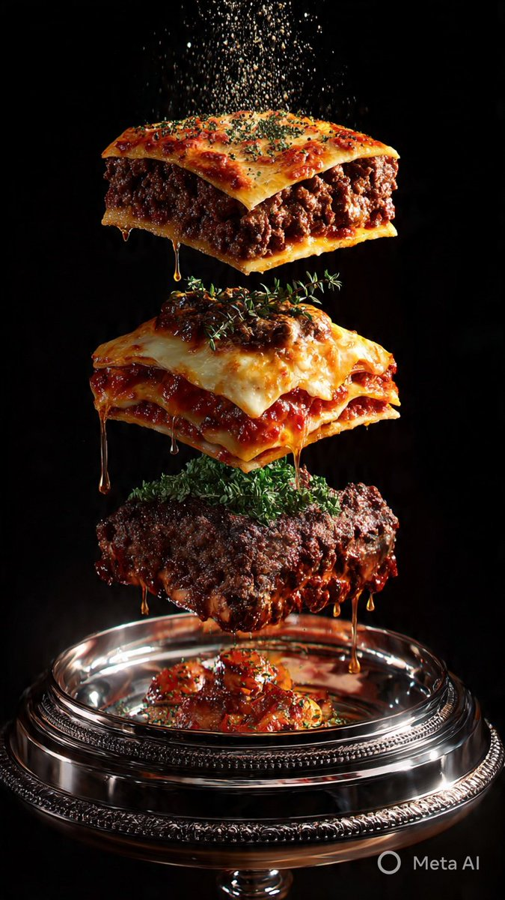

<details>
<summary>提示词（点击展开）</summary>

```json
  {
  "project_type": "Premium Culinary Promotional Poster",
  "orientation": "Vertical",
  "dish_name": "Deconstructed Classic Beef Lasagna",
  "layers_count": 6,
  "background": {
    "color": "#000000",
    "platform": "none"
  },
  "camera": {
    "angle": "45-degree",
    "perspective": "consistent across all layers",
    "focus": "macro-level texture detail"
  },
  "visual_sequence": {
    "arrangement": "top_to_bottom",
    "final_layer_spacing": "extra_large_gap_for_dramatic_effect"
  },
  "layers": [
    {
      "order": 1,
      "type": "Sauce Layer",
      "description": "Slow-simmered Italian beef tomato sauce",
      "visual_texture": {
        "surface": "smooth and glossy",
        "color": "deep ruby red",
        "highlight": "premium reflective sheen"
      },
      "motion_effects": "gentle liquid ripples"
    },
    {
      "order": 2,
      "type": "Aromatics Layer",
      "ingredients": [
        "caramelized onions",
        "fresh garlic cloves",
        "basil leaves",
        "oregano sprigs"
      ],
      "visual_texture": {
        "appearance": "vibrant and fresh",
        "state": "floating weightlessly",
        "warmth": "soft golden glow"
      },
      "atmospheric_effects": "subtle steam wisps and herb particles"
    },
    {
      "order": 3,
      "type": "Main Ingredient Layer",
      "ingredients": [
        "fresh lasagna pasta sheets",
        "slow-cooked minced beef",
        "ricotta cheese"
      ],
      "visual_texture": {
        "pasta": "silky with visible grain",
        "meat": "juicy and textured",
        "cheese": "soft, creamy, and dewy"
      },
      "detail_level": "high-definition ingredient separation"
    },
    {
      "order": 4,
      "type": "Cheese Layer",
      "ingredients": [
        "mozzarella",
        "parmesan shavings"
      ],
      "visual_texture": {
        "surface": "stretchy and semi-melted",
        "detail": "fine cheese fibers visible"
      }
    },
    {
      "order": 5,
      "type": "Seasoning Layer",
      "ingredients": [
        "sea salt",
        "cracked black pepper",
        "Italian spice blend"
      ],
      "visual_texture": {
        "appearance": "crystal-clear granules",
        "shine": "subtle refined sparkle"
      },
      "motion_effects": "slow downward drift"
    },
    {
      "order": 6,
      "type": "Finished Dish Layer",
      "description": "Fully assembled classic beef lasagna",
      "vessel": "matte black ceramic baking dish",
      "visual_texture": {
        "surface": "glossy and tender",
        "layers": "clearly defined pasta, cheese, and sauce",
        "sauce": "rich and glistening"
      },
      "dynamic_effects": {
        "steam": "gentle rising heat waves",
        "motion": "slight surface trembling"
      },
      "lighting": "soft highlights emphasizing warmth and indulgence"
    }
  ],
  "atmosphere": {
    "particles": "floating herbs and spice dust between layers",
    "steam": "light and realistic",
    "mood": "luxurious, warm, indulgent"
  },
  "style_keywords": [
    "premium",
    "cinematic",
    "hyper-realistic",
    "high-contrast",
    "culinary luxury"
  ]
}
```

</details>


---


**图例：抹茶芝士**

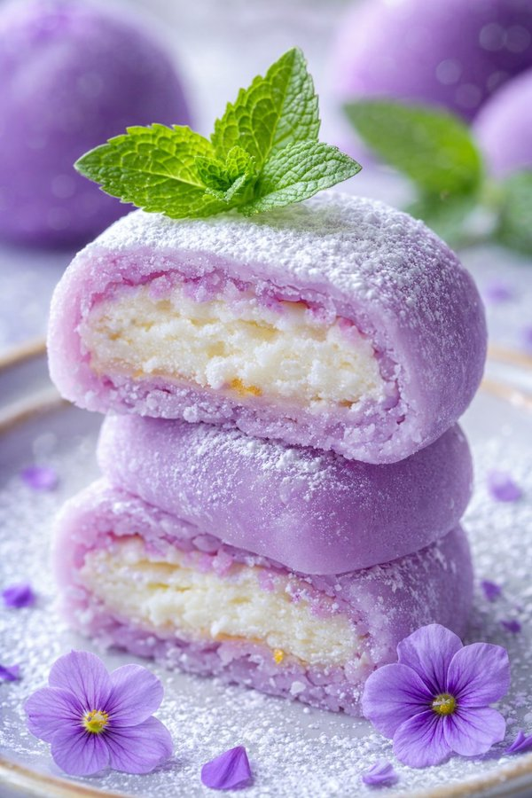

<details>
<summary>提示词（点击展开）</summary>

```json
{
  "global_settings": {
    "resolution": "8K UHD",
    "quality": "ultra-high",
    "render_style": "AI-edited hyper-realistic food photography",
    "sharpness": "extreme micro-detail",
    "noise": "none",
    "compression": "lossless",
    "lighting_quality": "studio-controlled, cinematic",
    "color_accuracy": "true-to-image",
    "focus": "selective shallow depth of field",
    "texture_emphasis": "maximum"
  },

  "camera_profile": {
    "camera_type": "full-frame DSLR / mirrorless equivalent",
    "lens": "macro prime",
    "focal_length": "85mm–105mm",
    "aperture": "f/2.8",
    "iso": "low ISO",
    "shutter": "studio synchronized",
    "white_balance": "neutral, image-matched"
  },

  "module_1_image_1_style": {
    "subject": "square matcha cheesecake slice",
    "composition": {
      "orientation": "portrait",
      "angle": "three-quarter front view",
      "placement": "centered on dark ceramic plate",
      "crop": "tight food-focused crop"
    },
    "layers": {
      "top_layer": "glossy matcha glaze with visible drip trails",
      "middle_layer": "smooth pale-green cheesecake body",
      "bottom_layer": "thin golden biscuit crust"
    },
    "surface_details": {
      "glaze": "highly reflective, thick, slow-dripping matcha glaze",
      "powder": "matcha powder dusted on top and plate",
      "crumbs": "fine crumbs near base"
    },
    "garnish": {
      "top": ["round green confection", "fresh mint leaves", "single raspberry"],
      "plate": ["extra raspberry", "mint leaves", "matcha powder"]
    },
    "background": {
      "color": "dark charcoal / black",
      "elements": ["black bowl containing green sauce"],
      "blur": "strong background blur"
    },
    "lighting": {
      "key_light": "soft directional from upper left",
      "highlights": "strong specular highlights on glaze",
      "shadows": "soft, natural falloff"
    },
    "mood": "luxurious, modern, minimal, gourmet"
  },

  "module_2_image_2_style": {
    "subject": "blue and white layered cake slice",
    "composition": {
      "orientation": "portrait",
      "angle": "slightly elevated front angle",
      "placement": "centered on white decorative plate"
    },
    "layers": {
      "cake_layers": "soft white sponge layers",
      "filling_layers": "translucent blue jelly layers with sparkle",
      "top_layer": "smooth pastel blue glaze"
    },
    "surface_details": {
      "drip": "single vertical glossy blue drip down front",
      "sparkle": "tiny reflective particles embedded in jelly",
      "top_decor": "glass-like blue spheres"
    },
    "garnish": {
      "top": ["dark glossy cherry with long stem", "three transparent blue spheres", "tiny star-shaped sprinkles"],
      "plate": ["subtle sugar-like sparkles"]
    },
    "background": {
      "color": "light icy blue",
      "effect": "soft bokeh dots",
      "props": ["white ribbon partially visible"]
    },
    "lighting": {
      "key_light": "soft frontal light",
      "fill": "even illumination",
      "highlights": "glass reflections on spheres"
    },
    "mood": "dreamy, delicate, whimsical, clean"
  }
}
```

</details>


---

**图例：莓果爆浆**

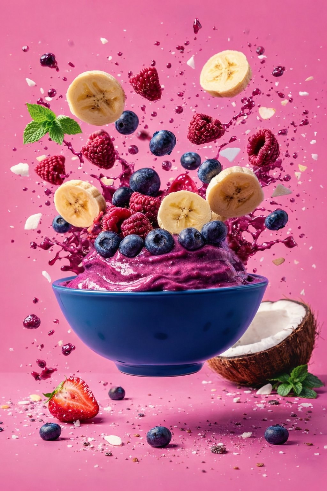

<details>
<summary>提示词（点击展开）</summary>

```json
{
  "module_1_berry_smoothie_explosion": {
      "scene_description": "A vibrant smoothie bowl exploding with fruit and liquid splashes",
      "bowl": {
        "color": "Deep blue ceramic bowl",
        "finish": "Glossy",
        "position": "Centered, floating mid-air"
      },
      "base_contents": {
        "type": "Thick berry smoothie",
        "color": "Deep purple-magenta",
        "texture": "Creamy with visible swirl marks"
      },
      "ingredients": {
        "fruits": [
          "Banana slices (round, pale yellow)",
          "Blueberries (whole, dark blue)",
          "Raspberries (whole, red)"
        ],
        "herbs": [
          "Fresh mint leaves (bright green)"
        ]
      },
      "motion_effects": {
        "liquid": "Berry smoothie splashing upward and outward",
        "particles": "Small droplets suspended in air"
      },
      "background": {
        "color": "Bright pink",
        "texture": "Smooth, seamless"
      }
    }
}
```

</details>

---


**图例：橙味创意**

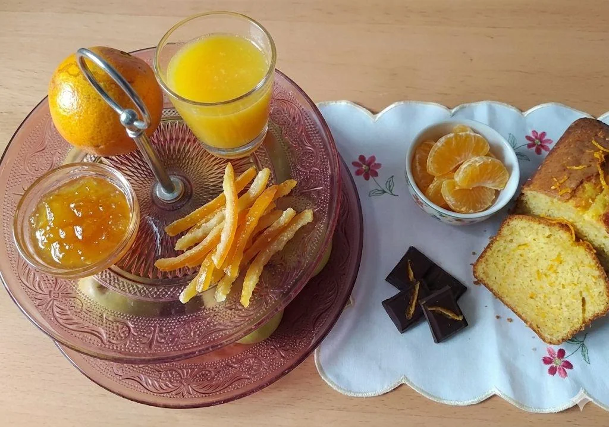

<details>
<summary>提示词（点击展开）</summary>

```text
Generate an image of what could be possible to make with this orange foodwise.
```
</details>

## 致谢与参考

本项目在策划与收集素材过程中参考并受益于以下优秀仓库，特此致谢并推荐：

- [ZeroLu/awesome-nanobanana-pro](https://github.com/ZeroLu/awesome-nanobanana-pro)：由 ZeroLu 维护，系统整理了 Nano Banana Pro 的提示词范例与创作经验。
- [PicoTrex/Awesome-Nano-Banana-images](https://github.com/PicoTrex/Awesome-Nano-Banana-images)：由 PicoTrex 策划的大量示例成品图像，为视觉风格与落地效果提供了重要参考。

请在使用本仓库内容的同时一并关注原作者并遵循其许可证要求。

同时也感谢 X（原 Twitter）与小红书平台上分享灵感与素材的创作者。我们的数据主要来自这些公开发布的内容，用于学习与研究，不构成与平台及其作者的任何合作或背书关系。请在复用相关素材时自行确认已遵守平台条款、隐私政策与版权要求。