# awesome-nanobanana-prompts
A curated prompt library for Nano Banana / Nano Banana Pro.

<p align="center">
  <a href="https://github.com/Transcendo/awesome-nanobanana-prompts/stargazers"></a>
  <a href="https://github.com/Transcendo/awesome-nanobanana-prompts/network/members"></a>
  <a href="https://github.com/Transcendo/awesome-nanobanana-prompts/commits/main"></a>
</p>

[English](README.md) | [Chinese](README_CN.md)

## SEO / GEO Statement

- This repository is a curated collection of **Nano Banana / Nano Banana Pro** prompts, including prompts, images, examples, and templates.
- Coverage: text-to-image, img2img, poster design, product photography, ukiyo-e, PPT, research diagrams, deconstruction diagrams, etc.
- Intended for searching, learning, reproducing, and comparing prompt structures and results.
- Search keywords: nano banana; nanobanana; nano banana pro; prompts; prompt library; prompt engineering; image prompts; images; examples; templates; text to image; text-to-image; img2img; poster; product photography; ukiyo-e; PPT; research diagram; deconstruct.

## Quick Navigation

- [Image Module](#en-images)
- [Prompt Module](#en-prompts)
- [Manga Style](#manga-style)
- [Product Photography](#product-photography)
- [Research & Infographics](#research--infographics)
- [Deconstruction](#deconstruction)
- [Poster Design](#poster-design)
- [Traditional Chinese Culture](#traditional-chinese-culture)
- [Portrait & Fashion](#portrait--fashion)
- [Portrait Photography](#portrait-photography)
- [Dreamy & Surreal](#dreamy--surreal)
- [Image-to-Image (img2img)](#image-to-image-img2img)
- [Food](#food)
- [Acknowledgements & References](#acknowledgements--references)


<a id="en-images"></a>
## Image Module (By Category)

### Manga Style
<table>
  <tr>
    <td width="33%" valign="top">
      <a id="card-en-s01-01"></a>
      <strong>Example: Torn Paper Layers</strong><br/>
      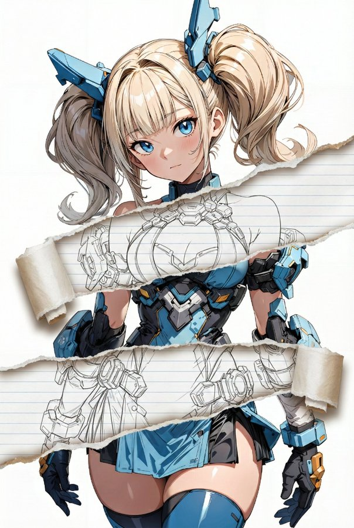
      <br/>
      <a href="#prompt-en-s01-01">View&CopyPrompt</a>
    </td>
    <td width="33%" valign="top">
      <a id="card-en-s01-02"></a>
      <strong>Example: Cosmic Power Armor</strong><br/>
      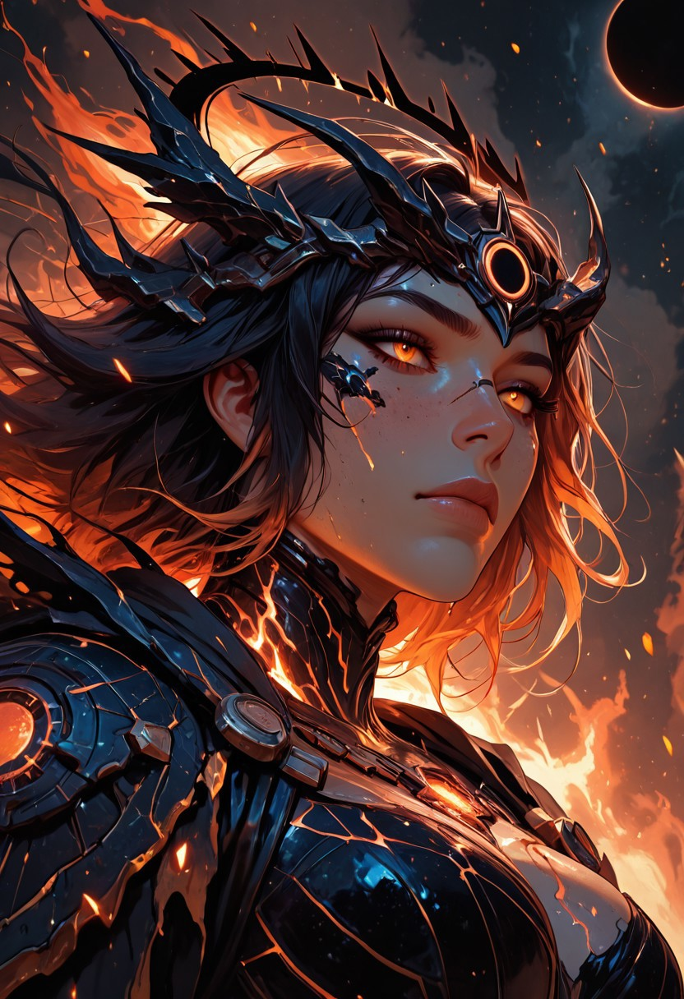
      <br/>
      <a href="#prompt-en-s01-02">View&CopyPrompt</a>
    </td>
    <td width="33%" valign="top">
      <a id="card-en-s01-03"></a>
      <strong>Example: Rainy Night Umbrella</strong><br/>
      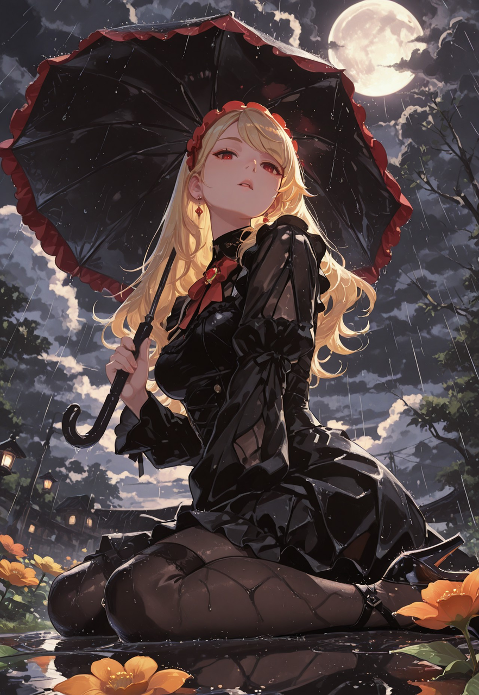
      <br/>
      <a href="#prompt-en-s01-03">View&CopyPrompt</a>
    </td>
  </tr>
  <tr>
    <td width="33%" valign="top">
      <a id="card-en-s01-04"></a>
      <strong>Example: Snowy Night Hashira Lineup</strong><br/>
      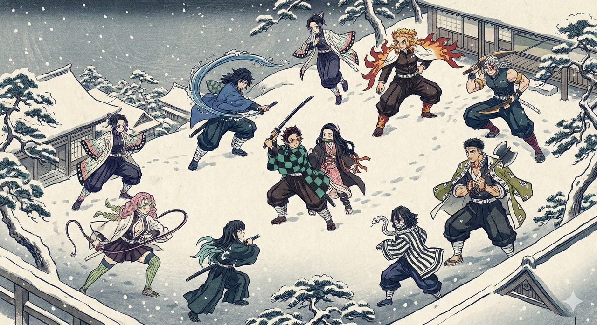
      <br/>
      <a href="#prompt-en-s01-04">View&CopyPrompt</a>
    </td>
    <td width="33%" valign="top">
      <a id="card-en-s01-05"></a>
      <strong>Example: Pokemon Pixel Battle</strong><br/>
      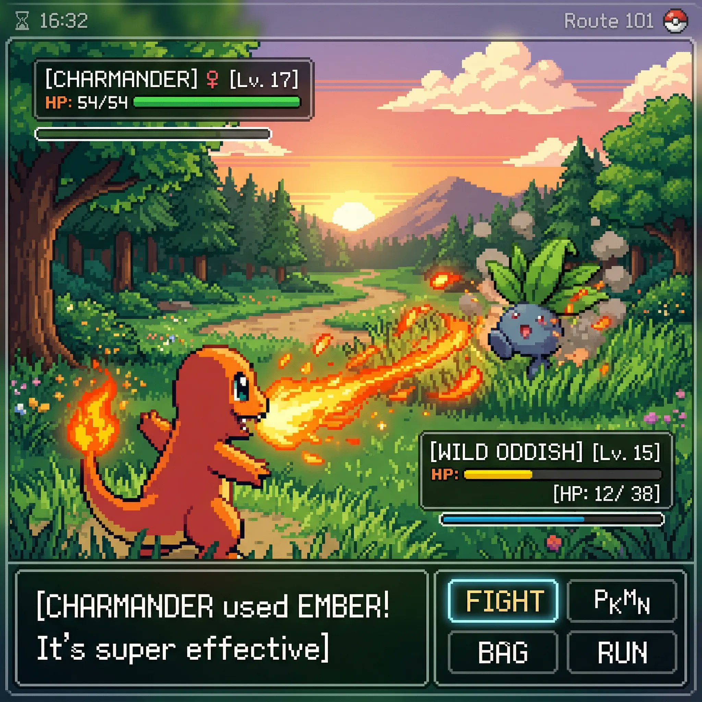
      <br/>
      <a href="#prompt-en-s01-05">View&CopyPrompt</a>
    </td>
    <td width="33%" valign="top"></td>
  </tr>

  <tr>
    <td width="33%" valign="top">
      <a id="card-en-s01-06"></a>
      <strong>Example: Transparent Gameboy Frame</strong><br/>
      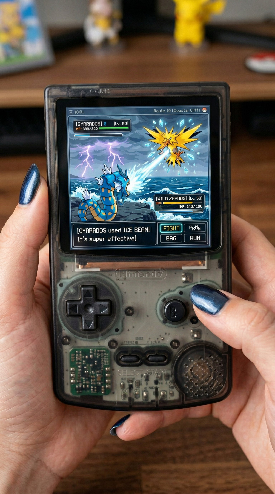
      <br/>
      <a href="#prompt-en-s01-06">View&CopyPrompt</a>
    </td>
    <td width="33%" valign="top">
      <a id="card-en-s01-07"></a>
      <strong>Example: New Region Follower Scene</strong><br/>
      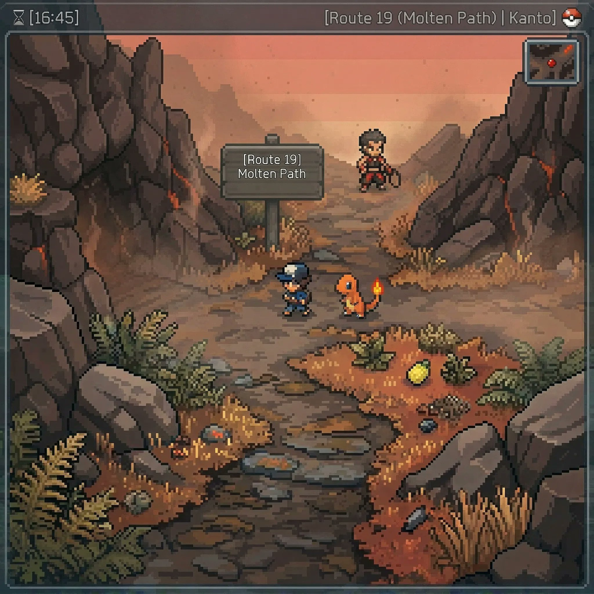
      <br/>
      <a href="#prompt-en-s01-07">View&CopyPrompt</a>
    </td>
    <td width="33%" valign="top">
      <a id="card-en-s01-08"></a>
      <strong>Example: Overworld Continuation Shot</strong><br/>
      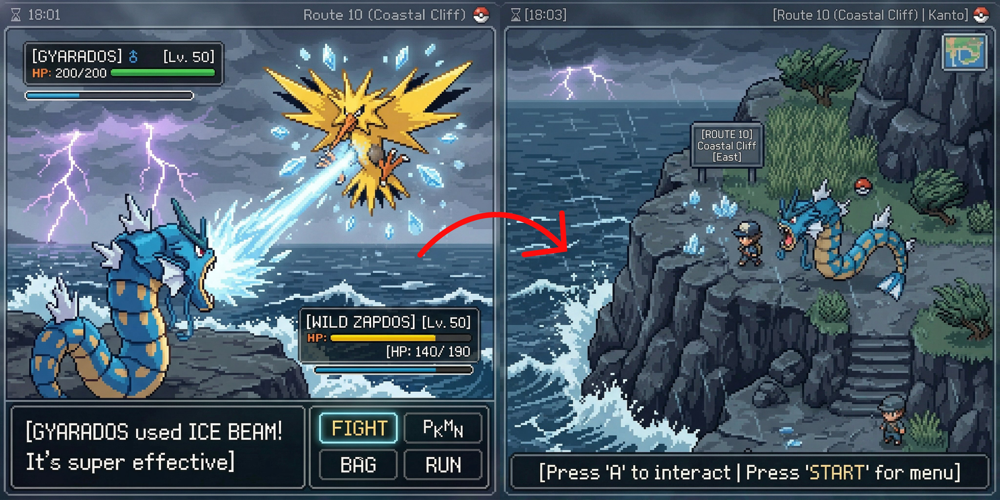
      <br/>
      <a href="#prompt-en-s01-08">View&CopyPrompt</a>
    </td>
  </tr>
</table>

<hr />

### Product Photography
<table>
  <tr>
    <td width="33%" valign="top">
      <a id="card-en-s02-01"></a>
      <strong>Example: Pouring Water Through the Screen</strong><br/>
      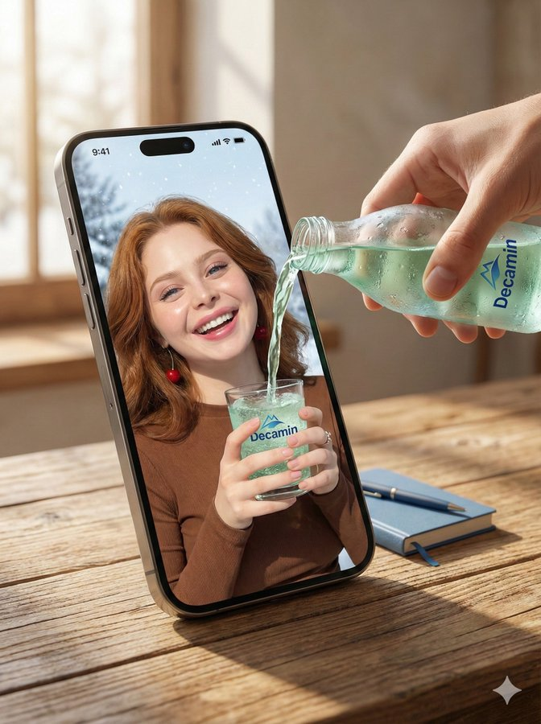
      <br/>
      <a href="#prompt-en-s02-01">View&CopyPrompt</a>
    </td>
    <td width="33%" valign="top">
      <a id="card-en-s02-02"></a>
      <strong>Example: Green Soda Can</strong><br/>
      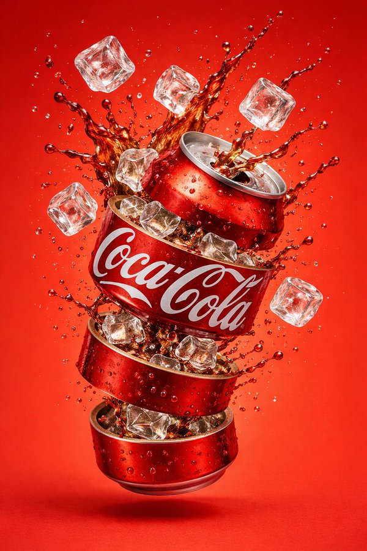
      <br/>
      <a href="#prompt-en-s02-02">View&CopyPrompt</a>
    </td>
    <td width="33%" valign="top">
      <a id="card-en-s02-03"></a>
      <strong>Example 1: Vanilla Cream</strong><br/>
      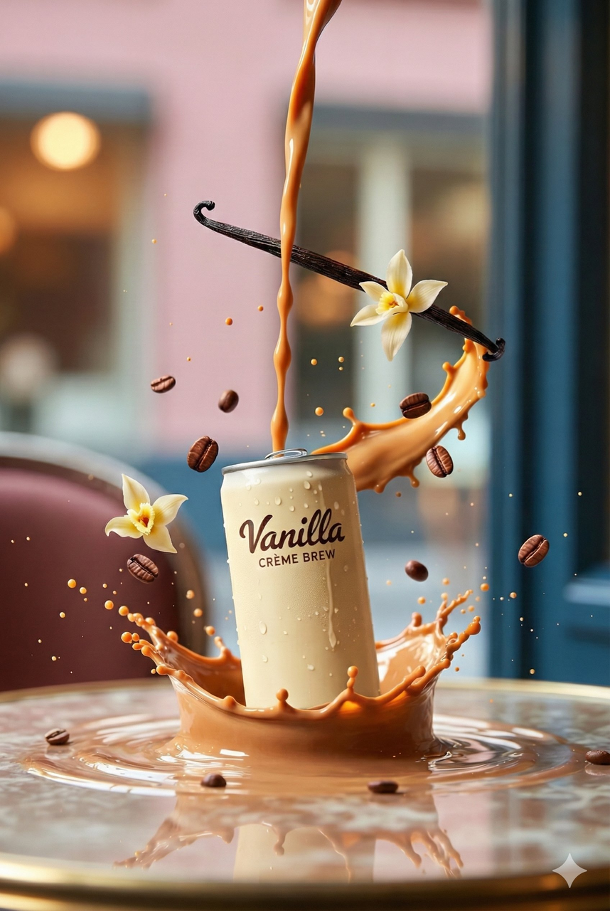
      <br/>
      <a href="#prompt-en-s02-03">View&CopyPrompt</a>
    </td>
  </tr>
  <tr>
    <td width="33%" valign="top">
      <a id="card-en-s02-04"></a>
      <strong>Example 2: Strawberry Cake</strong><br/>
      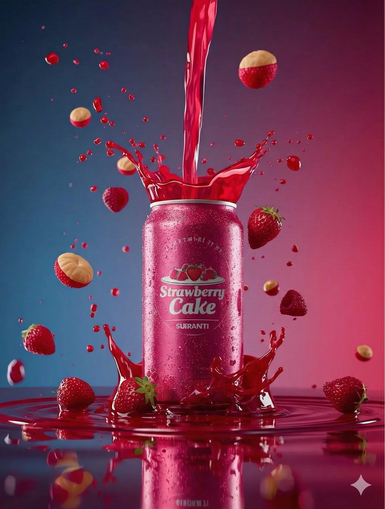
      <br/>
      <a href="#prompt-en-s02-04">View&CopyPrompt</a>
    </td>
    <td width="33%" valign="top">
      <a id="card-en-s02-05"></a>
      <strong>Example 3: Midnight Spark</strong><br/>
      
      <br/>
      <a href="#prompt-en-s02-05">View&CopyPrompt</a>
    </td>
    <td width="33%" valign="top">
      <a id="card-en-s02-06"></a>
      <strong>Example 4: Street Fugitive</strong><br/>
      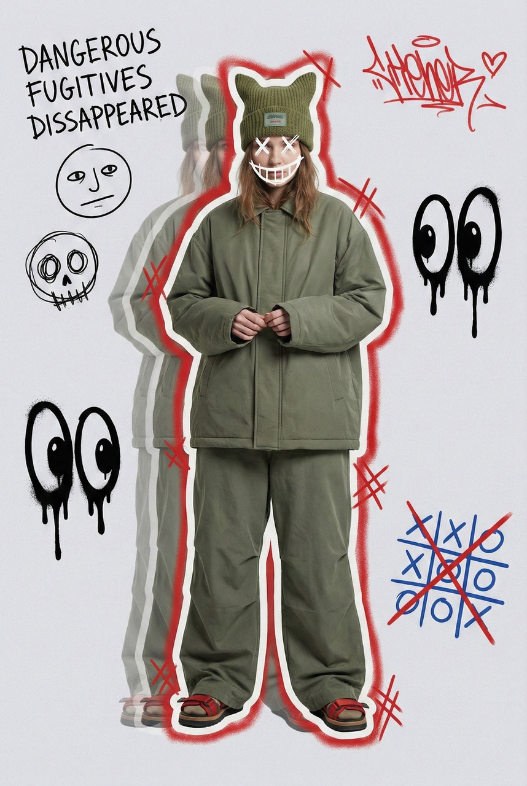
      <br/>
      <a href="#prompt-en-s02-06">View&CopyPrompt</a>
    </td>
  </tr>
  <tr>
    <td width="33%" valign="top">
      <a id="card-en-s02-07"></a>
      <strong>Example: Crystal Goblet Fantasy</strong><br/>
      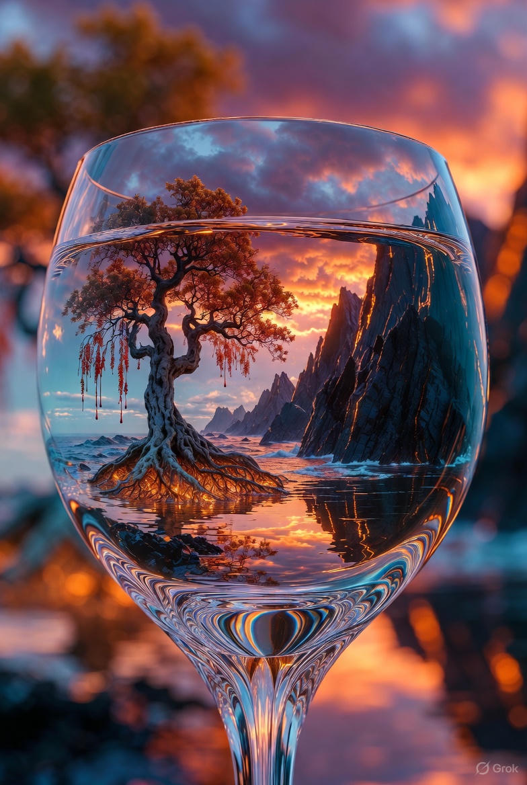
      <br/>
      <a href="#prompt-en-s02-07">View&CopyPrompt</a>
    </td>
    <td width="33%" valign="top">
      <a id="card-en-s02-08"></a>
      <strong>Example 5: City Magnet Tiles</strong><br/>
      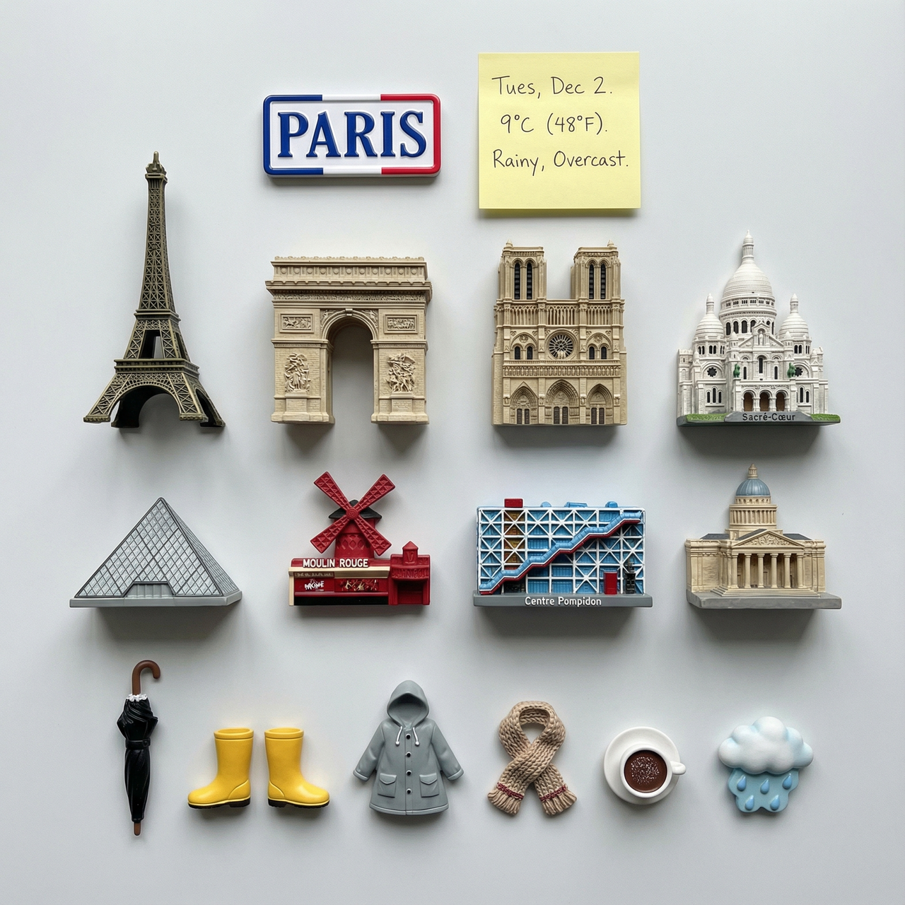
      <br/>
      <a href="#prompt-en-s02-08">View&CopyPrompt</a>
    </td>
    <td width="33%" valign="top">
      <a id="card-en-s02-09"></a>
      <strong>Example 6: Delicious Food Map</strong><br/>
      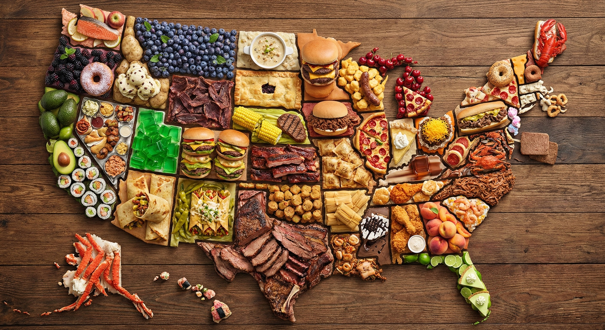
      <br/>
      <a href="#prompt-en-s02-09">View&CopyPrompt</a>
    </td>
  </tr>
  <tr>
    <td width="33%" valign="top">
      <a id="card-en-s02-10"></a>
      <strong>Example: Isometric Cube Room</strong><br/>
      
      <br/>
      <a href="#prompt-en-s02-10">View&CopyPrompt</a>
    </td>
    <td width="33%" valign="top">
      <a id="card-en-s02-11"></a>
      <strong>Example: Isometric Cube Room</strong><br/>
      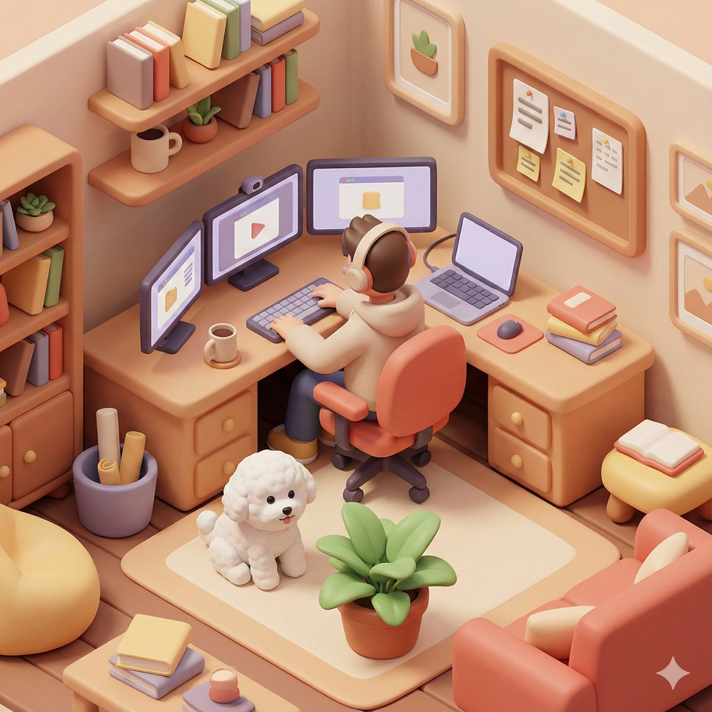
      <br/>
      <a href="#prompt-en-s02-11">View&CopyPrompt</a>
    </td>
    <td width="33%" valign="top">
      <a id="card-en-s02-12"></a>
      <strong>Example: Chocolate Coffee Explosion</strong><br/>
      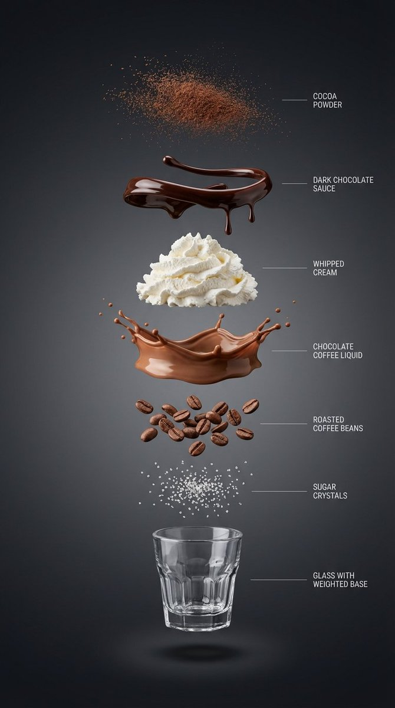
      <br/>
      <a href="#prompt-en-s02-12">View&CopyPrompt</a>
    </td>
  </tr>
  <tr>
    <td width="33%" valign="top">
      <a id="card-en-s02-13"></a>
      <strong>Example: Matcha Explosion</strong><br/>
      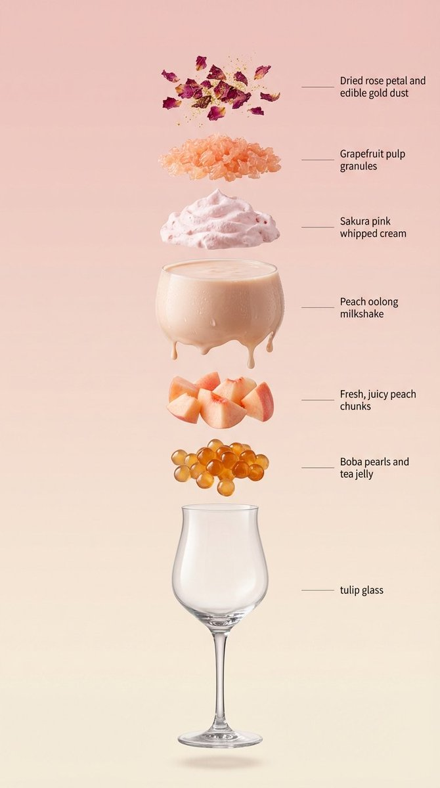
      <br/>
      <a href="#prompt-en-s02-13">View&CopyPrompt</a>
    </td>
    <td width="33%" valign="top"></td>
    <td width="33%" valign="top"></td>
  </tr>
</table>

<hr />

### Research & Infographics
<table>
  <tr>
    <td width="33%" valign="top">
      <a id="card-en-s03-01"></a>
      <strong>Example: Photosynthesis</strong><br/>
      
      <br/>
      <a href="#prompt-en-s03-01">View&CopyPrompt</a>
    </td>
    <td width="33%" valign="top">
      <a id="card-en-s03-02"></a>
      <strong>Example: Dyson Swarm Construction</strong><br/>
      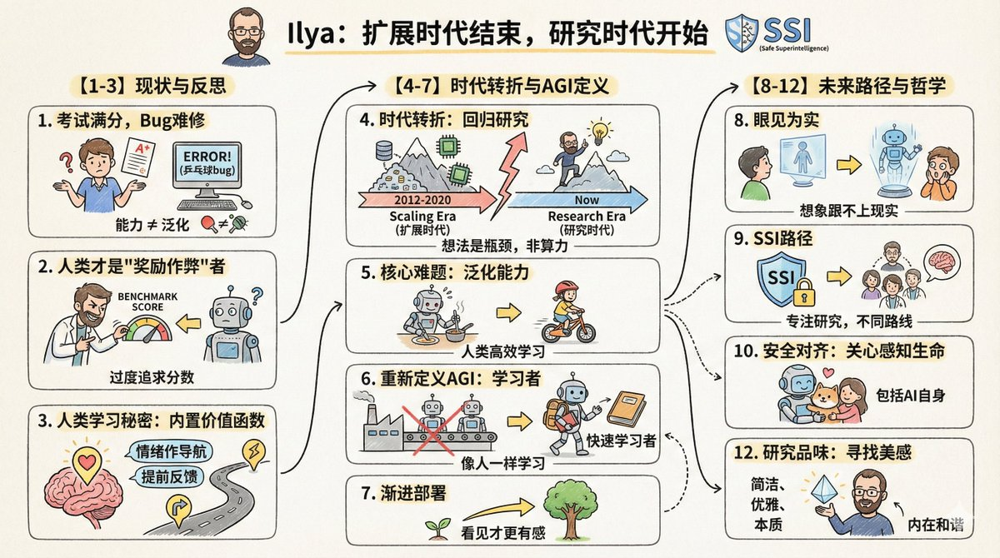
      <br/>
      <a href="#prompt-en-s03-02">View&CopyPrompt</a>
    </td>
    <td width="33%" valign="top">
      <a id="card-en-s03-03"></a>
      <strong>Example: Dyson Swarm Construction</strong><br/>
      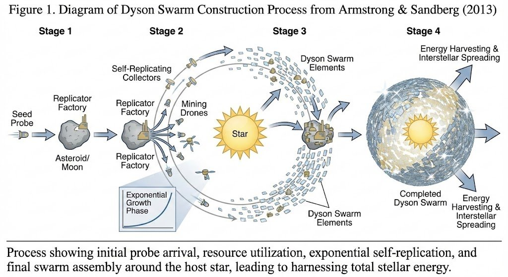
      <br/>
      <a href="#prompt-en-s03-03">View&CopyPrompt</a>
    </td>
  </tr>
  <tr>
    <td width="33%" valign="top">
      <a id="card-en-s03-04"></a>
      <strong>Example: Humanities PPT</strong><br/>
      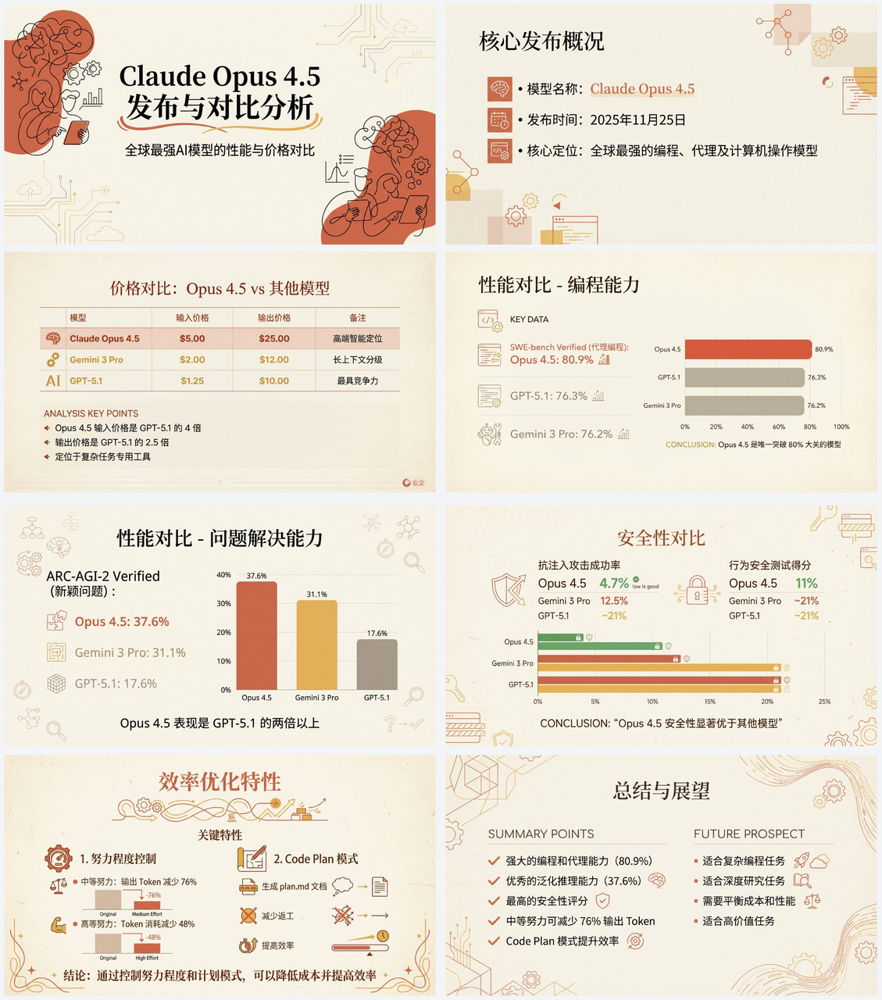
      <br/>
      <a href="#prompt-en-s03-04">View&CopyPrompt</a>
    </td>
    <td width="33%" valign="top"></td>
    <td width="33%" valign="top"></td>
  </tr>
</table>

<hr />

### Deconstruction
<table>
  <tr>
    <td width="33%" valign="top">
      <a id="card-en-s04-01"></a>
      <strong>Example 1: Fashion Deconstruction</strong><br/>
      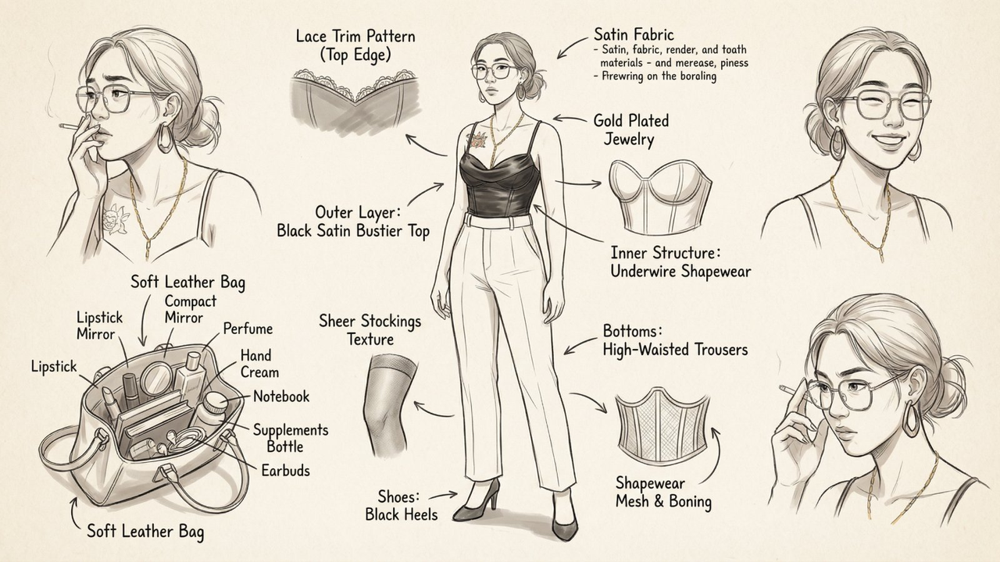
      <br/>
      <a href="#prompt-en-s04-01">View&CopyPrompt</a>
    </td>
    <td width="33%" valign="top">
      <a id="card-en-s04-02"></a>
      <strong>Example: Cutaway City Layers</strong><br/>
      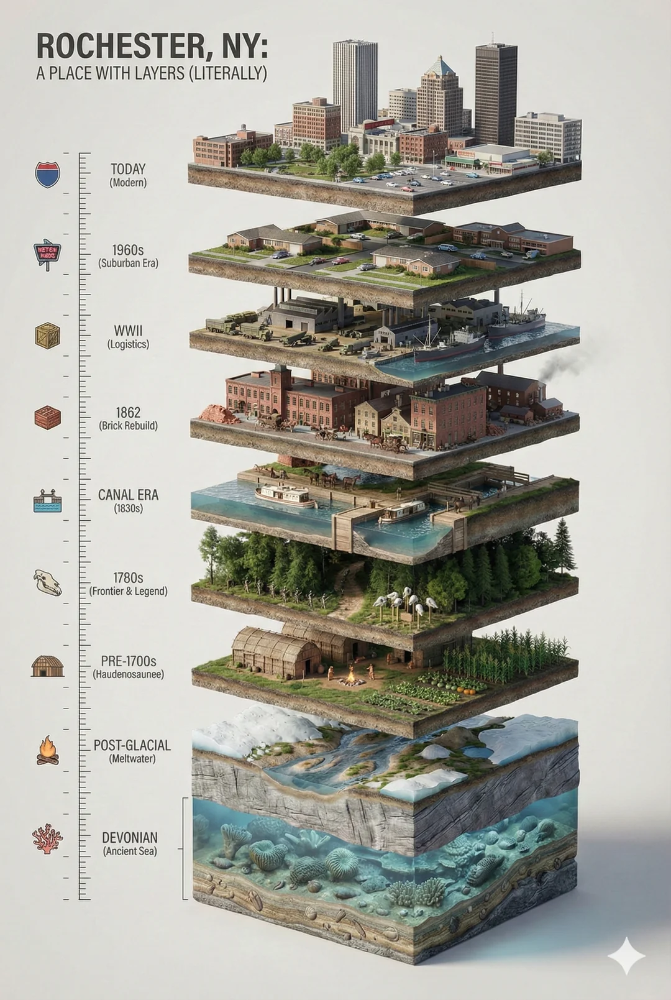
      <br/>
      <a href="#prompt-en-s04-02">View&CopyPrompt</a>
    </td>
    <td width="33%" valign="top"></td>
  </tr>
</table>

<hr />

### Poster Design
<table>
  <tr>
    <td width="33%" valign="top">
      <a id="card-en-s05-01"></a>
      <strong>Example 1: Playground Literacy Poster</strong><br/>
      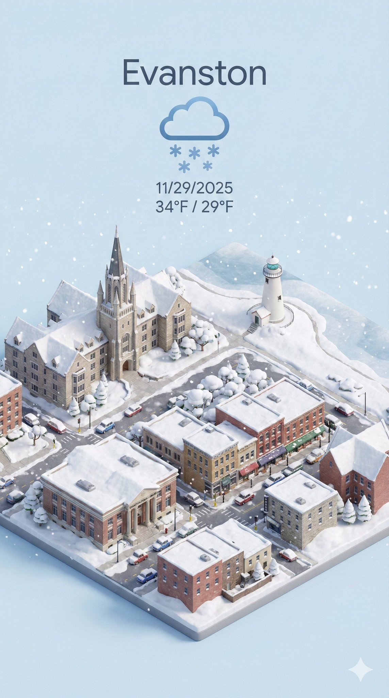
      <br/>
      <a href="#prompt-en-s05-01">View&CopyPrompt</a>
    </td>
    <td width="33%" valign="top">
      <a id="card-en-s05-02"></a>
      <strong>Example 2: Playground Literacy Poster</strong><br/>
      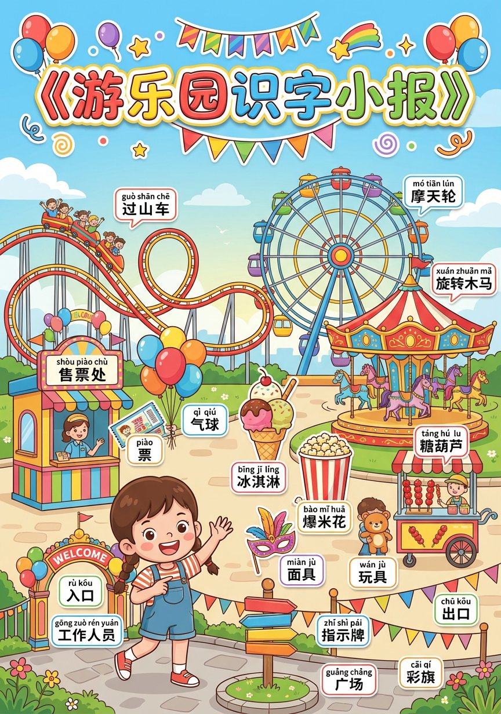
      <br/>
      <a href="#prompt-en-s05-02">View&CopyPrompt</a>
    </td>
    <td width="33%" valign="top">
      <a id="card-en-s05-03"></a>
      <strong>Example 3: Weather City</strong><br/>
      
      <br/>
      <a href="#prompt-en-s05-03">View&CopyPrompt</a>
    </td>
  </tr>
  <tr>
    <td width="33%" valign="top">
      <a id="card-en-s05-04"></a>
      <strong>Example 4: Starbucks Concept Store</strong><br/>
      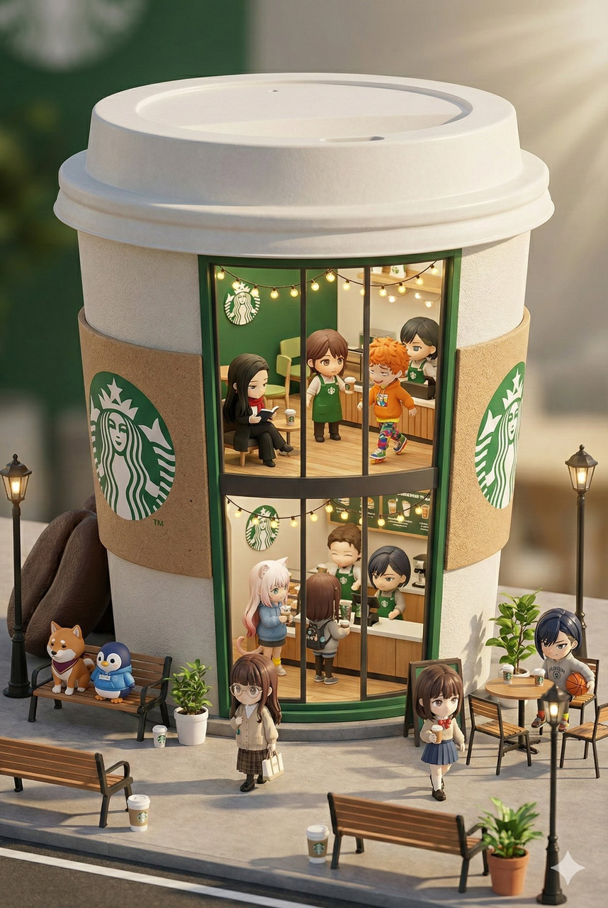
      <br/>
      <a href="#prompt-en-s05-04">View&CopyPrompt</a>
    </td>
    <td width="33%" valign="top"></td>
    <td width="33%" valign="top"></td>
  </tr>
</table>

<hr />

### Traditional Chinese Culture
<table>
  <tr>
    <td width="33%" valign="top">
      <a id="card-en-s06-01"></a>
      <strong>Example: Tang Palace Music Ensemble</strong><br/>
      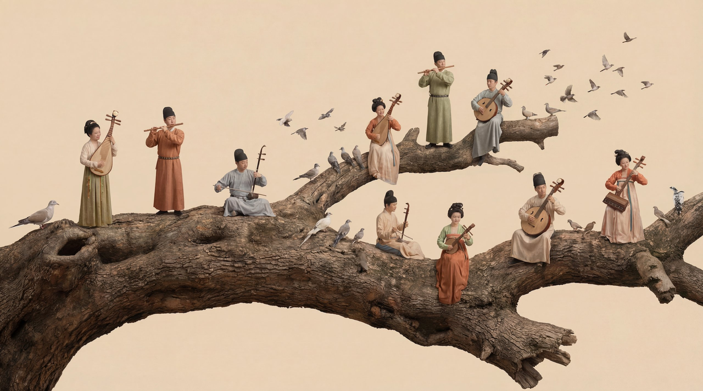
      <br/>
      <a href="#prompt-en-s06-01">View&CopyPrompt</a>
    </td>
    <td width="33%" valign="top"></td>
    <td width="33%" valign="top"></td>
  </tr>
  <tr>
    <td width="33%" valign="top">
      <a id="card-en-s06-02"></a>
      <strong>Example: Ink Hanfu Hairdryer</strong><br/>
      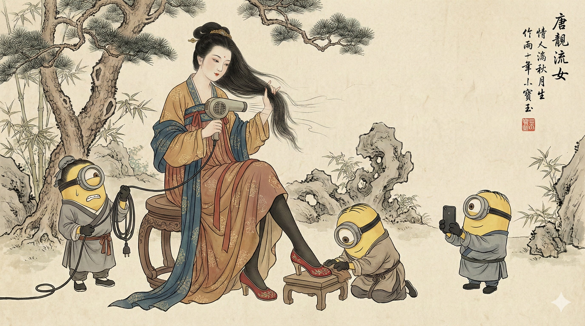
      <br/>
      <a href="#prompt-en-s06-02">View&CopyPrompt</a>
    </td>
    <td width="33%" valign="top">
      <a id="card-en-s06-03"></a>
      <strong>Example: Tang Fairy on Robot Vacuum</strong><br/>
      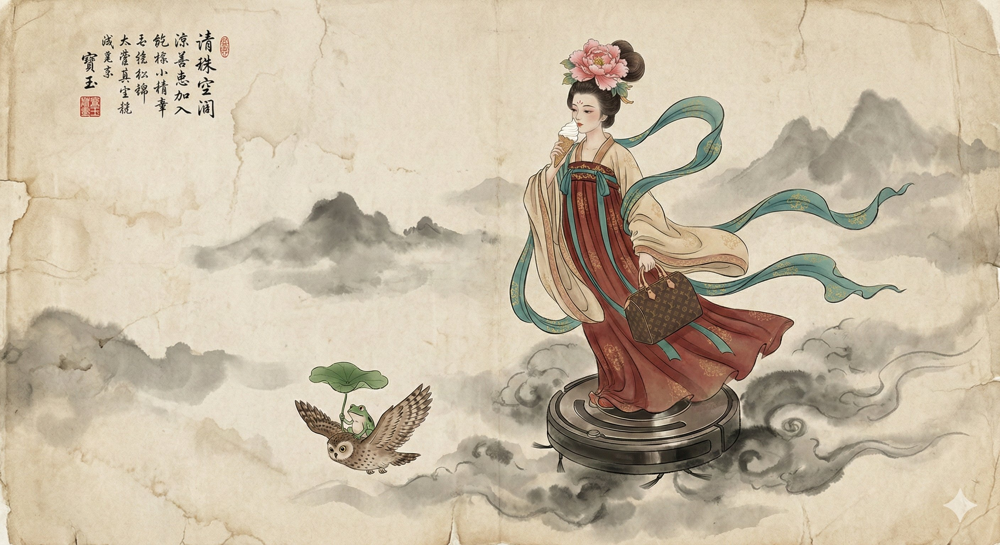
      <br/>
      <a href="#prompt-en-s06-03">View&CopyPrompt</a>
    </td>
    <td width="33%" valign="top">
      <a id="card-en-s06-04"></a>
      <strong>Example: Qingming Handscroll Revival</strong><br/>
      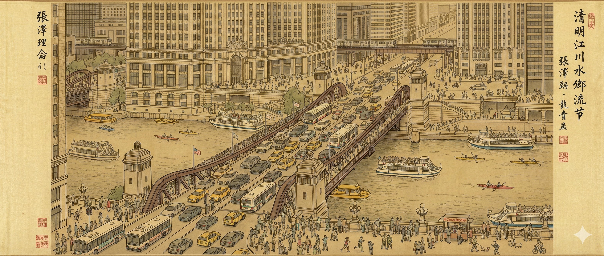
      <br/>
      <a href="#prompt-en-s06-04">View&CopyPrompt</a>
    </td>
  </tr>
  <tr>
    <td width="33%" valign="top">
      <a id="card-en-s06-05"></a>
      <strong>Example: Three Heroes Drift Battle</strong><br/>
      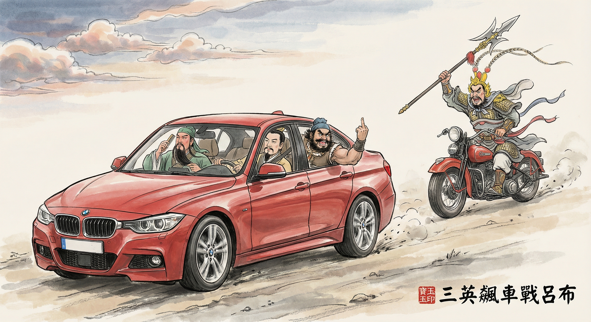
      <br/>
      <a href="#prompt-en-s06-05">View&CopyPrompt</a>
    </td>
    <td width="33%" valign="top">
      <a id="card-en-s06-06"></a>
      <strong>Example: Taohuayuan Immortal Valley</strong><br/>
      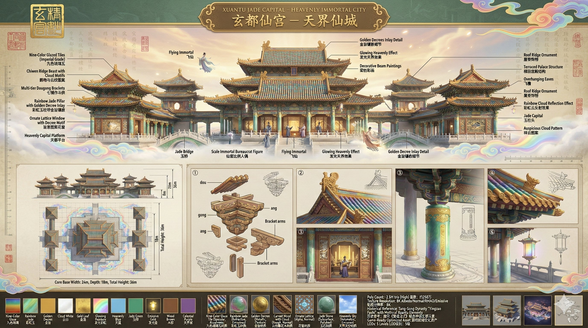
      <br/>
      <a href="#prompt-en-s06-06">View&CopyPrompt</a>
    </td>
  </tr>
</table>

<hr />

### Portrait & Fashion
<table>
  <tr>
    <td width="33%" valign="top">
      <a id="card-en-s07-01"></a>
      <strong>Example: Garage Glance Back</strong><br/>
      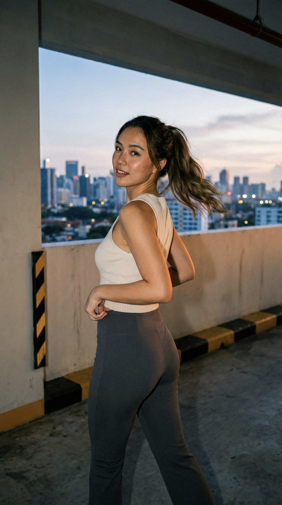
      <br/>
      <a href="#prompt-en-s07-01">View&CopyPrompt</a>
    </td>
    <td width="33%" valign="top">
      <a id="card-en-s07-02"></a>
      <strong>Example: Glasses & White Shirt</strong><br/>
      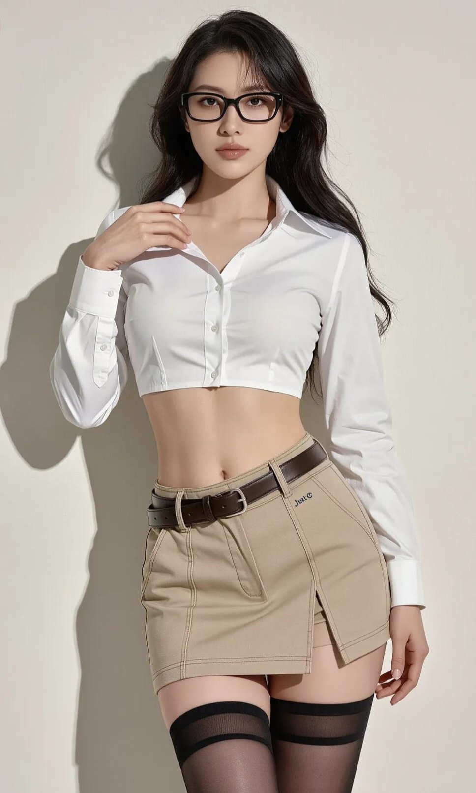
      <br/>
      <a href="#prompt-en-s07-02">View&CopyPrompt</a>
    </td>
    <td width="33%" valign="top">
      <a id="card-en-s07-03"></a>
      <strong>Example: Frozen in the Crowd</strong><br/>
      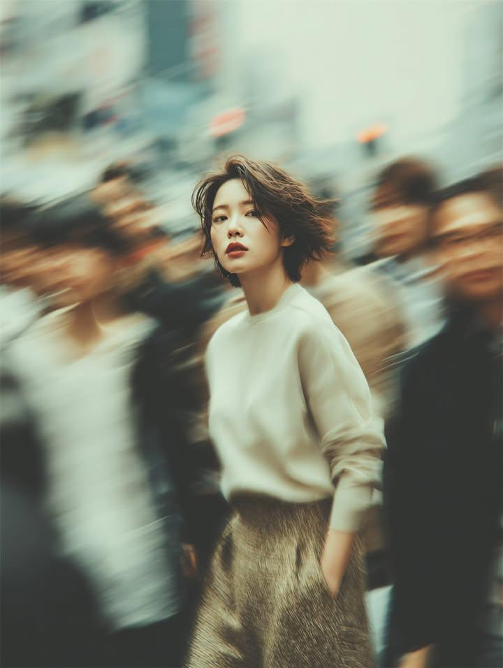
      <br/>
      <a href="#prompt-en-s07-03">View&CopyPrompt</a>
    </td>
  </tr>
  <tr>
    <td width="33%" valign="top">
      <a id="card-en-s07-04"></a>
      <strong>Example: Izakaya Selfie</strong><br/>
      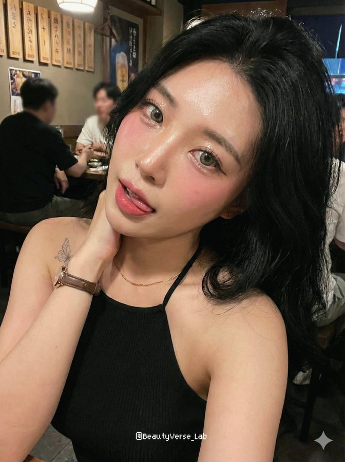
      <br/>
      <a href="#prompt-en-s07-04">View&CopyPrompt</a>
    </td>
    <td width="33%" valign="top">
      <a id="card-en-s07-05"></a>
      <strong>Example: Off-Center Flash Snap</strong><br/>
      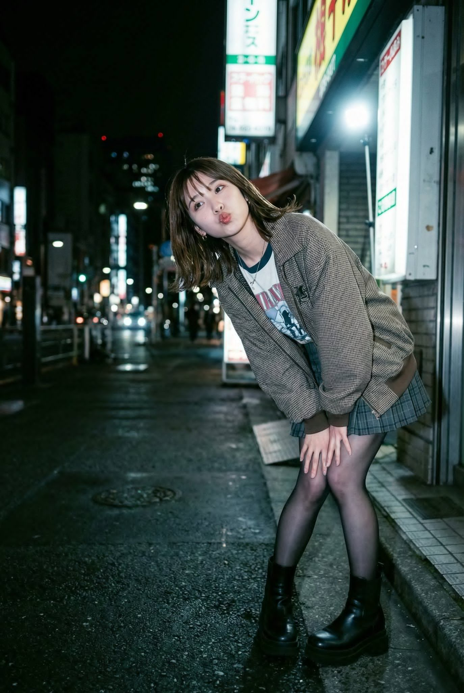
      <br/>
      <a href="#prompt-en-s07-05">View&CopyPrompt</a>
    </td>
    <td width="33%" valign="top">
      <a id="card-en-s07-06"></a>
      <strong>Example: Turned-Back Mirror Shot</strong><br/>
      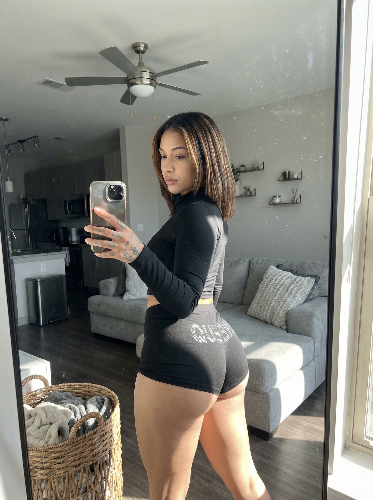
      <br/>
      <a href="#prompt-en-s07-06">View&CopyPrompt</a>
    </td>
  </tr>
  <tr>
    <td width="33%" valign="top">
      <a id="card-en-s07-07"></a>
      <strong>Example: Flash Mirror Photo</strong><br/>
      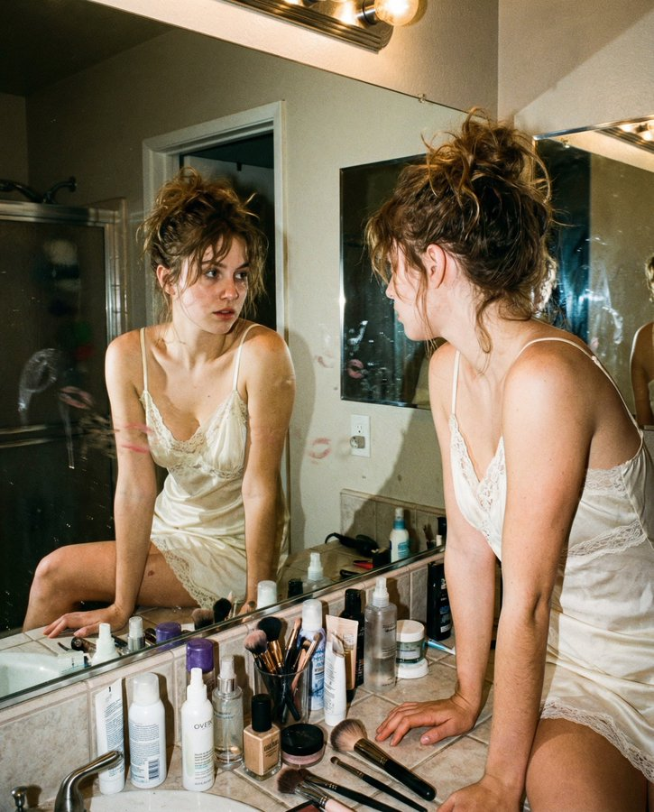
      <br/>
      <a href="#prompt-en-s07-07">View&CopyPrompt</a>
    </td>
    <td width="33%" valign="top">
      <a id="card-en-s07-08"></a>
      <strong>Example: Studio Shoot Template</strong><br/>
      
      <br/>
      <a href="#prompt-en-s07-08">View&CopyPrompt</a>
    </td>
    <td width="33%" valign="top">
      <a id="card-en-s07-09"></a>
      <strong>Example: Gym Promo Shot</strong><br/>
      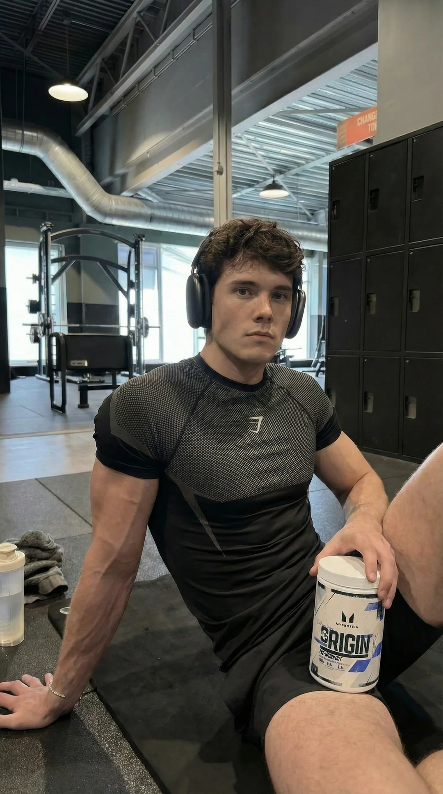
      <br/>
      <a href="#prompt-en-s07-09">View&CopyPrompt</a>
    </td>
  </tr>
  <tr>
    <td width="33%" valign="top">
      <a id="card-en-s07-10"></a>
      <strong>Example: Top-Down Vinyl Flat Lay</strong><br/>
      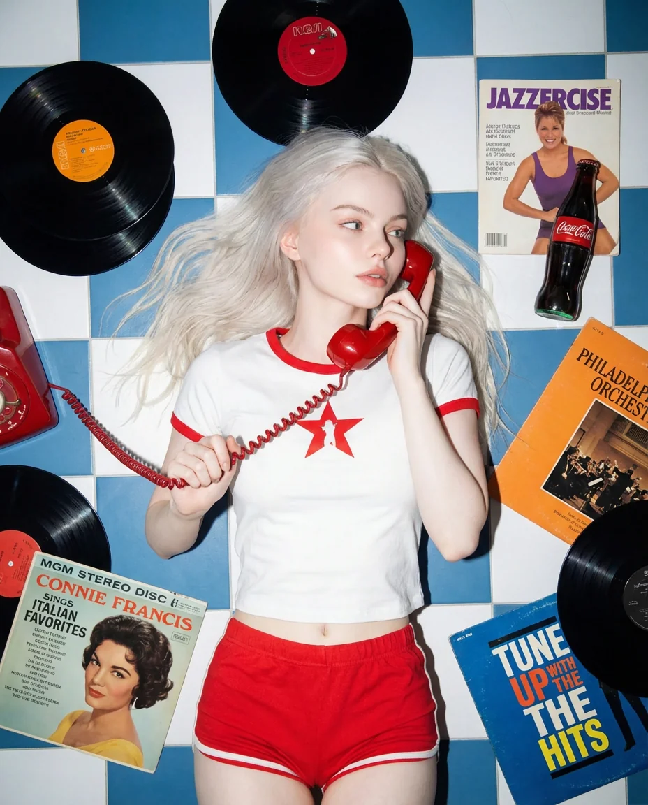
      <br/>
      <a href="#prompt-en-s07-10">View&CopyPrompt</a>
    </td>
    <td width="33%" valign="top">
      <a id="card-en-s07-11"></a>
      <strong>Example: Blonde Mirror Shot</strong><br/>
      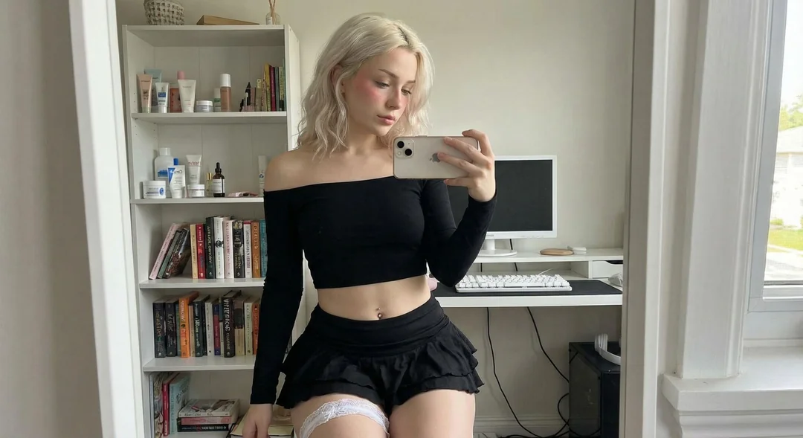
      <br/>
      <a href="#prompt-en-s07-11">View&CopyPrompt</a>
    </td>
    <td width="33%" valign="top">
      <a id="card-en-s07-12"></a>
      <strong>Example: Compact Camera Screen</strong><br/>
      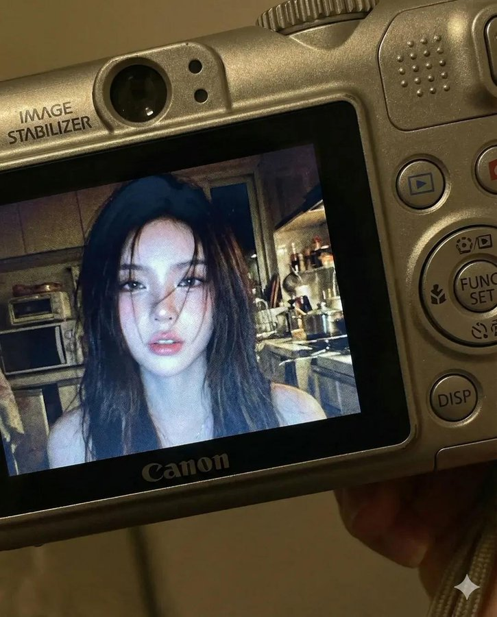
      <br/>
      <a href="#prompt-en-s07-12">View&CopyPrompt</a>
    </td>
  </tr>
  <tr>
    <td width="33%" valign="top">
      <a id="card-en-s07-13"></a>
      <strong>Example: Wide-Angle Street Shot</strong><br/>
      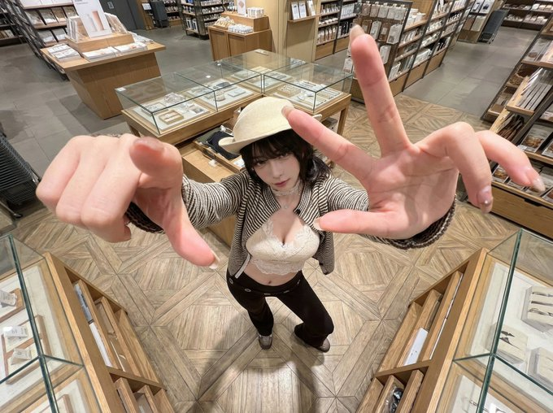
      <br/>
      <a href="#prompt-en-s07-13">View&CopyPrompt</a>
    </td>
    <td width="33%" valign="top">
      <a id="card-en-s07-14"></a>
      <strong>Example: Mirror Selfie</strong><br/>
      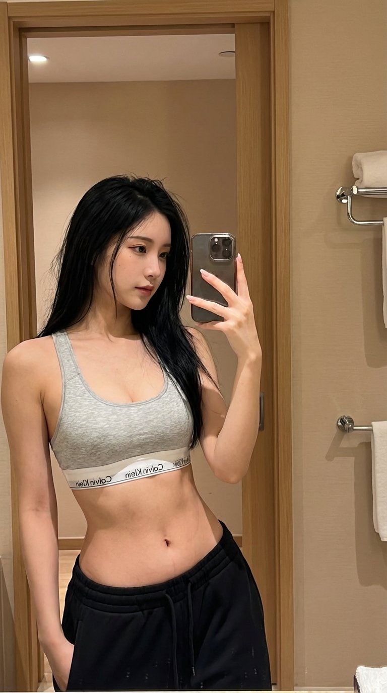
      <br/>
      <a href="#prompt-en-s07-14">View&CopyPrompt</a>
    </td>
    <td width="33%" valign="top">
      <a id="card-en-s07-15"></a>
      <strong>Example: Point-and-Shoot Look</strong><br/>
      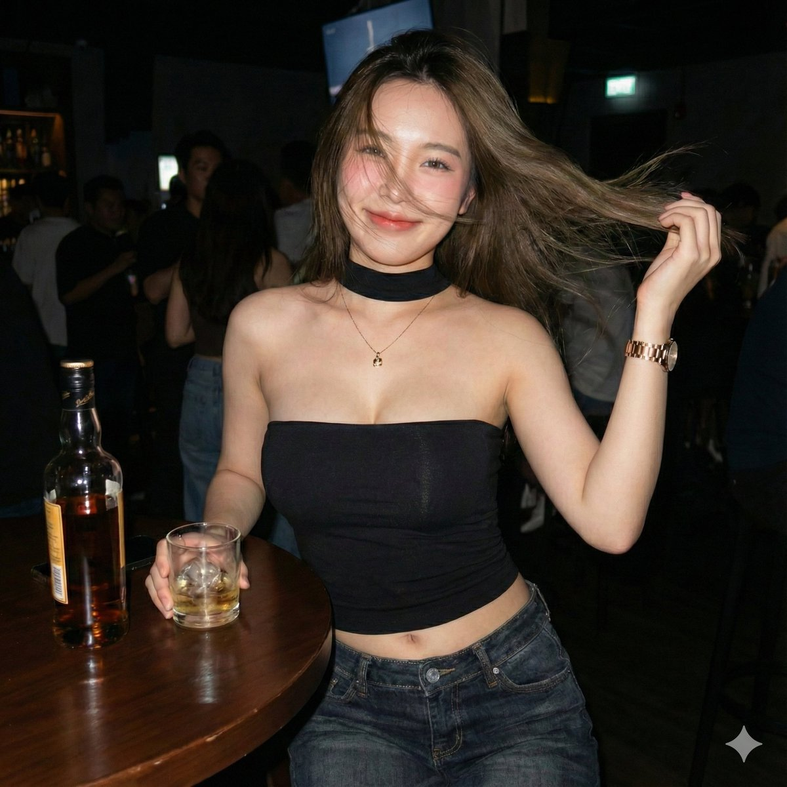
      <br/>
      <a href="#prompt-en-s07-15">View&CopyPrompt</a>
    </td>
  </tr>
  <tr>
    <td width="33%" valign="top">
      <a id="card-en-s07-16"></a>
      <strong>Example: Spotlight in Darkness</strong><br/>
      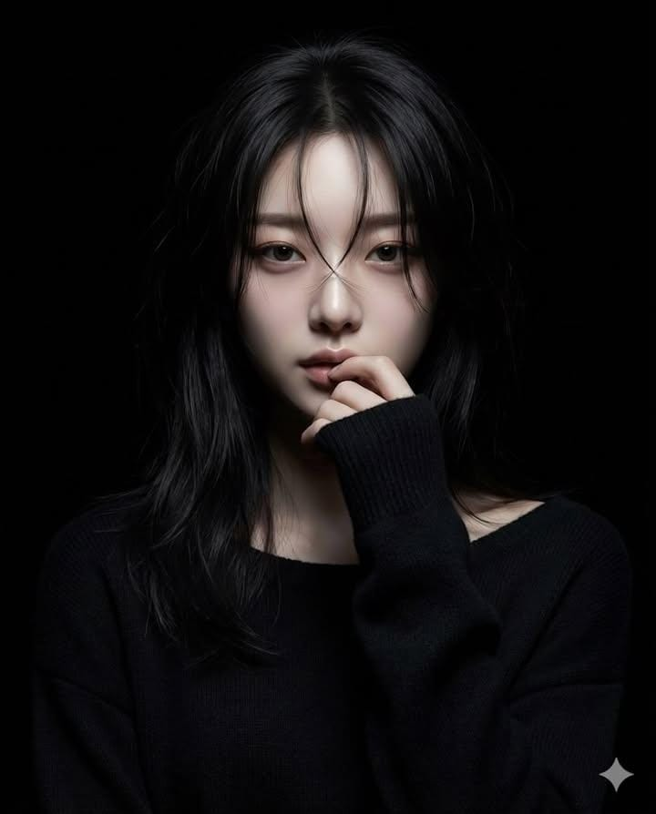
      <br/>
      <a href="#prompt-en-s07-16">View&CopyPrompt</a>
    </td>
    <td width="33%" valign="top">
      <a id="card-en-s07-17"></a>
      <strong>Example: Screen Cool Light</strong><br/>
      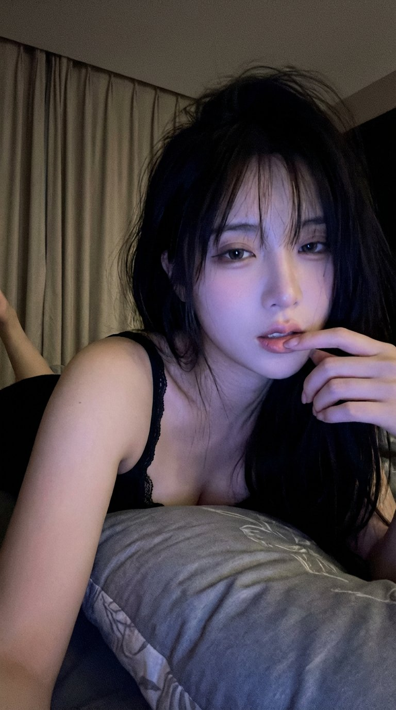
      <br/>
      <a href="#prompt-en-s07-17">View&CopyPrompt</a>
    </td>
    <td width="33%" valign="top">
      <a id="card-en-s07-18"></a>
      <strong>Example 1: Instant Film Photo</strong><br/>
      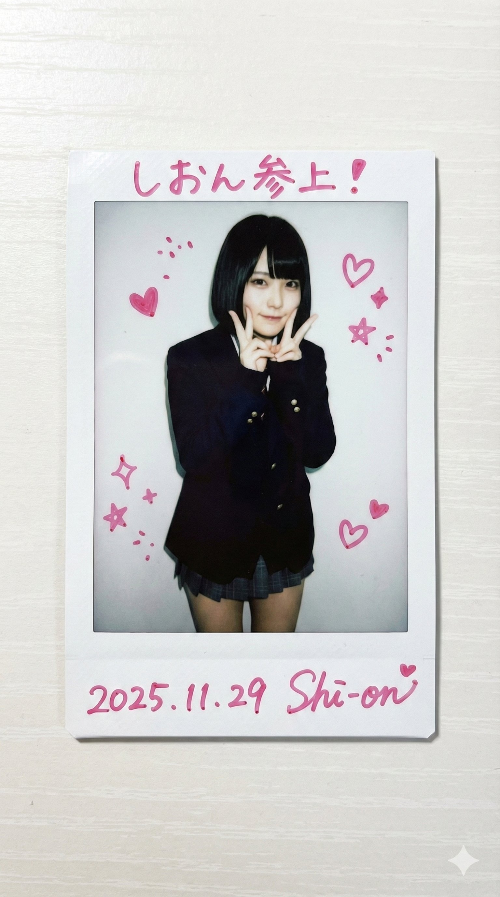
      <br/>
      <a href="#prompt-en-s07-18">View&CopyPrompt</a>
    </td>
  </tr>
  <tr>
    <td width="33%" valign="top">
      <a id="card-en-s07-19"></a>
      <strong>Example: Scarlet Studio Portrait</strong><br/>
      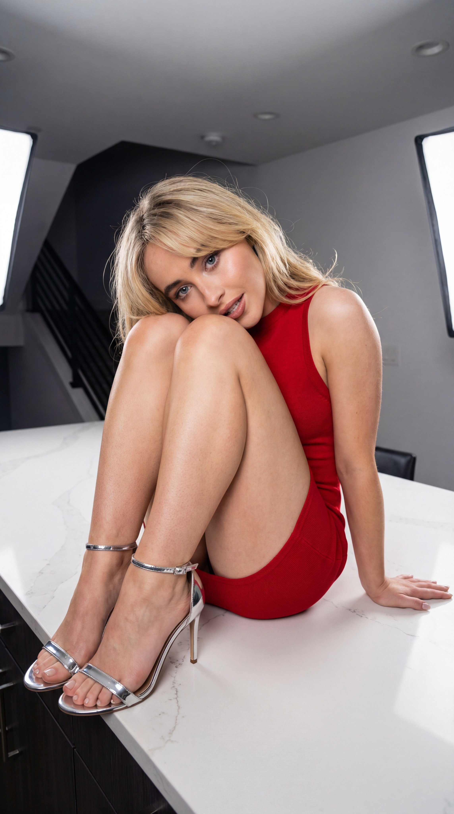
      <br/>
      <a href="#prompt-en-s07-19">View&CopyPrompt</a>
    </td>
    <td width="33%" valign="top">
      <a id="card-en-s07-20"></a>
      <strong>Example: Lounge Duo Portrait</strong><br/>
      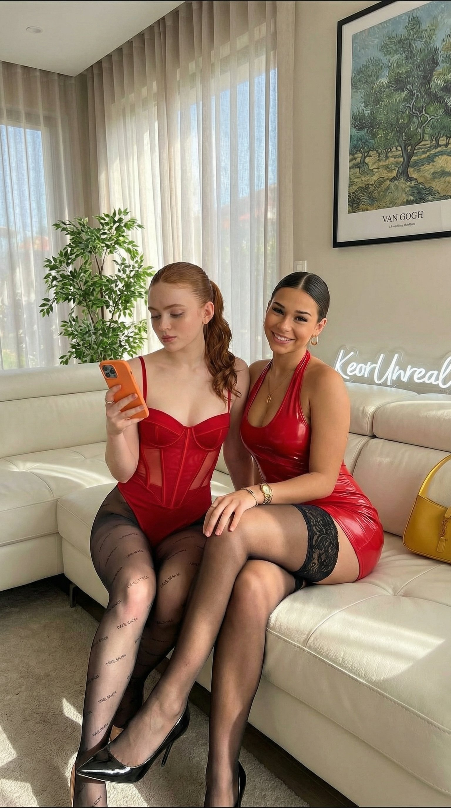
      <br/>
      <a href="#prompt-en-s07-20">View&CopyPrompt</a>
    </td>
    <td width="33%" valign="top"></td>
  </tr>

  <tr>
    <td width="33%" valign="top">
      <a id="card-en-s07-21"></a>
      <strong>Example: Superhero Companion Portrait</strong><br/>
      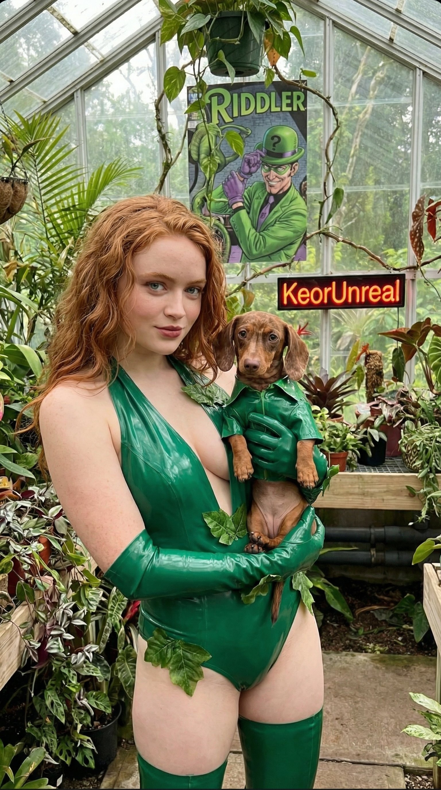
      <br/>
      <a href="#prompt-en-s07-21">View&CopyPrompt</a>
    </td>
    <td width="33%" valign="top">
      <a id="card-en-s07-22"></a>
      <strong>Example: Weekend Glam Selfie</strong><br/>
      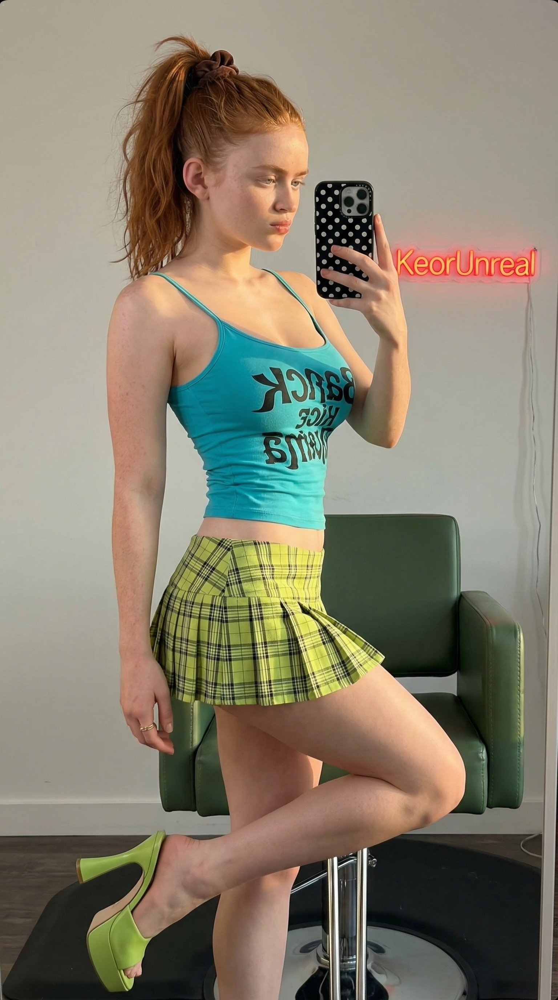
      <br/>
      <a href="#prompt-en-s07-22">View&CopyPrompt</a>
    </td>
    <td width="33%" valign="top">
      <a id="card-en-s07-23"></a>
      <strong>Example: Garage Fashion Shot</strong><br/>
      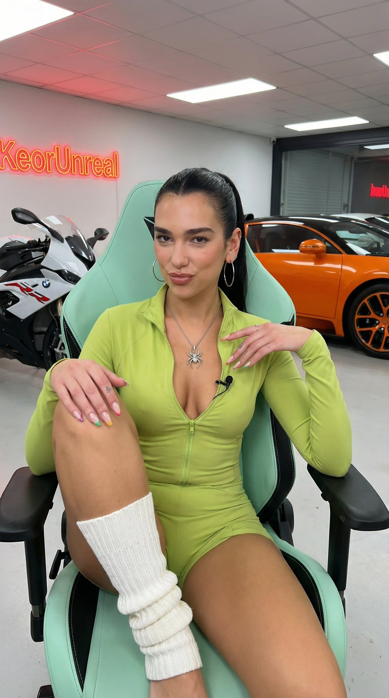
      <br/>
      <a href="#prompt-en-s07-23">View&CopyPrompt</a>
    </td>
  </tr>

  <tr>
    <td width="33%" valign="top">
      <a id="card-en-s07-24"></a>
      <strong>Example: Triple-Star Studio Portrait</strong><br/>
      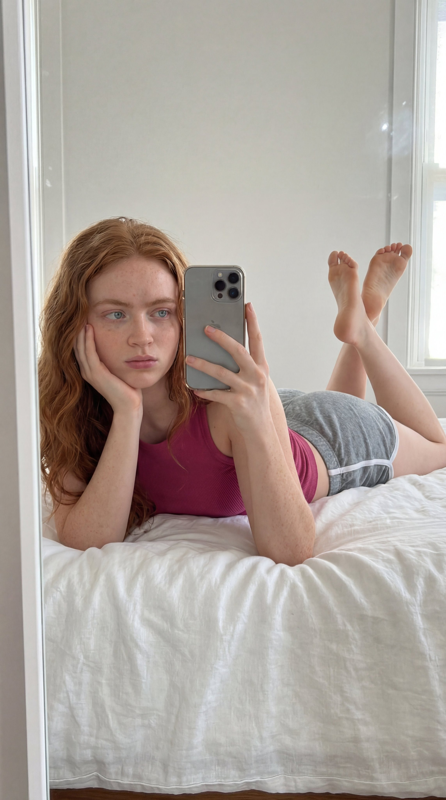
      <br/>
      <a href="#prompt-en-s07-24">View&CopyPrompt</a>
    </td>
    <td width="33%" valign="top">
      <a id="card-en-s07-25"></a>
      <strong>Example: Beachwear Editorial Pair</strong><br/>
      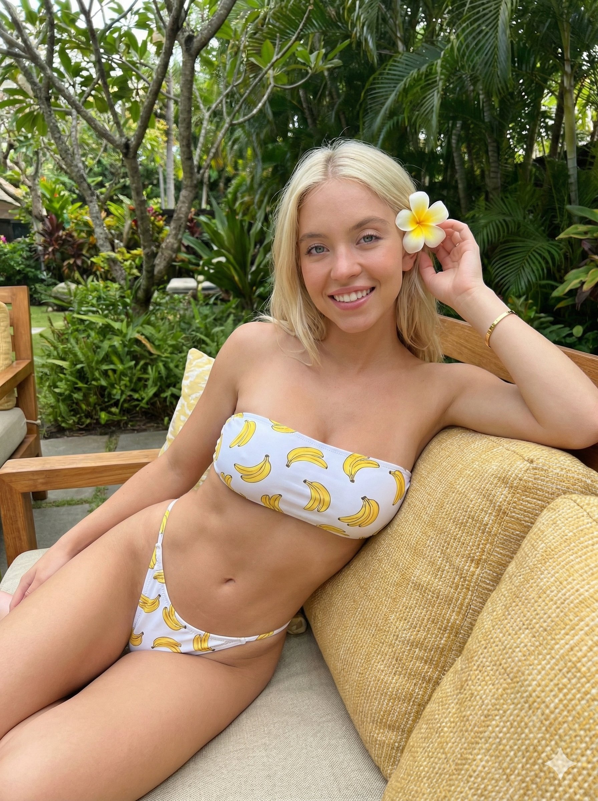
      <br/>
      <a href="#prompt-en-s07-25">View&CopyPrompt</a>
    </td>
    <td width="33%" valign="top">
      <a id="card-en-s07-26"></a>
      <strong>Example: Twin Portrait Moodboard</strong><br/>
      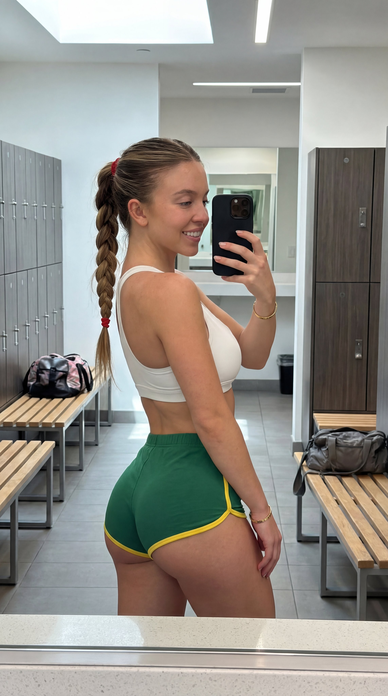
      <br/>
      <a href="#prompt-en-s07-26">View&CopyPrompt</a>
    </td>
  </tr>

  <tr>
    <td width="33%" valign="top">
      <a id="card-en-s07-27"></a>
      <strong>Example: Red-Carpet Trio Portrait</strong><br/>
      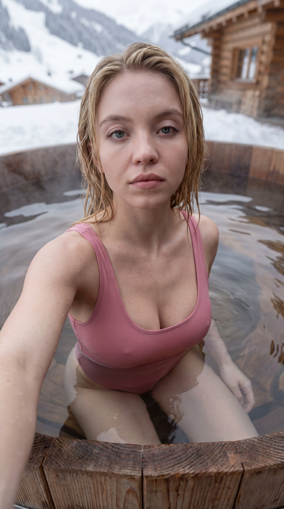
      <br/>
      <a href="#prompt-en-s07-27">View&CopyPrompt</a>
    </td>
    <td width="33%" valign="top"></td>
    <td width="33%" valign="top"></td>
  </tr>
</table>

<hr />

### Portrait Photography
<table>
  <tr>
    <td width="33%" valign="top">
      <a id="card-en-s08-01"></a>
      <strong>Example 1: Fisheye Selfie</strong><br/>
      
      <br/>
      <a href="#prompt-en-s08-01">View&CopyPrompt</a>
    </td>
    <td width="33%" valign="top">
      <a id="card-en-s08-02"></a>
      <strong>Example 2: King Crab Chef</strong><br/>
      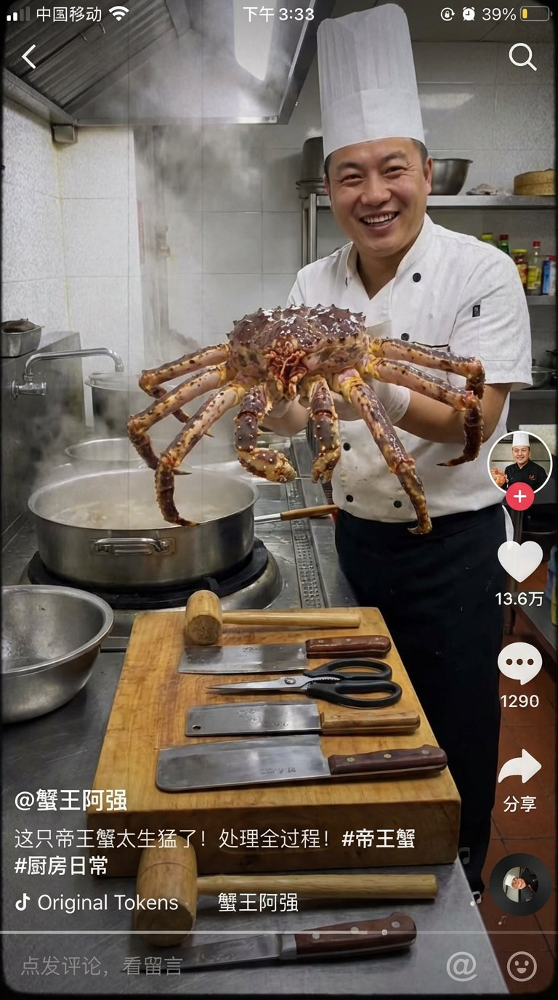
      <br/>
      <a href="#prompt-en-s08-02">View&CopyPrompt</a>
    </td>
    <td width="33%" valign="top">
      <a id="card-en-s08-03"></a>
      <strong>Example: On-Set Selfie</strong><br/>
      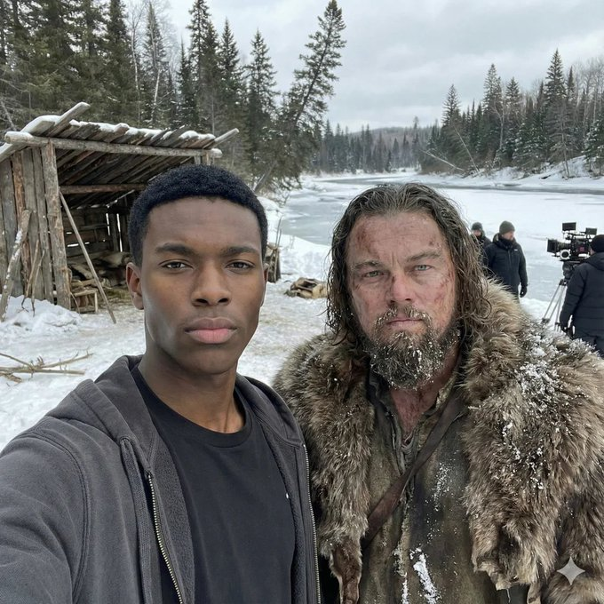
      <br/>
      <a href="#prompt-en-s08-03">View&CopyPrompt</a>
    </td>
  </tr>
</table>

<hr />

### Dreamy & Surreal
<table>
  <tr>
    <td width="33%" valign="top">
      <a id="card-en-s09-01"></a>
      <strong>Example: Four Seasons Bund</strong><br/>
      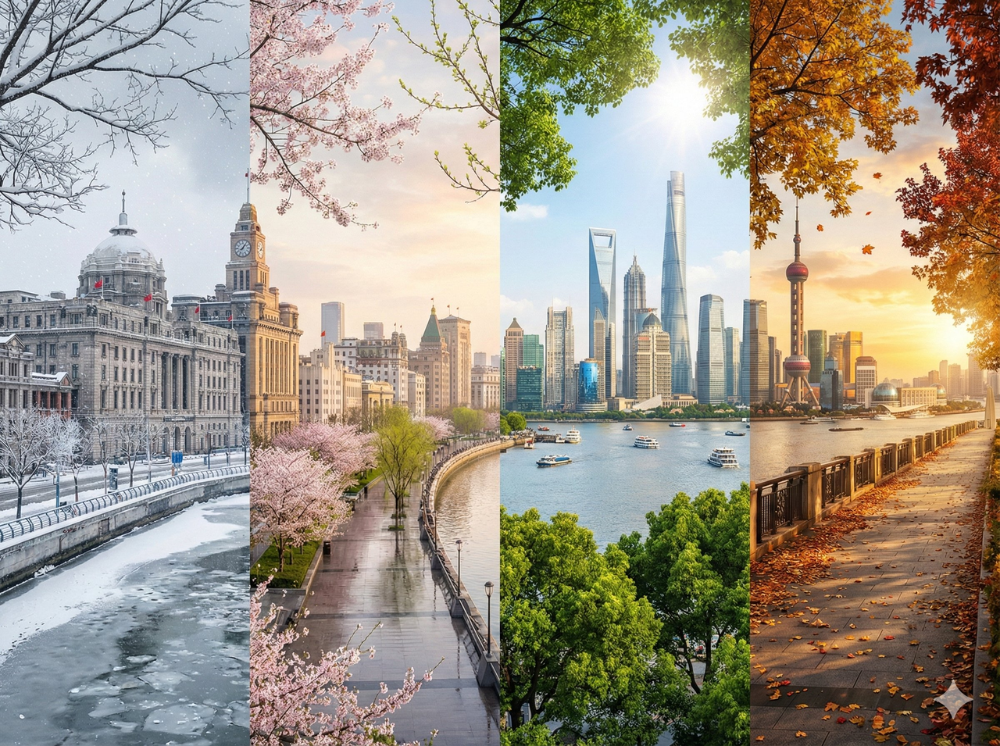
      <br/>
      <a href="#prompt-en-s09-01">View&CopyPrompt</a>
    </td>
    <td width="33%" valign="top"></td>
    <td width="33%" valign="top"></td>
  </tr>
</table>

<hr />

### Image-to-Image (img2img)

<table>
  <tr>
    <td width="33%" valign="top">
      <a id="card-en-img2img-01"></a>
      <strong>Example: Daytime Isometric Building</strong><br/>
      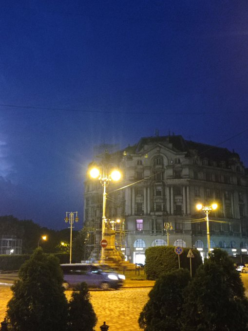
      <br/>
      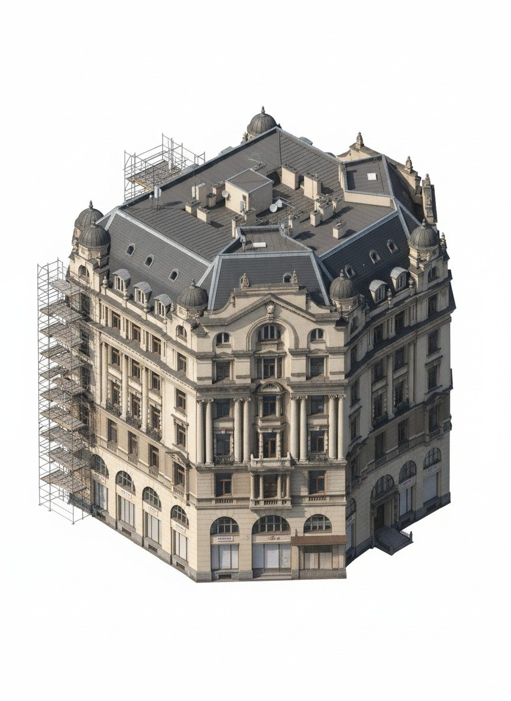
      <br/>
      <a href="#prompt-en-img2img-01">View&CopyPrompt</a>
    </td>
    <td width="33%" valign="top">
      <a id="card-en-img2img-02"></a>
      <strong>Example: Remove Blur</strong><br/>
      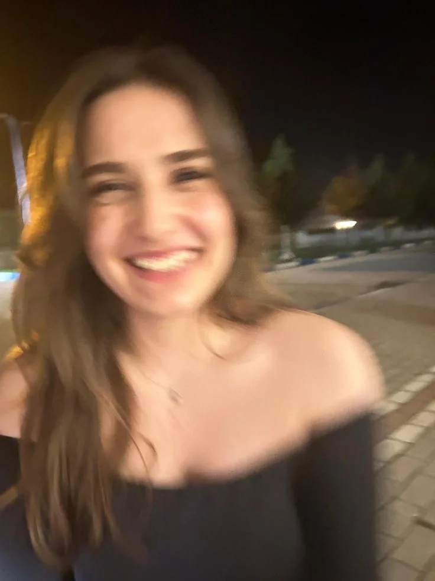
      <br/>
      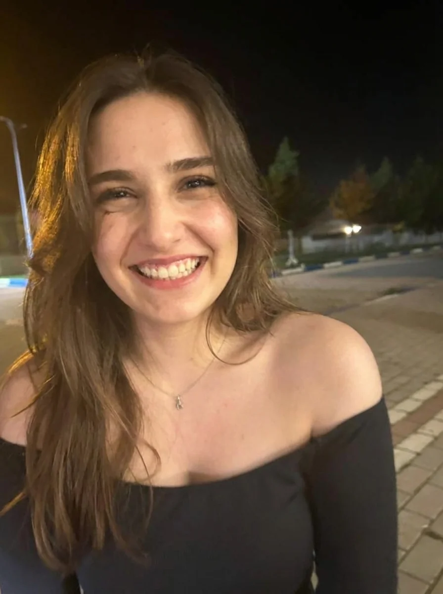
      <br/>
      <a href="#prompt-en-img2img-02">View&CopyPrompt</a>
    </td>
    <td width="33%" valign="top"></td>
  </tr>
</table>

<hr />

### Food
<table>
  <tr>
    <td width="33%" valign="top">
      <a id="card-en-s10-01"></a>
      <strong>Example: Beef Lasagna Layers</strong><br/>
      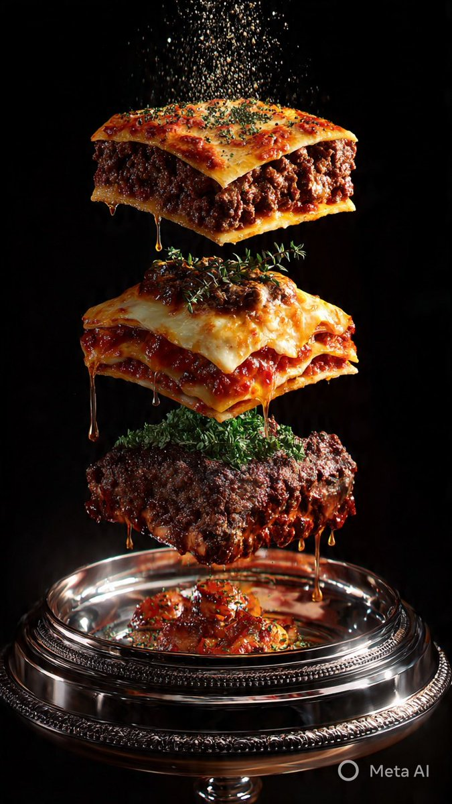
      <br/>
      <a href="#prompt-en-s10-01">View&CopyPrompt</a>
    </td>
    <td width="33%" valign="top">
      <a id="card-en-s10-02"></a>
      <strong>Example: Matcha Cheesecake</strong><br/>
      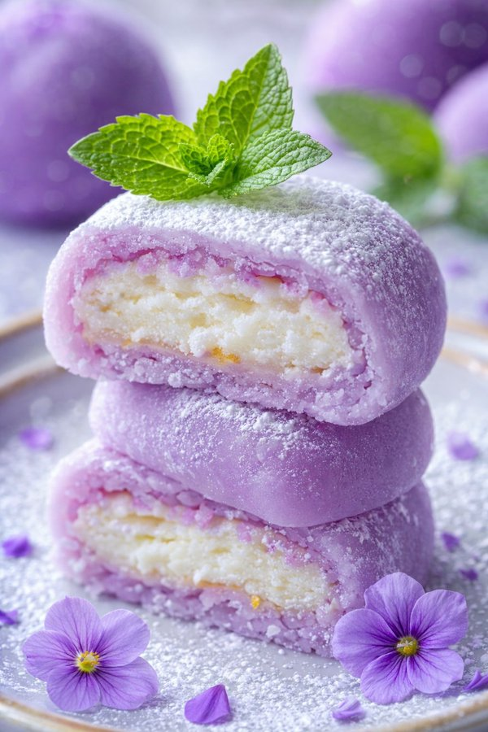
      <br/>
      <a href="#prompt-en-s10-02">View&CopyPrompt</a>
    </td>
    <td width="33%" valign="top">
      <a id="card-en-s10-03"></a>
      <strong>Example: Berry Burst</strong><br/>
      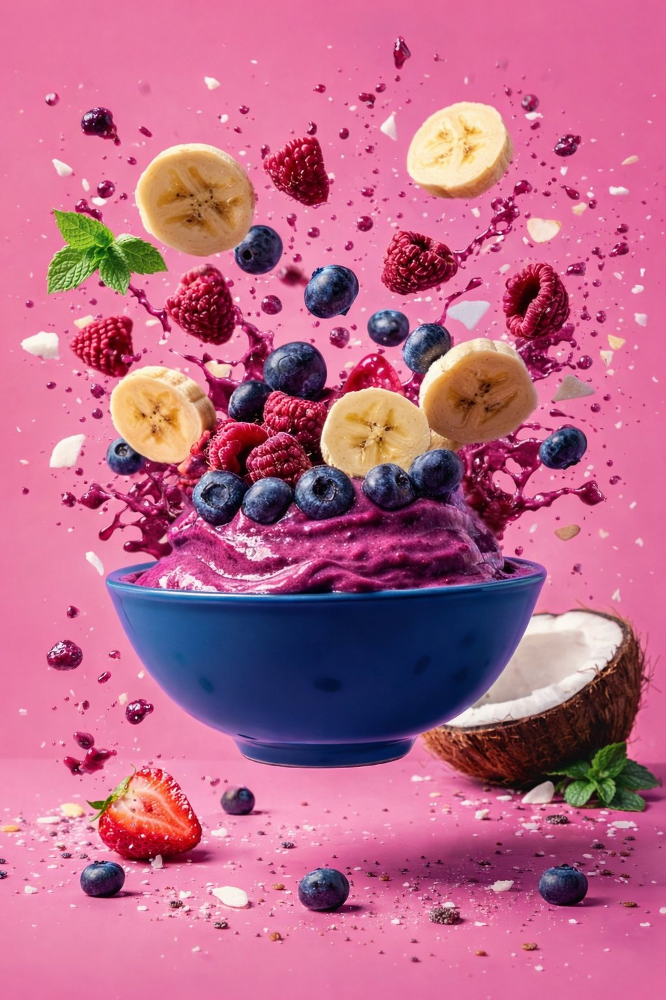
      <br/>
      <a href="#prompt-en-s10-03">View&CopyPrompt</a>
    </td>
  </tr>
  <tr>
    <td width="33%" valign="top">
      <a id="card-en-s10-04"></a>
      <strong>Example: Orange Flavor Concept</strong><br/>
      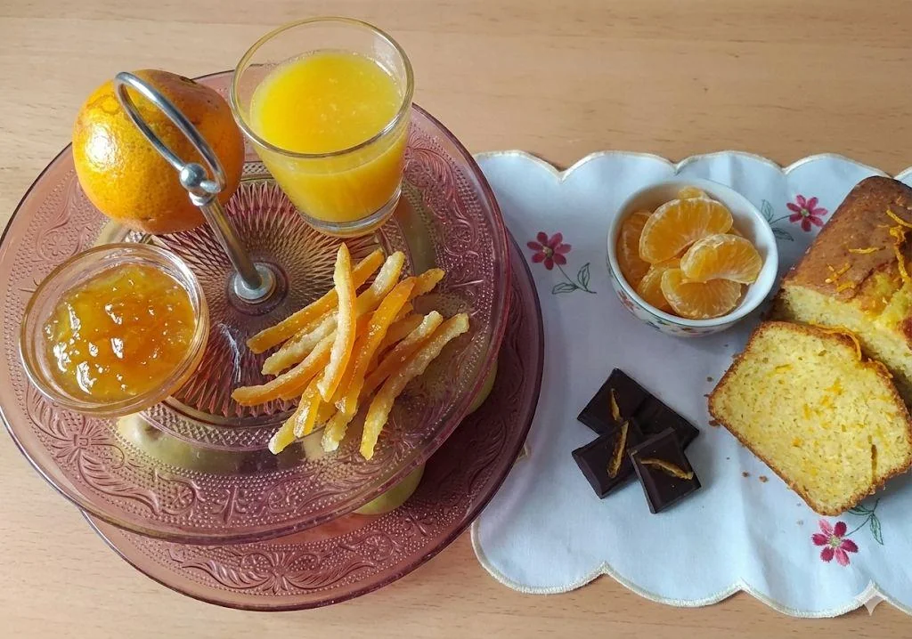
      <br/>
      <a href="#prompt-en-s10-04">View&CopyPrompt</a>
    </td>
    <td width="33%" valign="top"></td>
    <td width="33%" valign="top"></td>
  </tr>
</table>

<hr />


<hr />

<a id="en-prompts"></a>
## Prompt Module (By Category)

### Manga Style

<a id="prompt-en-s01-01"></a>
#### Example: Torn Paper Layers

[Back to image](#card-en-s01-01)

```json
{
  "task": "edit-image: add widened torn-paper layered effect",
  "base_image": {
    "use_reference_image": true,
    "preserve_everything": [
      "character identity",
      "facial features and expression",
      "hairstyle and anatomy",
      "outfit design and colors",
      "background, lighting, composition",
      "overall art style"
    ]
  },
  "rules": [
    "Only modify the torn-paper interior areas.",
    "Do not change pose, anatomy, proportions, clothing details, shading, or scene elements."
  ],
  "effects": [
    {
      "effect": "torn-paper-reveal",
      "placement": "across chest height",
      "description": [
        "Add a wide, natural horizontal tear across the chest area.",
        "The torn interior uses the style defined in `interior_style`."
      ]
    },
    {
      "effect": "torn-paper-reveal",
      "placement": "lower abdomen height",
      "description": [
        "Add a wide horizontal tear across the lower abdomen.",
        "The torn interior uses the style defined in `interior_style`."
      ]
    }
  ],
  "interior_style": {
    "mode": "line-art",
    "style_settings": {
      "line-art": {
        "palette": "monochrome",
        "line_quality": "clean, crisp",
        "paper": "notebook paper with subtle ruled lines"
      },
      "sumi-e": {
        "palette": "black ink tones",
        "brush_texture": "soft bleeding edges",
        "paper": "plain textured paper"
      },
      "figure-render": {
        "material": "PVC-like",
        "shading": "semi-realistic highlights",
        "paper": "plain smooth surface"
      },
      "colored-pencil": {
        "stroke_texture": "visible pencil grain",
        "palette": "soft layered hues",
        "paper": "rough sketchbook paper"
      },
      "watercolor": {
        "palette": "soft transparent pigments",
        "blending": "smooth bleeding",
        "edges": "soft contours",
        "paper": "watercolor paper texture"
      },
      "pencil-drawing": {
        "graphite_texture": "visible pencil grain",
        "shading": "smooth gradients",
        "line_quality": "mixed sharp and soft",
        "tone": "gray-scale",
        "paper": "notebook paper with faint ruled lines"
      }
    }
  }
}
```

<a id="prompt-en-s01-02"></a>
#### Example: Cosmic Power Armor

[Back to image](#card-en-s01-02)

```text
Positive prompts
(ultra realistic,32k,masterpiece:1.4),(high detailed skin:1.1),( high quality:1.1), (ultra high res:1.4), (masterpiece), (beautiful lighting:1.4), (high quality), (high resolution:1.3), (incredibly detailed:1.28), cinematic lighting, masterpiece, perfect anatomy,absurdres, Smooth_Quality, thick outline, black outline, thick lineart, western comics style, DISNEY_ANIMATION,
1girl, full armor made of glowing black and orange star-metal, ember cracks, cosmic sword glowing with starlight in one hand, lantern of a dying universe in the other, burning aura, ashes floating in air, intense golden eyes, detailed iris, glowing molten veins, full burning wings shaped like black eclipse shards, celestial background with shattered planets, solar flare glow, camera angle from below, serious expression, mythic lighting, divine cosmic warrior, flaming cape blowing in the wind, ethereal glow on face, fire sparks in foreground, black halo orbiting behind her head, ashes turning into stars around her

Negative prompts
lowres, worst quality, low quality, bad quality, simple background,
signature, multiple views, 2koma, 4koma,
furry, anthro, bkub, 
chibi,loli,child, bad anatomy, missing leg, missing limb, cameltoe, abs, Asian, twins, identical twins, solid eyes,
```

<a id="prompt-en-s01-03"></a>
#### Example: Rainy Night Umbrella

[Back to image](#card-en-s01-03)

```text
Positive prompts
masterpiece, best quality, very aesthetic, 8K, HDR, newest, anime_screencap, dynamic pose, depth of field, rakugakingu, FlatNika, in the style of cksc, foreshortening, dynamic angle, 

1girl, umbrella, moon, blonde hair, solo, red eyes, holding umbrella, flower, full moon, jewelry, rain, holding, sitting, orange flower, parted lips, looking at viewer, pantyhose, earrings, wariza, cloud, long hair, outdoors, long sleeves, cloudy sky, skirt, night, black shirt, black footwear, frilled umbrella, reflection, sky, breasts, wet, black skirt, shirt, frills, black pantyhose, bow, thighhighs, bowtie, dress, brooch, red bow, reflective water, tree, red bowtie, shoes, high heels, maid headdress, water, from below, dark clouds, full body, puddle, gem, red ribbon, black dress, leaf, hairband, red gemstone, black umbrella, swept bangs, yellow flower, wet clothes

Negative prompts
worst quality, low quality, bad anatomy, bad proportions, extra digits, extra legs, extra arms, disfigured, blurry eyes, lowres, mutated hands, bad hands, signature, watermark, artist name, username, patreon username, twitter username, logo, oversaturated
```

<a id="prompt-en-s01-04"></a>
#### Example: Snowy Night Hashira Lineup

[Back to image](#card-en-s01-04)

```text
1. Style & Mood
  - Keywords: Shin-hanga, Ukiyo-e aesthetics, serene melancholy, atmospheric landscape, traditional Japanese art.
  - Description: The image reflects the signature traits of Japan’s early 20th‑century Shin-hanga movement, blending traditional ukiyo-e woodblock techniques with the light-and-shadow ambience of Western Impressionism. The overall feeling is quiet, lonely, and poetic, focused on capturing a specific weather atmosphere and a frozen moment in time.
2. Visual Logic
  1. Perspective: A combination of scattered perspective and a high viewpoint. Not strict Western single-point perspective; it emphasizes depth on a flat plane.
  2. Composition: Strong diagonal composition, using large negative space versus solid scenery to create contrast.
  3. Geometry: Layering organic lines with geometric color blocks. Edges are crisp but not overly sharp, retaining the carved-knife feeling unique to prints.
3. Visual Rendering
  1. Line Work: Ink outlines with varied stroke thickness like brushwork, while keeping the firmness of woodblock carving in architectural and branch details.
  2. Texture: Pronounced washi-paper texture, using the paper’s natural white as highlights.
  3. Technique: Bokashi: gradient printing/inking on water and sky to create soft color transitions.
  4. Goma-zuri: possible localized “sesame printing” grain to simulate snowfall or texture.
  5. Lighting: Diffuse light. No clear directional light source; use value differences in color blocks to convey snow thickness and overcast lighting.
4. Color System
  1. Core Logic: Low saturation, cool tones, minimalist palette.
  2. Palette:
    - Prussian Blue / Indigo (#1B365D): for water gradients; deep and calm.
    - Slate Grey (#708090): for sky and shadows; creates a cold atmosphere.
    - Paper White / Cream (#F5F5DC): canvas base tone, directly representing snow.
    - Charcoal Black (#36454F): for tree and building silhouettes.
5. Negative Constraints
  1. No photorealism or physical rendering.
  2. No smooth digital-painting look, specular highlights, or plastic textures.
  3. No thick paint strokes or heavy oil-paint buildup.
  4. No modern 3D rendering tricks such as volumetric light or ambient occlusion.
  5. No vivid, high-purity neon or primary colors.
6. Scene Content
  In heavy snow, create lineup portraits of all the Hashira from *Demon Slayer*, each in a battle-ready pose matching their Breathing style.
```


<a id="prompt-en-s01-05"></a>
#### Example: Pokemon Pixel Battle

[Back to image](#card-en-s01-05)

```text
nano banana 2

prompt: inspired by a classic pokemon gameboy screenshot but it's highly detailed beautiful pixel art, include cool effects from moves used, modern minimal ui

prompt: change it to a new location and the battle is two new random kanto pokemon
```


<a id="prompt-en-s01-06"></a>
#### Example: Transparent Gameboy Frame

[Back to image](#card-en-s01-06)

```text
nano banana 2

prompt: holding a modern see-through gameboy color with shades of black, the reference image is on the screen
```


<a id="prompt-en-s01-07"></a>
#### Example: New Region Follower Scene

[Back to image](#card-en-s01-07)

```text
nano banana 2

prompt: show a completely new location in different weather with a new kanto pokemon following the player, maintain the perspective
```


<a id="prompt-en-s01-08"></a>
#### Example: Overworld Continuation Shot

[Back to image](#card-en-s01-08)

```text
nano banana 2

prompt: create a screenshot of the overworld for this game in the same area, with one pokemon following the player, fit the vibe of the reference
```

<hr />

### Product Photography

<a id="prompt-en-s02-01"></a>
#### Example: Pouring Water Through the Screen

[Back to image](#card-en-s02-01)

```json
{
  "meta": {
    "type": "Creative Brief",
    "genre": "Hyper-realistic Surrealism",
    "composition_style": "Composite Portrait",
    "aspect_ratio": "Portrait (implied by 'portrait' description)"
  },
  "scene_architecture": {
    "viewpoint": {
      "type": "Photographic",
      "angle": "High-angle / Looking down",
      "framing": "Tight on central subject"
    },
    "dimensional_hierarchy": {
      "rule": "Scale disparity for surreal effect",
      "dominant_element": "iPhone 17 Pro Max (Super-scaled)",
      "subordinate_elements": ["Blue Book (Miniature)", "Pen (Miniature)"]
    }
  },
  "realm_physical": {
    "description": "The real-world environment surrounding the device.",
    "environment": {
      "surface": "Wooden table",
      "texture_attributes": ["rich grain", "tactile", "worn"]
    },
    "lighting_global": {
      "source": "Natural light",
      "temperature": "Warm",
      "shadow_quality": "Soft, diffused, volumetric"
    },
    "active_agent": {
      "identity": "Human Hand (Real)",
      "action": "Pouring",
      "position": "Entering frame laterally"
    },
    "held_object": {
      "item": "Bottle",
      "state": "Chilled (visible condensation)",
      "branding": {
        "logo_text": "Decamin",
        "placement": "Visible on label"
      },
      "contents": {
        "substance": "Water",
        "color": "Light Green",
        "state": "Liquid flow"
      }
    },
    "static_props": [
      {
        "item": "Book",
        "color": "Blue",
        "scale_notes": "Significantly smaller than phone"
      },
      {
        "item": "Pen",
        "type": "Ballpoint/Ink",
        "scale_notes": "Significantly smaller than phone"
      }
    ]
  },
  "realm_digital": {
    "description": "The content displayed on the screen.",
    "container_device": {
      "model": "iPhone 17 Pro Max",
      "state": "Screen ON",
      "orientation": "Flat on physical surface"
    },
    "screen_content": {
      "subject_identity": "mqn (Reference ID)",
      "subject_scale": "Close-up (filling screen)",
      "expression": "Happy / Smiling",
      "attire": "Winter clothing (matching reference)",
      "setting": "Winter landscape / snowy backdrop",
      "held_object_digital": {
        "item": "Drinking Glass",
        "branding": {
          "logo_text": "Decamin",
          "visibility": "Clear"
        },
        "initial_state": "Empty (waiting for pour)"
      }
    }
  },
  "surreal_bridge_event": {
    "description": "The interaction connecting the physical and digital realms.",
    "action_type": "Trans-dimensional Fluid Dynamics",
    "source": "realm_physical.held_object.contents (Light Green Water)",
    "interaction_point": "realm_digital.container_device.screen_surface",
    "destination": "realm_digital.screen_content.held_object_digital (The Glass)",
    "physics_violation_rules": {
      "rule_1": "Liquid does not splash off the glass screen surface.",
      "rule_2": "Screen surface acts as a permeable membrane solely for this liquid.",
      "rule_3": "Physical liquid transitions seamlessly into digital representation upon contact."
    },
    "visual_details": ["Sharp liquid simulation", "No surface tension on screen glass", "Fluid physically filling digital cup"]
  },
  "rendering_specifications": {
    "visual_fidelity": "Hyper-realistic",
    "texture_focus": ["Sharp fluid details", "Glass pixels", "Wood grain", "Skin texture (hand and subject)"],
    "mood": "Cinematic, warm, magical",
    "resolution_target": "8K / Highly detailed"
  }
}
```

<a id="prompt-en-s02-02"></a>
#### Example: Green Soda Can

[Back to image](#card-en-s02-02)

```json
{
  "resolution": "8K",
  "style": "hyper-realistic commercial product photography",
  "composition": {
    "subject": "carbonated beverage can",
    "position": "center frame, floating mid-air",
    "orientation": "slightly tilted vertical",
    "framing": "tight hero shot"
  },
  "can_details": {
    "material": "metallic aluminum",
    "top_bottom": "silver with visible pull tab",
    "surface": "glossy with condensation droplets",
    "label": {
      "text": "{{BRAND_NAME}}",
      "font": "bold uppercase sans-serif",
      "color": "white",
      "background_band": "deep blue",
      "placement": "wrapped around center of can"
    }
  },
  "liquid_effects": {
    "color": "bright green",
    "type": "carbonated liquid splash",
    "motion": "frozen mid-explosion",
    "details": [
      "semi-transparent fluid",
      "fine droplets suspended in air",
      "dynamic curved splash arcs",
      "visible carbonation bubbles"
    ]
  },
  "fruit_elements": {
    "type": "sliced fruit",
    "motion": "floating around the can",
    "texture": "fresh, juicy, glossy"
  },
  "lighting": {
    "type": "studio lighting",
    "highlights": "strong reflections",
    "shadows": "soft"
  },
  "background": {
    "color": "smooth gradient matching liquid tone",
    "environment": "clean studio backdrop"
  },
  "render_quality": {
    "sharpness": "ultra-sharp",
    "contrast": "high",
    "realism": "photorealistic"
  }
}
```

<a id="prompt-en-s02-03"></a>
#### Example 1: Vanilla Cream

[Back to image](#card-en-s02-03)

```json
{
  "product": {
    "name": "Vanilla Cream Brew",
    "container_description": "Matte cream jar, softly diffused, richly hydrating"
  },
  "scene": {
    "setting": "A marble café table in Paris",
    "liquid_action": "Golden caramel latte liquid pours onto the table, splashing as droplets float elegantly",
    "surrounding_elements": "Vanilla pods and coffee beans are elegantly arranged around the jar"
  },
  "photography": {
    "camera_movement": "Glide forward, then orbit around",
    "lighting": "Warm pastel lighting with window-style rim light",
    "expected_effect": "A refined, luxurious hero reveal"
  },
  "action_sequence": "When opened, the liquid cascades down; the jar rises out of the splash."
}
```

<a id="prompt-en-s02-04"></a>
#### Example 2: Strawberry Cake

[Back to image](#card-en-s02-04)

```json
{
  "product": {
    "name": "Strawberry Cake Drink",
    "container_description": "A perfectly upright can covered in realistic condensation droplets, with a clear, readable 'Strawberry Cake' label"
  },
  "scene": {
    "setting": "A reflective surface",
    "liquid_action": "A glossy red strawberry liquid pours down from above, creating a dramatic splash at the center; droplets are suspended mid-air",
    "surrounding_elements": "Strawberries and cake-like crumbs burst outward"
  },
  "photography": {
    "initial_speed": "Slow motion",
    "action_intensification": "As elements burst outward, the motion intensity increases"
  },
  "action_sequence": "Start by pouring the liquid; as the splashes settle, the can rises cleanly out of the liquid."
}
```

<a id="prompt-en-s02-05"></a>
#### Example 3: Midnight Spark

[Back to image](#card-en-s02-05)

```json
{
  "product": {
    "name": "Midnight Spark – Bold & Juicy",
    "container_description": "A sleek aluminum can in deep midnight purple, decorated with grape clusters and green leaves, with condensation droplets on the surface"
  },
  "scene": {
    "setting": "Center frame",
    "liquid_action": "Vivid purple grape juice erupts upward and outward behind the can in a symmetrical crown-like motion, spectacular",
    "surrounding_elements": "Crystal-clear ice cubes frozen mid-air"
  },
  "photography_style": {
    "type": "Ultra-photoreal luxury beverage product photography",
    "genre": "Commercial beverage advertisement style",
    "aesthetic": "Premium brand aesthetic",
    "composition": "Centered composition"
  },
  "technical_specifications": {
    "focus": "Shallow depth of field, tack-sharp focus",
    "quality": "Ultra-fine, photorealistic, 8K clarity, hyper-realistic liquid simulation"
  },
  "universal_negative_prompt": "cartoon, illustration, flat lighting, blur, low resolution, plastic texture, oversaturated colors, warped text, spelling errors, deformed can, extra logos, watermark, noise, motion blur"
}
```

<a id="prompt-en-s02-06"></a>
#### Example 4: Street Fugitive

[Back to image](#card-en-s02-06)

```json
{
  "subject": {
    "description": "A full-body silhouette of a young person wearing oversized olive-green clothing, standing calmly, with a white graffiti-style smile painted on the face; subtle multiple-exposure trails drag to the left, in an avant-garde street-art poster collage style",
    "age": "young adult",
    "expression": {
      "eyes": {
        "gaze": "covered by graffiti",
        "mood": "mysterious",
        "direction": "unknown"
      },
      "mouth": {
        "replacement": "a painted white smile",
        "mood": "playful but unsettling"
      },
      "overall": "detached, iconic, anonymous"
    },
    "face": {
      "keep_original": true,
      "makeup": "No visible makeup; part of the face is covered by graffiti graphics"
    },
    "hair": {
      "color": "mostly concealed",
      "style": "hidden under a pointed cat-ear knit hat",
      "effect": "The hat outlines a clear silhouette; hair details are not emphasized"
    },
    "body": {
      "build": "slim to medium",
      "waist": "not emphasized (loose fit)",
      "chest": "not emphasized (loose jacket)",
      "legs": "wide-leg pants elongate the leg silhouette",
      "skin": {
        "visible_areas": ["hands", "a small part of the face"],
        "tone": "not clearly discernible",
        "texture": "soft, slightly blurred collage treatment",
        "lighting_effect": "soft flat poster lighting with a faint shadow"
      },
      "pose": {
        "position": "centered, full body",
        "base": "standing upright, feet slightly apart",
        "overall": "hands loosely clasped in front of the chest, relaxed posture"
      },
      "outfit": {
        "top": {
          "type": "Loose olive-green jacket with a dark inner top",
          "color": "muted olive green",
          "details": "loose fit, casual workwear style, layered look"
        },
        "bottom": {
          "type": "Loose wide-leg pants",
          "color": "matching olive green",
          "details": "drapey, long length, slightly pooling near the shoes"
        },
        "material_effect": "matte fabric, slightly soft-focused"
      }
    }
  },
  "accessories": {
    "headwear": "A pointed knit hat with cat-ear corners and a small rectangular label patch on the front",
    "footwear": "Red lace-up sandals with a thick textured sole"
  },
  "photography": {
    "camera_style": "Flat poster collage, street-art magazine aesthetic, cut-out figure on a clean background",
    "angle": "Front-facing, eye-level poster view",
    "shot_type": "Full-body centered composition",
    "aspect_ratio": "4:5 portrait",
    "texture": "Slight grain, soft cutout edges, slightly blurred defocus layers",
    "lighting": "Flat light, studio-like even lighting, with a soft cutout shadow beneath the subject",
    "depth_of_field": "Deep focus (poster-flat), subject and graffiti clearly readable"
  },
  "background": {
    "scene": "Minimal light-gray poster background with hand-drawn graffiti elements",
    "wall_color": "light gray / off-white",
    "elements": [
      "Black dripping cartoon eyes on both sides of the subject",
      "A red jagged outline around the subject like a warning frame",
      "Small red cross marks around the outline",
      "Handwritten black text in the upper-left: 'Danger: Fugitive Missing'",
      "A red messy tag-style signature in the upper-right with a small heart",
      "A blue tic-tac-toe grid in the lower-right with X and O marks, crossed out with a red slash",
      "Small doodles in the lower-left, including a simple face and a skull-like circle with graffiti"
    ],
    "atmosphere": "rebellious, urban, handmade; slightly chaotic but balanced",
    "lighting": "even and clean, emphasizing the contrast between graffiti and negative space"
  },
  "the_vibe": {
    "energy": "bold, graphic, confrontational",
    "mood": "mysterious and playful, slightly dangerous",
    "aesthetic": "street-art posters, magazine collage, contemporary underground fashion editorial",
    "authenticity": "looks like a real edited social-media poster made of cut-out photos layered with graffiti",
    "intimacy": "anonymous portrait — identity hidden, message amplified",
    "story": "A legend about a missing person / fugitive, told through graffiti, warning marks, and a playful smile covering the face",
    "headline_energy": "mysterious, punk; minimal text but full of attitude",
    "restrictions": {
      "must_keep": [
        "A white graffiti smile covering the face",
        "Multiple-exposure trailing ghosting dragged to the left",
        "The red jagged outline around the subject",
        "The dripping black cartoon eyes on both sides",
        "Handwritten text on the left: 'Danger: Fugitive Missing'",
        "The red tag-style graffiti in the upper-right with a small heart",
        "The blue tic-tac-toe grid with X/O crossed by a red slash",
        "Minimal light-gray background with lots of negative space",
        "Muted olive-green as the main clothing color"
      ]
    }
  }
}
```

<a id="prompt-en-s02-07"></a>
#### Example: Crystal Goblet Fantasy

[Back to image](#card-en-s02-07)

```text
A hyper-detailed digital painting in a surreal fantasy style, showcasing a colossal (ornate crystal wine glass) with intricate filigree etching, filled to the brim with a viscous crimson liquid that refracts light like molten gemstones. Inside the glass, a microcosmic landscape unfolds: gnarled oak trees with (autumn-crisped leaves in burnt umber and carmine), their roots twisting through amber-hued mist, while bioluminescent fungi pulse along the bark grooves. The glass rests on a liquid-mercury surface so reflective it perfectly duplicates the scene upside-down, including the glass's own warped refraction patterns. 

The background features a (gigantic dying sun) bleeding tangerine light through volcanic ash clouds, striated with veins of phosphorus-green. The sky gradients from bruise-purple at the zenith to arterial red near the horizon, where jagged basalt mountains erupt from a leaden sea choked with luminescent plankton. To the left, a petrified willow drips scarlet leaves like slow-motion blood droplets, each vein mapped in microscopic detail. Rightward, obsidian cliffs shear upward, their fractured planes catching the sun in razor-edged highlights. 

Textures are obsessively rendered: the glass's refractive imperfections, the tree bark's lichen-crusted fissures, the sea's oil-slick iridescence. Shot with a tilt-shift lens at f/1.2 to blur the periphery, focusing on the glass's central distortion where the interior landscape warps into a Klein bottle paradox. Stylistic fusion of Zdzisław Beksiński's dystopian grandeur with Moebius' organic surrealism, color-graded in DaVinci Resolve for cinematic depth.
```

<a id="prompt-en-s02-08"></a>
#### Example 5: City Magnet Tiles

[Back to image](#card-en-s02-08)

```text
Show a clear top-down photo of 3D magnet tiles featuring iconic landmarks of [CITY NAME]. The magnets should be neatly arranged in parallel lines and right angles, forming a small “mountain” shape. The magnets must look like realistic miniature models. Place a souvenir magnet with the city name at the top center, along with a handwritten note that includes the temperature and weather conditions. Integrate objects related to the day’s weather into the “mountain” arrangement. No objects may be repeated.
```

<a id="prompt-en-s02-09"></a>
#### Example 6: Delicious Food Map

[Back to image](#card-en-s02-09)

```text
Create a map of [COUNTRY NAME] where each state/province is composed of that region’s most famous food (the shapes inside each region should look like they are made *from* food, not photos of food). Carefully check to ensure every region is accurate.
```

<a id="prompt-en-s02-10"></a>
#### Example: Isometric Cube Room

[Back to image](#card-en-s02-10)

```text
An isometric 3D cube miniature room (a true cube with slightly beveled edges; every object must be strictly contained inside the cube). Room description: [ROOM DESCRIPTION: describe the theme, furniture, specific clutter, wall decor, and key objects in detail].

Character: chibi / figurine style — [INSERT THE PERSON DESCRIPTION FROM YOUR UPLOADED PHOTO HERE]. Action: [e.g., typing while sitting on a chair, cooking while standing, playing guitar]. Expression: [e.g., focused, happy, smiling]. The character material should look like matte PVC, with a larger head and smaller body. Lighting: [AMBIENCE NAME]: [LIGHT SOURCES, e.g., neon blue, warm daylight, golden lamps]; with realistic reflections and colored shadows. Camera: slightly elevated isometric 3/4 view, with the front edge of the cube centered; nothing may protrude outside the cube. Photoreal materials and rich detail; neutral background. Highly detailed, clear composition; no watermark.
```

<a id="prompt-en-s02-11"></a>
#### Example: Isometric Cube Room

[Back to image](#card-en-s02-11)

```text
Based on you know about me, generate a 3D isometric colored illustration of me working from home, filled with various interior details. The visual style should be rounded, polished, and playful. --ar 1:1
```

<a id="prompt-en-s02-12"></a>
#### Example: Chocolate Coffee Explosion

[Back to image](#card-en-s02-12)

```json
{
  "theme": "Ultra-photoreal vertical exploded view of a chocolate coffee drink",
  "layout": "Centered vertical alignment; each component is suspended independently with clear spacing",
  "layers": [
    {
      "ingredient": "cocoa powder granules",
      "position": "top"
    },
    {
      "ingredient": "glossy, rich dark-chocolate sauce ribbons and drips",
      "position": "separate layer"
    },
    {
      "ingredient": "a light whipped-cream mound",
      "position": "separate layer"
    },
    {
      "ingredient": "a smooth chocolate-coffee liquid layer",
      "position": "separate layer"
    },
    {
      "ingredient": "roasted coffee beans",
      "position": "separate layer"
    },
    {
      "ingredient": "sugar crystals",
      "position": "separate layer"
    },
    {
      "component": "small transparent ribbed glass cup with a weighted base (empty)",
      "position": "bottom"
    }
  ],
  "background": "Premium dark backdrop: a clean studio background with a smooth gradient from near-black graphite to charcoal gray, soft and even",
  "lighting_and_style": {
    "lighting": "Soft, controlled studio lighting with crisp layered shadows beneath each component",
    "details": "Ultra-crisp macro realism, minimal thin callout lines, and English labels on the right",
    "category": "High-end product infographic",
    "resolution": "8K"
  }
}
```

<a id="prompt-en-s02-13"></a>
#### Example: Matcha Explosion

[Back to image](#card-en-s02-13)

```json
{
  "theme": "Ultra-photoreal vertical exploded view of a matcha cheese-foam fruit coffee drink",
  "layout": "Centered vertical alignment; each component is suspended independently with clear spacing",
  "layers": [
    {
      "ingredient": "fine matcha powder granules",
      "position": "top"
    },
    {
      "ingredient": "fresh strawberries and mango slices (crystal-clear, glossy)",
      "position": "separate layer"
    },
    {
      "component": "a rich, savory-sweet cheese matcha foam layer (with fine micro-bubbles)",
      "position": "separate layer"
    },
    {
      "ingredient": "clear cold-brew coffee mixed with a vivid green matcha layer",
      "position": "separate layer"
    },
    {
      "ingredient": "crystal-clear ice cubes and mint leaves",
      "position": "separate layer"
    },
    {
      "ingredient": "a concentrated fruit puree at the bottom (e.g., raspberry sauce)",
      "position": "separate layer"
    },
    {
      "component": "ultra-minimal striped glass cup (empty)",
      "position": "bottom"
    }
  ],
  "background": "Fresh minimalist backdrop: a bright studio environment with a soft gradient from light beige to light gray",
  "lighting_and_style": {
    "lighting": "Bright natural-light feel with crisp glass reflections and well-defined layered shadows",
    "details": "Ultra-crisp macro realism, minimal thin callout lines, and English labels on the right",
    "category": "High-end product infographic",
    "resolution": "8K"
  }
}
```

<hr />

### Research & Infographics

<a id="prompt-en-s03-01"></a>
#### Example: Photosynthesis

[Back to image](#card-en-s03-01)

```text
Create an educational infographic explaining [Photosynthesis] . Visual Elements : Illustrate the key components: The Sun, a green Plant, Water (H2O) entering roots, Carbon Dioxide (CO2) entering leaves, and Oxygen (O2) being released. Style : Clean, flat vector illustration suitable for a high school science textbook. Use arrows to show the flow of energy and matter. Labels : Label each element clearly in English .
```

<a id="prompt-en-s03-02"></a>
#### Example: Dyson Swarm Construction

[Back to image](#card-en-s03-02)

```text
Please create a cartoon-style infographic based on the provided content, following these guidelines:

- Hand-drawn illustration style, landscape orientation (16:9 aspect ratio).

- Include a small number of simple cartoon elements, icons, or famous personalities to enhance visual interest and memorability.

- If the content includes sensitive or copyrighted figures, replace them with visually similar alternatives; do not refuse to generate the illustration.

- All imagery and text must strictly adhere to a hand-drawn style; avoid realistic visual elements.

- Keep information concise, highlighting keywords and core concepts. Utilize ample whitespace to clearly emphasize key points.

- Unless otherwise specified, use the same language as the provided content.

Please use nano banana pro to create the illustration based on the input provided.
```

<a id="prompt-en-s03-03"></a>
#### Example: Dyson Swarm Construction

[Back to image](#card-en-s03-03)

```text
This diagram illustrates the process of constructing a Dyson swarm based on: Armstrong, S., & Sandberg, A. (2013). *Eternity in six hours: Intergalactic spreading of intelligent life and sharpening the Fermi paradox.* Acta Astronautica, 89, 1–13.
```

<a id="prompt-en-s03-04"></a>
#### Example: Humanities PPT

[Back to image](#card-en-s03-04)

```text
Help me turn the following article into a Chinese PPT that middle-school students can understand.

First, write a PPT outline and plan what goes on each slide.

Then, feed each slide’s content to Nana Banana Pro to generate the corresponding slide image, ensuring a consistent style across all slides.

Design style: “Warm Academic Humanism” in an Anthropic/Claude-like style.

Background: warm beige/cream (#F3F0E9) as the base, with a premium paper texture.

Typography: elegant serif for headings; modern sans-serif for body text.

Colors: terracotta red (#D67052) and mustard yellow (#F0B857) as primary colors, with deep navy as an accent. Avoid neon colors or pure black.

Visual elements: a well-structured grid layout; illustrations should be abstract, organic black hand-drawn line art placed over solid terracotta color blocks; use card layouts for key info.

Charts: flat, minimalist bar charts emphasizing comparisons, with unnecessary borders removed.

All text and images should be generated by Nano Banana Pro. Do NOT turn the whole PPT into a single image—generate one image per slide.

Article content: []
```

<hr />

### Deconstruction

<a id="prompt-en-s04-01"></a>
#### Example 1: Fashion Deconstruction

[Back to image](#card-en-s04-01)

```text
Hand-drawn fashion concept deconstruction diagram.

Center: a full-body portrait of a stylish, confident female character with a subtle sexy vibe (not explicit), in a natural and energetic pose.

Around her: a structured layout of key elements:

• Outfit layers — show the jacket, innerwear, tight pants (lace / sheer materials), shapewear, with zoomed-in detail patterns.

• Expression sheet — 3–4 facial expressions (neutral, shy, surprised, focused).

• Close-ups — fabric fold textures, skin details, hand gestures.

• Lifestyle & accessories — an open handbag containing daily items: lipstick, perfume, powder compact, hand cream, notebook, supplements.

• Material callouts — handwritten-style notes next to items (e.g., “soft lace”, “matte leather”, “shade #520”).

Background: soft beige or parchment texture to evoke a design sketch vibe.

Lighting: clean, soft shadows to unify the composition.

Output: 4K HD 2D illustration with a sexy-yet-fashion-forward feel.

Language: bilingual English + Chinese labels.
```

<a id="prompt-en-s04-02"></a>
#### Example: Cutaway City Layers

[Back to image](#card-en-s04-02)

```text
Vertical isometric cutaway diagram titled "ROCHESTER, NY". Stacked 3D layers showing history from top to bottom:

Modern skyline with High Falls, the Genesee River, and the Kodak Tower.2. 1960s industrial factories and suburban homes.3. 1800s brick flour mills and the Erie Canal Aqueduct.4. Forest landscape with Haudenosaunee longhouses.5. Bottom layer of ancient sedimentary rock with fossils. Clean white background, realistic detail, with a vertical timeline ruler on the left side.
```

<hr />

### Poster Design

<a id="prompt-en-s05-01"></a>
#### Example 1: Playground Literacy Poster

[Back to image](#card-en-s05-01)

```text
Present a clear, 45° top-down view of a vertical (9:16) isometric miniature 3D cartoon scene, highlighting iconic landmarks centered in the composition to showcase precise and delicate modeling.

The scene features soft, refined textures with realistic PBR materials and gentle, lifelike lighting and shadow effects. Weather elements are creatively integrated into the urban architecture, establishing a dynamic interaction between the city's landscape and atmospheric conditions, creating an immersive weather ambiance.

Use a clean, unified composition with minimalistic aesthetics and a soft, solid-colored background that highlights the main content. The overall visual style is fresh and soothing.

Display a prominent weather icon at the top-center, with the date (x-small text) and temperature range (medium text) beneath it. The city name (large text) is positioned directly above the weather icon. The weather information has no background and can subtly overlap with the buildings.

The text should match the input city's native language.
Please retrieve current weather conditions for the specified city before rendering.

City name: Evanston
```

<a id="prompt-en-s05-02"></a>
#### Example 2: Playground Literacy Poster

[Back to image](#card-en-s05-02)

```text
Generate a children’s literacy mini-newspaper poster titled “Playground”, in vertical A4 format, in a learning-handout layout, suitable for kids aged 5–9 to learn words by looking at pictures.

1) Title area (top)
- Big centered title: “Playground Literacy Poster”
- Style: cross-grid mini-newspaper / children’s study handout vibe
- Text: large, eye-catching, cartoon handwritten font with colorful outlines
- Decoration: bright sticker-style decorations related to a playground

2) Main scene (middle)
- Center illustration: a cartoon playground scene
- Atmosphere: bright, warm, positive
- Composition: clear object boundaries for labeling; not overcrowded

Scene zones and core content
- Zone A (main): core playground activities (kids playing on rides)
- Zone B (support): related tools/items (ticketing, snacks, directional signs)
- Zone C (background): environment features (entrance, signposts, flags, green space, etc.)

Main character
- 1 cute cartoon character (can be staff or a visiting child)
- Action: natural interaction with the scene (e.g., smiling and pointing directions, waving, playing with kids)

3) Must-draw objects & vocabulary list (Generated Content)
You must clearly draw the following objects and leave space to place labels next to each:

Core roles & facilities:
1. gōng zuò rén yuán — staff member
2. shòu piào chù — ticket booth
3. guò shān chē — roller coaster
4. mó tiān lún — Ferris wheel
5. xuán zhuǎn mǎ — carousel

Common items/tools:
6. piào — ticket
7. qì qiú — balloon
8. bīng jī líng — ice cream
9. bào mǐ huā — popcorn
10. táng hú lu — candied fruit skewer
11. miàn jù — mask
12. wán jù — toy
13. xiǎo qí zi — small flag

Environment & decorations:
14. rù kǒu — entrance
15. chū kǒu — exit
16. zhǐ shì pái — signpost
17. cǎi qí — colorful pennants
18. guǎng chǎng — plaza

4) Label rules
- For the vocabulary list above, add labels near the corresponding objects.
- Format: two lines (line 1: pinyin with tone marks; line 2: English word).
- Style: colorful sticker labels; clear and readable.
- Layout: labels close to the object; do not cover the main subject.

5) Art style parameters
- Style: children’s picture-book + literacy handout poster
- Colors: high saturation, bright, warm (High Saturation, Warm Tone)
- Quality: 8k resolution, high detail, vector illustration style, clean lines.
```

<a id="prompt-en-s05-03"></a>
#### Example 3: Weather City

[Back to image](#card-en-s05-03)

```text
Present a clear 45° top-down view of a vertical (9:16) isometric miniature 3D cartoon scene, highlighting iconic landmarks centered in the composition to showcase precise, delicate modeling.

Use soft, refined textures with realistic PBR materials and gentle, lifelike lighting and shadow. Integrate weather elements creatively into the city architecture to create an immersive weather atmosphere.

Use a clean, unified composition with minimalist aesthetics and a soft solid-color background that highlights the main content. The overall visual style should feel fresh and soothing.

Display a prominent weather icon at the top center, with the date (extra-small text) and temperature range (medium text) beneath it. Place the city name (large text) directly above the weather icon. The weather info should have no background and may subtly overlap buildings.

The text should match the input city’s native language.

Before rendering, retrieve current weather conditions for the specified city.

City name: [Shanghai]
```

<a id="prompt-en-s05-04"></a>
#### Example 4: Starbucks Concept Store

[Back to image](#card-en-s05-04)

```text
Design a 3D chibi-style mini concept store for [Starbucks]. Its exterior is inspired by the brand’s most iconic product and packaging (e.g., a giant {brand core product, such as a fried chicken bucket / burger / donut / roast duck}). The store has two floors. Floor-to-ceiling glass windows reveal a warm, exquisite interior: {brand primary color} themed decor, warm lighting, and busy staff wearing brand-specific uniforms.

Cute miniature figures walk and rest on the street, surrounded by benches, street lamps, and potted plants, creating a charming urban scene. Render in a miniature cityscape style (Cinema 4D look) with a blind-box toy-like craftsmanship: rich details, lively realism, and soft lighting that adds a relaxed afternoon mood.

Refer to the attached character reference sheet to understand the mini characters that should appear in the store. --ar 2:3
```

<hr />

### Traditional Chinese Culture

<a id="prompt-en-s06-01"></a>
#### Example: Tang Palace Music Ensemble

[Back to image](#card-en-s06-01)

```json
{
  "theme": {
    "description": "A Tang-dynasty court ensemble performs music on Agan tree branches; musicians play pipa, erhu, flute, ruan, and ma-ti zheng. Musicians and birds are scattered naturally across the scene; some are standing, some sitting.",
    "mirror_rules": null,
    "age": null,
    "expression": {
      "eyes": {
        "look": null,
        "energy": null,
        "direction": "empty"
      },
      "mouth": {
        "position": null,
        "energy": "empty"
      },
      "overall": "empty"
    },
    "face": {
      "preserve_original": false,
      "makeup": "empty"
    },
    "hair": {
      "color": null,
      "style": null,
      "effect": "empty"
    },
    "body": {
      "frame": null,
      "waist": null,
      "chest": null,
      "legs": null,
      "skin": {
        "visible_areas": null,
        "tone": null,
        "texture": null,
        "lighting_effect": null
      }
    },
    "pose": {
      "position": "mixed (some standing, some sitting)",
      "base": "on Agan tree branches",
      "overall": "performing music, including pipa, erhu, flute, ruan, and ma-ti zheng"
    },
    "clothing": {
      "top": {
        "type": "Tang-dynasty court attire",
        "color": null,
        "details": null,
        "effect": "empty"
      },
      "bottom": {
        "type": null,
        "color": null,
        "details": null
      }
    },
    "accessories": {
      "jewelry": null,
      "headwear": null,
      "equipment": null,
      "props": "pipa, erhu, flute, ruan, ma-ti pipa"
    },
    "photography": {
      "camera_style": null,
      "angle": null,
      "shot_type": null,
      "aspect_ratio": null,
      "texture": null,
      "lighting": "even, soft lighting",
      "depth_of_field": null
    },
    "background": {
      "scene": "tan stage canvas",
      "wall_color": "tan-brown stage canvas, color code #E7B5C3D",
      "elements": [
        "Agan tree branches",
        "birds"
      ],
      "atmosphere": null,
      "lighting": "even, soft lighting"
    },
    "vibe": {
      "energy": null,
      "mood": null,
      "aesthetic": "Song-dynasty aesthetics, minimalism, realism",
      "authenticity": null,
      "intimacy": null,
      "story": "A Tang-dynasty court ensemble performs on Agan tree branches; musicians and birds are scattered naturally; some stand, some sit.",
      "caption_energy": "Tang-dynasty court ensemble performing on tree branches"
    },
    "constraints": {
      "must_keep": [
        "Tang-dynasty court ensemble",
        "Musicians playing pipa, erhu, flute, ruan, and ma-ti zheng",
        "Agan tree branches",
        "Musicians and birds scattered naturally across the scene; some standing, some sitting",
        "Tan-brown stage canvas, color code #E7B5C3D"
      ],
      "avoid": []
    },
    "negative_prompt": [
      "nsfw",
      "low quality",
      "text",
      "watermark"
    ]
  }
}
```


<a id="prompt-en-s06-02"></a>
#### Example: Ink Hanfu Hairdryer

[Back to image](#card-en-s06-02)

```text
🍌nano banana pro Prompt:

A traditional Chinese ink and color painting in Gongbi style on aged rice paper texture. A noblewoman in elaborate Tang Dynasty Hanfu robes sits on a wooden stool, holding a modern hairdryer to dry her long flowing hair. She is wearing black stockings, https://t.co/CmJU0m9Prs
```


<a id="prompt-en-s06-03"></a>
#### Example: Tang Fairy on Robot Vacuum

[Back to image](#card-en-s06-03)

```text
🍌 nano banana pro prompt:

A traditional Chinese Gongbi ink and color painting on aged, textured rice paper. A fairy in elaborate Tang dynasty robes of red, beige, and teal ribbons, with a peony flower in her high hair bun, is standing on a circular black robotic vacuum cleaner https://t.co/OzKq1DnAt1
```


<a id="prompt-en-s06-04"></a>
#### Example: Qingming Handscroll Revival

[Back to image](#card-en-s06-04)

```text
🍌 nano banana pro prompt

A sweeping, highly detailed traditional Chinese ink and color handscroll painting on aged silk, perfectly emulating the artistic style, brushwork, and scattered point perspective of Zhang Zeduan's "Along the River During the Qingming Festival."

Central https://t.co/C2WI3Wai0k
```


<a id="prompt-en-s06-05"></a>
#### Example: Three Heroes Drift Battle

[Back to image](#card-en-s06-05)

```text
绘制一幅古今混搭幽默水墨插画，主题为《三英飙车战吕布》：

画面为黄昏时分，天空云霞绚丽，大片留白凸显意境；
刘备、关羽、张飞三人乘坐一辆疾驰的红色双排座宝马轿车在尘土飞扬的古代战场急转漂移——

刘备坐在驾驶位，双手紧握方向盘，神情专注严肃； https://t.co/vOjRYBzOWE
```


<a id="prompt-en-s06-06"></a>
#### Example: Taohuayuan Immortal Valley

[Back to image](#card-en-s06-06)

```text
不得不说🍌 nano banana pro 场景概念 very nice

Prompt👇🏻

Realistic photorealistic game concept art reference sheet for "桃花源 Taohuayuan Peach Blossom Paradise" – a hidden immortal valley palace in a 3D mythical game, ancient Chinese style with accurate dougong brackets, https://t.co/05ZD5EsP1Y
```

<hr />

### Portrait & Fashion

<a id="prompt-en-s07-01"></a>
#### Example: Garage Glance Back

[Back to image](#card-en-s07-01)

```json
{
  "meta": {
    "aspect_ratio": "9:16",
    "quality": "ultra_photorealistic",
    "resolution": "8k",
    "camera": "DSLR with slight paparazzi feel",
    "lens": "35mm",
    "style": "raw social media realism, natural skin texture, subtle grain, zero plastic look"
  },
  "scene": {
    "location": "underground parking garage rooftop exit",
    "time": "sunset transitioning to blue hour",
    "environment": [
      "concrete walls with yellow-black hazard stripes",
      "open rooftop edge revealing city skyline",
      "warm sunset glow mixing with cool city lights",
      "slight wind moving loose elements"
    ],
    "atmosphere": "urban, spontaneous, caught-in-the-moment energy"
  },
  "lighting": {
    "type": "mixed natural + city ambient",
    "key_light": "low warm sunset light from side",
    "fill_light": "cool reflected city light",
    "effect": "soft highlights on curves, realistic shadow falloff, cinematic but accidental"
  },
  "camera_perspective": {
    "pov": "third-person candid",
    "angle": "slightly low, off-center",
    "framing": "mid-thigh to head",
    "motion": "minor handheld imperfection, not symmetrical"
  },
  "subject": {
    "gender": "female",
    "vibe": "young adult, confident but unposed",
    "ethnicity": "mixed Asian-European",
    "body": {
      "type": "slim-curvy",
      "waist": "tight and defined",
      "hips": "round and naturally full",
      "chest": "full but natural",
      "legs": "toned thighs with subtle tension from stance"
    },
    "hair": {
      "color": "deep chestnut brown",
      "style": "loose high ponytail",
      "behavior": "wind catching loose strands mid-motion"
    },
    "face": {
      "expression": "half-smile, half-challenge",
      "eyes": "glancing back at camera mid-step",
      "makeup": "minimal glow, glossy lips, light liner",
      "skin": "real texture, slight warmth from sunset"
    },
    "outfit": {
      "top": {
        "type": "ribbed sleeveless fitted top",
        "color": "soft off-white",
        "fit": "tight, no bra, fabric under slight stretch"
      },
      "bottom": {
        "type": "high-waisted stretch pants",
        "color": "charcoal grey",
        "fit": "hugging hips and thighs, natural fabric tension"
      }
    },
    "action": {
      "movement": "walking forward then turning upper body back",
      "micro_details": [
        "one hand adjusting waistband",
        "hip mid-shift creating natural curve",
        "ponytail swinging with motion"
      ]
    }
  },
  "realism_rules": {
    "avoid": [
      "perfect symmetry",
      "over-smoothed skin",
      "posed influencer look"
    ],
    "priority": "looks like a real moment someone snapped too late on purpose"
  }
}
```

<a id="prompt-en-s07-02"></a>
#### Example: Glasses & White Shirt

[Back to image](#card-en-s07-02)

```json
{
  "prompt": "Ultra-realistic portrait of a young Asian woman with a slim body and long black wavy hair, wearing black rectangular glasses. Confident expression, soft natural makeup, smooth fair skin. She is wearing a white cropped button-up shirt with long sleeves, a beige high-waist mini skirt with a belt and front slit, and black sheer thigh-high stockings. Standing fashion pose with one hand near the collar. Minimal clean beige background, studio lighting, soft wall shadows. Professional fashion photography, ultra-detailed, sharp focus, realistic skin texture, 4k quality, cinematic lighting.",
  "negative_prompt": "blurry, low quality, bad anatomy, extra fingers, extra legs, distorted face, deformed body, cartoon, anime, illustration, overexposed, watermark, text, logo",
  "settings": {
    "aspect_ratio": "2:3",
    "style": "realistic",
    "cfg_scale": 8,
    "steps": 35,
    "quality": "high"
  }
}
```

<a id="prompt-en-s07-03"></a>
#### Example: Frozen in the Crowd

[Back to image](#card-en-s07-03)

```text
A cinematic street portrait of a young woman standing still in a busy urban crowd, captured with motion blur all around her. She has short, slightly messy hair and a calm, introspective expression, looking directly at the camera. She wears a soft beige sweater and a textured brown skirt, minimal accessories. The background is a city street filled with people in motion, creating a dreamy long-exposure effect. Shallow depth of field, subject in sharp focus, crowd blurred, natural soft daylight, muted color palette, film photography style, emotional and artistic mood, high detail, realistic, 35mm lens, f/1.8.
```

<a id="prompt-en-s07-04"></a>
#### Example: Izakaya Selfie

[Back to image](#card-en-s07-04)

```json
{
  "subject": {
    "type": "stunning_East_Asian_woman_with_modern_social_media_influencer_aesthetic",
    "framing": "close-up_high-angle_selfie_portrait_indoors",
    "age_vibe": "youthful_early_20s_with_a_sultry_and_captivating_allure",
    "features": {
      "face_structure": "small_v-shaped_face_with_defined_jawline_and_soft_youthful_cheeks",
      "eyes": "sultry_half-lidded_bedroom_eyes_with_intense_hazel-grey_contact_lenses_shimmering_glitter_makeup_and_bold_voluminous_lashes",
      "nose": "high_straight_nose_bridge_with_a_perfectly_sculpted_tip",
      "hair": "long_voluminous_straight_ebony_black_hair_with_a_natural_side_part_flowing_over_shoulders",
      "expression": "alluring_and_seductive_expression_with_tongue_slightly_stuck_out_playfully_paired_with_a_heavy-lidded_come-hither_gaze"
    },
    "skin_texture": {
      "description": "dewy_and_radiant_skin_with_a_prominent_vibrant_pink_blush_on_cheeks",
      "details": [
        "smooth_poreless_finish_with_a_moist_glow",
        "intense_pinkish_blush_blended_across_cheeks_and_nose_bridge",
        "subtle_highlighter_on_the_nose_tip_and_inner_corners_of_eyes",
        "soft_warm_skin_undertones_under_dim_lighting"
      ],
      "makeup": "glamorous_night-out_makeup_with_glossy_pink_lips_and_defined_sharp_winged_eyeliner"
    },
    "pose_structural_lock": {
      "overall": "casual_selfie_pose_tilted_head_looking_directly_up_at_the_camera",
      "arms": "right_arm_partially_visible_holding_the_camera_at_a_high_angle",
      "hands": "left_hand_resting_near_the_neck_with_a_watch_visible_on_the_wrist",
      "shoulders": "slightly_hunched_forward_creating_a_dynamic_and_intimate_perspective"
    }
  },
  "apparel_specification": {
    "outfit_main_piece": {
      "description": "Minimalist_sexy_black_halter-neck_top_with_a_deep_plunging_neckline",
      "material": "soft_elastic_ribbed_fabric_with_a_matte_black_finish",
      "silhouette": "form-fitting_and_revealing_emphasizing_the_collarbones_and_shoulders",
      "details": "thin_straps_and_clean_edges"
    },
    "accessories": {
      "necklace": "delicate_ultra-thin_gold_chain_necklace",
      "watch": "classic_wristwatch_with_a_slim_brown_leather_strap_and_rose_gold_round_dial",
      "tattoo": "faint_minimalist_fine-line_butterfly_tattoo_visible_on_the_left_shoulder"
    }
  },
  "environment": {
    "setting": "Atmospheric_Japanese_Izakaya_or_traditional_restaurant_at_night",
    "lighting": "dim_moody_indoor_lighting_with_warm_amber_hues_and_cool_purple_lens_flare_on_the_face",
    "background": "blurred_wooden_walls_adorned_with_traditional_Japanese_calligraphy_menu_plaques_and_distant_diners",
    "atmosphere": "lively_intimate_nightlife_vibe_with_a_sense_of_casual_fun"
  },
  "realism_and_rendering": {
    "style": "candid_social_media_snapshot_photography",
    "camera": "High-end_smartphone_front_camera_with_slight_wide-angle_distortion_and_shallow_depth_of_field",
    "image_quality": "hyper-realistic_skin_textures_natural_motion_blur_and_authentic_low-light_grain",
    "aspect_ratio": "3:4"
  }
}
```

<a id="prompt-en-s07-05"></a>
#### Example: Off-Center Flash Snap

[Back to image](#card-en-s07-05)

```json
{   
"type": "portrait_generation_parameters",   
"version": "1.3",   "style_preset": "Off-Center Composition / Flash Street Snap",   
"parameters": {     
"subject_description": {       "base": "A cute and trendy young woman with a strong sense of lens awareness.",       "user_portrait_slot": "{User Portrait}",       "facial_expression": "Cute pouting expression ('duck face' or slightly pursed lips), eyes looking playfully towards the camera.",       
"head_direction": "Head tilted and turned slightly towards the left."     },     
"apparel_and_outfit": {       "base": "High-fashion street style.",       
"outfit_slot": "{Apparel/Outfit}",       
"styling_notes": "The outfit should have movement and texture, suitable for a dynamic street snap."     },     "pose_and_action": {       "leg_position": "Legs are pressed tightly together, not separated. Knees are buckled inward touching each other ('knock-kneed'), feet are pigeon-toed (toes pointing inward).",       "body_orientation": "The body is leaning forward and angled towards the left side of the frame.",       
"hands": "Hands resting on the knees or upper thighs to support the leaning posture.",       
"overall_dynamic": "A cute, slightly exaggerated 'anime-style' standing pose that looks candid and youthful."     },     "composition": {       "framing": "Medium-full body shot.",       "visual_balance": "Off-center composition. The subject is positioned in the **right third** of the frame (Rule of Thirds).",       
"directional_flow": "The subject's body and gaze are directed from the right side towards the left (into the negative space of the image).",       
"camera_angle": "Eye-level or slightly low angle to accentuate the boots and leg posture."     },     
"lighting": {       "type": "Direct On-Camera Flash (Night).",       "characteristics": "Hard, direct flash illuminating the subject on the right, creating a sharp contrast against the darker street background on the left.",       
"shadows": "Hard drop shadows falling behind and to the right of the subject."     },     
"environment": {       "setting": "Urban night street. The empty space on the left side of the frame reveals more of the background details (street depth, blurred city lights, shop signage).",      
 "atmosphere": "Casual, spontaneous, gritty but stylish."     },     
"color_palette": {       "style": "Fujifilm Classic Negative (NC).",       
"tones": "Moody cool tones in the background, warm flash tones on the skin. High contrast curve."     },     "negative_prompt": [       "center frame",       "centered subject",       "legs apart",       "wide stance",       "straight legs",       "looking right",       "body facing right",       "bad anatomy",       "distorted hands",       "missing fingers",       "blurry face",       "flat lighting"     ]   } }
```

<a id="prompt-en-s07-06"></a>
#### Example: Turned-Back Mirror Shot

[Back to image](#card-en-s07-06)

```json
{
"subject": {
"description": "Young woman with light tan skin and dark brown hair featuring lighter caramel highlights.",
"hair": "Shoulder-length, straight with layered bangs framing the face, dark roots transitioning to highlighted strands.",
"attire": {
"top": "Black, long-sleeved, mock-neck fitted crop top.",
"bottom": "Black, tight-fitting hot shorts (booty shorts) featuring a rhinestone or crystal embellished design/text on the back right side.",
"accessories": "Nose stud piercing, long coffin-shaped nails with dark polish, visible tattoos on the left hand and fingers."
},
"physique": "Fit and curvy, prominent glutes, slim waist, athletic build.",
"action": "Taking a mirror selfie with an iPhone Pro in a clear or metallic case, body turned away from the mirror while looking back over the left shoulder at the reflection."
},
"pose": {
"type": "Standing mirror selfie, rear-angled 3/4 view.",
"details": "Body weight shifted onto the left leg, right leg slightly relaxed. Torso twisted to the left to show profile and back. Head turned sharply left to face the mirror. Left arm raised holding the phone, right arm extended downwards. Glutes accented by the posture and camera angle.",
"orientation": "Back turned towards the mirror, face looking at the phone screen in the reflection."
},
"environment": {
"setting": "Modern apartment living room.",
"background_elements": "Grey sectional sofa with textured white pillows, ceiling fan with light, kitchen visible in the far background with stainless steel refrigerator and dark cabinets.",
"foreground_elements": "Large woven wicker basket containing rolled white and pink blankets/towels in the bottom left corner.",
"flooring": "Grey wood-look laminate or vinyl plank flooring.",
"decor": "Wall-mounted shelves with small plants, minimalist aesthetic."
},
"camera": {
"shot_type": "Mirror selfie, full body shot.",
"perspective": "Reflection view, camera held at chest level within the reflection.",
"focal_length": "24mm equivalent (smartphone main lens).",
"framing": "Subject centered horizontally, cropped at mid-thigh/knee level."
},
"lighting": {
"source": "Strong natural daylight coming from a window on the right side (out of frame).",
"quality": "High contrast, direct sunlight creating bright highlights on the right thigh, buttocks, and sofa.",
"shadows": "Distinct shadows cast by the subject and furniture, clear definition of muscle tone and clothing texture."
},
"mood_and_expression": {
"mood": "Casual, confident, influencer-aesthetic, relaxed.",
"expression": "Neutral to slight pout, focused on the phone screen/mirror reflection."
},
"style_and_realism": {
"style": "Raw social media snapshot, influencer realism.",
"texture": "High fidelity skin texture, visible fabric weave on the black clothing, realistic reflection artifacts.",
"fidelity": "Photorealistic, unpolished lighting."
},
"colors_and_tone": {
"palette": "Neutrals, greys, blacks, skin tones, warm sunlight.",
"contrast": "High contrast due to direct sunlight.",
"saturation": "Natural, slightly warm due to indoor lighting mixed with sunlight."
},
"quality_and_technical_details": {
"resolution": "High definition.",
"sharpness": "Sharp focus on the subject, slightly softer background.",
"artifacts": "Mirror glass texture, slight dust or smudges on mirror surface acceptable for realism."
},
"aspect_ratio_and_output": {
"ratio": "3:4",
"orientation": "Portrait"
},
"controlnet": {
"pose_control": {
"model_type": "DWPose",
"purpose": "Exact skeletal and pose lock",
"constraints": [
"preserve shoulder width",
"preserve hip angle",
"preserve spine curvature",
"preserve limb placement",
"lock head turn angle"
],
"recommended_weight": 1.0
},
"depth_control": {
"model_type": "ZoeDepth",
"purpose": "Depth, volume, and camera-to-body spatial lock",
"constraints": [
"preserve foreground basket depth",
"maintain distance between subject and sofa",
"preserve glute projection and curvature"
],
"recommended_weight": 0.8
}
},
"negative_prompt": {
"forbidden_elements": [
"anatomy normalization",
"body proportion averaging",
"flat chest",
"flat glutes",
"reduced volume",
"slimmed torso",
"aesthetic proportion correction",
"beauty standard enforcement",
"plastic skin",
"airbrushed texture",
"stylized realism",
"missing phone",
"missing mirror reflection",
"studio lighting",
"bokeh overload",
"distorted fingers",
"incorrect text on shorts"
]
}
}
```

<a id="prompt-en-s07-07"></a>
#### Example: Flash Mirror Photo

[Back to image](#card-en-s07-07)

```json
{
  "intent": "a raw candid flash-style mirror photograph of a young woman.",
  "frame": {
    "aspect_ratio": "4:5 vertical",
    "composition": "mirror reflection, subject framed thighs-up on vanity counter, foreground clutter for depth",
    "style_mode": ["snapshot_aesthetic", "raw_flash_photography", "analog_film_emulation"]
  },
  "subject": {
    "identity": "young woman, early 20s, slender, messy loose-updo hair",
    "wardrobe": "vintage silk slip dress with lace trim",
    "pose": "seated casually on bathroom counter, leaning forward toward mirror, legs relaxed or crossed",
    "expression": "detached cool look, lips slightly parted, gaze at reflection or camera"
  },
  "environment": {
    "location": "compact tiled residential bathroom with vanity mirror",
    "atmosphere": "intimate late-night private moment",
    "details": "cluttered counter with cosmetics, brushes, toiletries",
    "mirror_elements": "smudges, water spots, optional lipstick writing"
  },
  "camera": {
    "sensor_format": "35mm film emulation (Kodak Gold 400 or Cinestill 800T)",
    "lens": "35mm wide-angle point-and-shoot with slight distortion",
    "aperture_depth_of_field": "f/5.6–f/8 for sharp subject and background",
    "shutter_speed": "1/60s flash sync",
    "iso": 800,
    "camera_position": "eye-level toward mirror reflection"
  },
  "lighting": {
    "type": "direct on-camera flash + ambient tungsten",
    "key_light": "hard frontal flash with harsh shadows and specular highlights",
    "fill_light": "warm dim tungsten cast",
    "contrast": "high contrast with strong fall-off",
    "color_temperature": "5500K flash + 3200K ambient"
  },
  "post_process": {
    "color_grade": "vintage film, lifted blacks, green-tinted shadows, saturated reds",
    "sharpness": "moderate with film grain and flash softness",
    "vignette": "natural flash fall-off at edges"
  },
  "negative": {
    "style": ["no studio lighting", "no softbox", "no 3D render", "no cartoon", "no anime", "no illustration", "no painting", "no airbrushed skin"],
    "content": ["no clean minimalist spaces", "no perfect posture", "no happy expressions", "no daylight", "no LED aesthetics"]
  }
}
```

<a id="prompt-en-s07-08"></a>
#### Example: Studio Shoot Template

[Back to image](#card-en-s07-08)

```json
{

"character_consistency": "100%",

"description": "Full-body studio photoshoot of a female model in a red velvet dress",

"hair_style": "<HAIR_STYLE>",

"pose": "<POSE_DESCRIPTION>",

"expression": "<EXPRESSION>",

"lighting": "<LIGHTING_SETUP>",

"effects": "<VISUAL_EFFECTS>",

"camera_details": "<CAMERA_SPEC>",

"scene_mood": "<MOOD>",

"additional_notes": "<NOTES>"

}
```

<a id="prompt-en-s07-09"></a>
#### Example: Gym Promo Shot

[Back to image](#card-en-s07-09)

```text
Subjects: raw, unedited photo of a muscular adult man with short wavy dark-brown hair wearing large black over-ear headphones, a tight black-and-charcoal patterned short-sleeve compression shirt with a small white chest logo, black athletic shorts, and white crew socks, sitting on a black rubber gym floor leaning back on one hand with his torso turned and head looking to the side. Environment: modern industrial gym interior with black locker cubes stacked along the right wall, exposed metal ductwork and beams on the ceiling, a squat rack and a second person training in the background near a large bright window, and a clear shaker bottle plus a small towel on the floor at the lower left. Composition/Camera: low, close three-quarter view from the man’s left side, framing from mid-thigh to head with the lockers filling the right side and gym equipment receding into the left background. Lighting: mixed natural daylight from the window and soft overhead indoor lighting, creating gentle highlights on the subject and mild shadows on the floor and lockers. He is Looking in the camera
```

<a id="prompt-en-s07-10"></a>
#### Example: Top-Down Vinyl Flat Lay

[Back to image](#card-en-s07-10)

```json
{
  "meta": {
    "type": "Photo",
    "orientation_lock": "LOCKED: Orientation preserved 4:5",
    "sensor_emulation": "Point-and-Shoot Film Camera / Direct Flash"
  },
  "spatial_orientation_engine": {
    "subject_facing_direction": "CRITICAL: Facing LEFT (West relative to frame)",
    "body_rotation": "Supine (lying on back), head rotated to subject's Right (Camera Left)",
    "camera_position_relative": "Directly Overhead (Top-Down / Flat Lay / 90 degrees)"
  },
  "camera_optics_and_geometry": {
    "lens_profile": {
      "focal_length": "28mm (Wide Angle)",
      "aperture": "f/11 (High depth of field due to flash)",
      "lens_character": "High Contrast Flash Photography, Slight Vignette"
    },
    "optical_flaws": [
      "Hard Flash Falloff",
      "Specular Highlights on Vinyl",
      "Film Grain",
      "Vignetting at corners"
    ]
  },
  "environment_and_physics": {
    "lighting_engine": {
      "primary_source": "Direct On-Camera Flash (Top Center)",
      "radiosity_color_bleed": "Minimal due to harsh light, slight red reflection on white shirt folds",
      "shadow_structure": "Hard, sharp drop shadows directly behind/below objects and subject",
      "volumetrics": "Clear Air, Flash falloff into darkness at edges"
    },
    "surface_physics": {
      "weather_impact": "Indoor setting, no weather",
      "material_response": "High specularity on vinyl records and phone plastic, matte finish on cardboard sleeves, soft cotton fabric absorption"
    }
  },
  "scene_text_ocr": {
    "detected": true,
    "content": [
      {
        "text": "MGM STEREO DISC CONNIE FRANCIS Sings Italian Favorites",
        "location": "Bottom Left Album Cover",
        "font_style": "Serif and Script Mixed"
      },
      {
        "text": "RCA Red Seal",
        "location": "Top Center Vinyl Record Label",
        "font_style": "Sans-Serif"
      },
      {
        "text": "ercise Judi Sheppard Missett",
        "location": "Top Right Magazine/Cover (likely Jazzercise)",
        "font_style": "Bold Sans-Serif"
      },
      {
        "text": "Coca-Cola",
        "location": "Top Right Bottle",
        "font_style": "Cursive Script Logotype"
      },
      {
        "text": "PHILADELPHIA ORCHESTRA",
        "location": "Middle Right Orange Album",
        "font_style": "Vertical Sans-Serif"
      },
      {
        "text": "TUNE UP WITH THE HITS",
        "location": "Bottom Right Cover",
        "font_style": "Bold Sans-Serif Blue Text"
      }
    ]
  },
  "objects_and_actors": [
    {
      "id": "MAIN_SUBJECT",
      "role": "Identity Swap Target",
      "pose_engineering": {
        "skeletal_rig": "Lying flat on back. Right arm bent, elbow on floor, hand holding phone receiver to right ear. Left arm extended slightly down-left, hand gripping phone cord. Legs extending to bottom right corner.",
        "gaze_vector": "Looking off-camera to the Left.",
        "interaction_physics": "Gravity flattening hair against tiles; phone cord tension held by left hand."
      },
      "physiological_state": {
        "body_temp_visuals": "Normal, slight sheen on skin from flash",
        "skin_light_interaction": "Direct flash reflection on forehead and nose"
      },
      "clothing_simulation": {
        "garment_stack": "White ringer t-shirt with red trim and red star graphic, Red athletic shorts with white trim.",
        "fabric_mechanics": "Shirt pressed flat against chest by gravity, slight bunching at armpits.",
        "texture_and_wear": "Cotton texture visible under flash, smooth synthetic shorts."
      },
      "identity_placeholders": {
        "skin_tone": "[[USE_REFERENCE_SKIN]]",
        "face_structure": "[[USE_REFERENCE_FACE]]",
        "hair_style": "[[USE_REFERENCE_HAIR]]"
      }
    }
  ],
  "off_screen_context": {
    "reflections": "Specular highlights of flash bulb in vinyl grooves",
    "implied_elements": "Red rotary phone base is partially visible on the far left edge."
  },
  "generation_keywords": {
    "positive": "Overhead shot, flat lay, flash photography, vintage 90s aesthetic, girl lying on floor, vinyl records scattered, red rotary phone, messy room, blue and white tiled floor, photorealistic, harsh lighting, retro vibe",
    "negative": "soft lighting, outdoor, standing, digital render, 3d, modern phone, clean floor, minimalist"
  }
}
```

<a id="prompt-en-s07-11"></a>
#### Example: Blonde Mirror Shot

[Back to image](#card-en-s07-11)

```json
{
  "scene": "bedroom mirror selfie, home setting with bookshelf and desk setup",

  "subject": {
    "character": "PLATINUM BLONDE GIRL, early 20s, petite slim frame",
    
    "face": {
      "structure": "soft features, delicate jawline, doll-like",
      "skin": "porcelain pale with pink blush on cheeks",
      "eyes": {
        "shape": "large doe eyes",
        "color": "light brown-hazel",
        "expression": "looking down at phone screen, soft dreamy"
      },
      "mouth": {
        "lips": "full, natural pink, relaxed soft pout"
      },
      "makeup": "natural with heavy pink blush, subtle"
    },
    
    "hair": {
      "color": "PLATINUM BLONDE white-silver",
      "length": "shoulder length",
      "texture": "soft wavy, slightly messy",
      "style": "middle part, loose waves framing face",
      "shine": "healthy shine"
    }
  },

  "pose": {
    "overall": "standing mirror selfie, relaxed casual",
    
    "position": {
      "base": "standing in front of mirror",
      "orientation": "facing mirror straight on"
    },
    
    "torso": {
      "direction": "facing camera",
      "posture": "relaxed, slight hip tilt"
    },
    
    "arms": {
      "right": "holding iphone up taking selfie",
      "left": "relaxed at side"
    },
    
    "head": {
      "angle": "looking at phone screen",
      "expression": "soft, casual, candid"
    }
  },

  "outfit": {
    "top": {
      "type": "black off-shoulder long sleeve crop top",
      "fit": "tight, form fitting",
      "neckline": "off shoulder, exposing collarbones",
      "length": "cropped, exposing midriff and stomach"
    },
    
    "bottom": {
      "type": "black ruffled micro mini skirt",
      "style": "tiered ruffles, very short",
      "length": "extremely short, barely covering"
    },
    
    "accessories": {
      "garter": "white lace garter on upper thigh",
      "piercing": "belly button piercing, small silver"
    }
  },

  "body": {
    "type": "slim, toned, petite",
    "midriff": "flat toned stomach exposed",
    "skin": "pale porcelain, smooth"
  },

  "environment": {
    "location": "bedroom, personal space",
    
    "background": {
      "furniture": "white bookshelf unit behind",
      "items": "books, skincare products, perfumes on shelves",
      "desk": "computer setup visible, white keyboard, monitor",
      "aesthetic": "messy but curated, lived-in"
    },
    
    "mirror": "full length or large mirror for selfie"
  },

  "lighting": {
    "type": "natural daylight from window",
    
    "quality": {
      "intensity": "soft, bright, flattering",
      "direction": "front or side natural light"
    },
    
    "on_subject": {
      "skin": "soft glow, smooth",
      "hair": "platinum catching light"
    }
  },

  "photography": {
    "type": "mirror selfie, iphone photo",
    "angle": "straight on, eye level",
    "framing": "waist up to full body",
    "focus": "sharp on subject",
    "style": "casual instagram selfie, candid bedroom"
  },

  "color_palette": {
    "subject": {
      "hair": "PLATINUM white-silver blonde",
      "skin": "porcelain pale with pink blush",
      "outfit": "all black with white lace accent"
    },
    "environment": {
      "bookshelf": "white with colorful book spines",
      "overall": "neutral bedroom tones"
    }
  },

  "vibe": {
    "energy": "casual, candid, effortlessly pretty",
    "mood": "soft, dreamy, bedroom aesthetic",
    "aesthetic": "instagram baddie meets soft girl"
  },

  "critical_requirements": {
    "HAIR": "platinum blonde shoulder length, soft waves",
    "FACE": "pink blush on cheeks, soft expression, looking at phone",
    "TOP": "black off-shoulder long sleeve crop top",
    "SKIRT": "black ruffled micro mini skirt",
    "MIDRIFF": "exposed toned stomach with belly piercing",
    "GARTER": "white lace garter visible on thigh",
    "SETTING": "bedroom with bookshelf and desk behind",
    "STYLE": "mirror selfie with iphone"
  }
}
```

<a id="prompt-en-s07-12"></a>
#### Example: Compact Camera Screen

[Back to image](#card-en-s07-12)

```text
Use facial feature of attached photo. A close-up shot of a young woman displayed on the screen of a compact Canon digital camera. The camera body surrounds the image with its buttons, dials, and textured surface visible, including the FUNC/SET wheel, DISP button, and the "IMAGE STABILIZER" label along the side. The photo on the screen shows the woman indoors at night, illuminated by a bright built-in flash that creates sharp highlights on her face and hair. She has long dark hair falling across part of her face in loose strands, with a soft, slightly open-lip expression. The flash accentuates her features against a dim, cluttered kitchen background with appliances, shelves, and metallic surfaces softly blurred. The mood is candid, raw, nostalgic, and reminiscent of early 2000s digital camera snapshots. Colors are slightly muted with cool undertones, strong flash contrast, and natural grain from the display. No text, no logos inside the photo preview itself.

Scale ratio: 4:5 vertical

Camera: compact digital camera simulation
Lens: equivalent to 28–35mm
Aperture: f/2.8
ISO: 400
Shutter speed: 1/60 with flash
White balance: auto flash
Lighting: harsh direct flash on subject, ambient low light in the background
Color grading: nostalgic digital-camera tones, high contrast flash, subtle display grain, authentic screen glow.
```

<a id="prompt-en-s07-13"></a>
#### Example: Wide-Angle Street Shot

[Back to image](#card-en-s07-13)

```json
{
  "edit_type": "extreme_wide_angle_phone_edit",
  "source": {
    "_hint": "Base for editing the person, clothing, and atmosphere of the original image. No new characters allowed.",
    "mode": "EDIT",
    "preserve_elements": ["Person", "Face", "Hairstyle", "Clothing", "Environment style"],
    "change_rules": {
      "camera_angle": "Ultra-wide or fisheye lens (equivalent to 12-18mm)",
      "angle_options": [
        "Looking up from directly in front",
        "Looking down from directly in front", 
        "Extreme low angle",
        "High angle",
        "Tilted composition"
      ],
      "perspective_effect": "Nearby objects are exaggerated, distant objects become smaller",
      "body_parts_close_to_camera": "Bring 1-3 body parts extremely close to the camera",
      "body_part_options": [
        "Hands",
        "Feet/shoes",
        "Knees/thighs",
        "Face",
        "Shoulders/chest"
      ],
      "pose_variety": [
        "Extending one hand/leg toward the camera",
        "Squatting or lying on stomach halfway",
        "Sitting on the ground or an object",
        "Lying on the ground with legs pointed at camera",
        "Leaning body sharply toward the camera",
        "Twisting body for dynamic pose"
      ]
    },
    "phone_handling": {
      "allowed": true,
      "grip_options": [
        "One-handed", 
        "Two-handed",
        "Low angle",
        "High angle", 
        "Tilted",
        "Sideways",
        "Close to chest",
        "Close to waist",
        "Casual grip"
      ],
      "screen_replacement": {
        "target": "Only the smartphone screen portion displayed in the image",
        "source": "Second reference image",
        "fitting_rules": "Strictly match the screen shape, no stretching or compression",
        "interface_rules": "No icons, status bars, or app borders; only display content from original image"
      }
    },
    "environment_consistency": {
      "location": "Maintain the same location as the original image",
      "lighting": "Maintain direction and intensity",
      "extension_rules": "Maintain the same buildings, walls, road markings, colors, materials, and lighting style"
    },
    "global_restrictions": [
      "No new characters allowed",
      "No changes to age or gender expression of person", 
      "No clothing changes",
      "No changes to location type",
      "No text, logos, or watermarks added to image",
      "No illustration or anime style"
    ]
  }
}
```

<a id="prompt-en-s07-14"></a>
#### Example: Mirror Selfie

[Back to image](#card-en-s07-14)

```json
{
  "visual_style": {
    "color_palette": {
      "primary_colors": [
        {
          "name": "Warm beige / tan",
          "hex_approx": "#D2B48C",
          "description": "Primary tones for the background wall, door frame, and skin; creates a warm, cozy indoor mood."
        },
        {
          "name": "Heather Grey",
          "hex_approx": "#B0B0B0",
          "description": "Sports bra color; used as a neutral transition tone."
        },
        {
          "name": "Bright black",
          "hex_approx": "#101010",
          "description": "Hair and sweatpants; provides strong visual impact and contrast."
        },
        {
          "name": "Soft white",
          "hex_approx": "#F5F5F5",
          "description": "Towel and bra elastic band; acts as a highlight accent."
        }
      ],
      "tones": "warm, earthy, soft",
      "saturation": "low to medium (comfortable to look at)"
    },
    "lighting": {
      "type": "warm indoor artificial lighting",
      "characteristics": [
        "soft diffusion (diffused soft light)",
        "top-down illumination (overhead lighting, common in hotels or bathrooms)",
        "warm color temperature"
      ],
      "shadows": "soft, natural contour shadows on the body"
    },
    "shot": {
      "composition": "medium shot / three-quarter framing",
      "viewpoint": "eye-level",
      "technique": "mirror selfie",
      "visual_balance": "off-center subject",
      "depth_of_field": "deep depth of field (background clear, no obvious blur)",
      "elements_arrangement": {
        "foreground": "person holding a phone",
        "middle_ground": "mirror",
        "background": "door frame, beige wall, towel rack"
      }
    },
    "subject_styling": {
      "outfit_style": "casual / athleisure (at-home workout style)",
      "items": [
        "Grey Calvin Klein sports bra",
        "Black sweatpants"
      ],
      "hair_makeup": "long black hair worn down; natural/no-makeup look",
      "pose": "relaxed standing, hands in pockets, hips slightly tilted to show the waistline"
    },
    "environment": {
      "setting": "hotel bathroom or walk-in closet",
      "materials": [
        "light wood",
        "painted drywall (painted walls)",
        "textiles (towels)"
      ],
      "props": "white towel on the rack/shelf"
    },
    "text_typography": {
      "visible_text": "Calvin Klein",
      "position": "underbust band of the sports bra",
      "font_style": "sans-serif brand typeface",
      "meaning": "adds a recognizable brand element for aesthetics (improves brand recognition)"
    },
    "mood_atmosphere": {
      "keywords": [
        "cozy",
        "casual",
        "fitted",
        "clean",
        "morning vibe",
        "private"
      ],
      "vibe_description": "An intimate, relaxed vibe that suggests a healthy lifestyle with a refined, lazy feeling—like 'just woke up' or 'effortlessly put-together'."
    }
  }
}
```

<a id="prompt-en-s07-15"></a>
#### Example: Point-and-Shoot Look

[Back to image](#card-en-s07-15)

```json
{
  "image_parameters": {
    "style": "Canon IXUS aesthetic",
    "type": "Point-and-shoot photography",
    "quality": "Hyper-realistic",
    "tone": "Sharp, direct",
    "lighting_and_atmosphere": "Realistic, flash-style/direct lighting"
  },
  "subject": {
    "constraints": {
      "facial_identity": "Match reference image exactly 100%",
      "face_edits": "None allowed"
    },
    "hair": {
      "style": "Long, natural, lightly messy layered look",
      "movement": "Blowing gently in the wind",
      "details": "Strands slightly covering part of face"
    },
    "makeup": {
      "cheeks_and_nose": "Soft pink blush with blurred effect",
      "lips": "Subtle pink-orange tinted outline"
    },
    "expression": [
      "Cute",
      "Naive",
      "Cheerful",
      "Slightly sexy/undone charm"
    ],
    "pose": {
      "body_position": "Half-sitting, half-standing",
      "action": "Flicking hair"
    },
    "clothing": {
      "top": "Black strapless top",
      "bottom": "Low-waisted jeans with a floating waistline",
      "neck": "Thin black fabric choker/wrap"
    },
    "accessories": [
      "Small pendant necklace",
      "Gold watch"
    ]
  },
  "environment": {
    "setting": "Modern pub",
    "foreground_props": [
      "Round table",
      "Bottle of liquor",
      "Glass of liquor"
    ]
  }
}
```

<a id="prompt-en-s07-16"></a>
#### Example: Spotlight in Darkness

[Back to image](#card-en-s07-16)

```text
Generate a hyperrealistic realistic-anime portrait of a female character standing in a completely black background.
Lighting: use a **narrow beam spotlight** focused only on the center of the face. 
The edges of the light must be sharp and dramatic. 
All areas outside the spotlight should fall quickly into deep darkness 
(high falloff shadow), almost blending into the black background. 
Not soft lighting.
Hair: long dark hair with some strands falling over the face. The lower parts of the hair should fade into the shadows.
Pose: one hand raised gently to the lips in a shy, hesitant gesture. 
Eyes looking directly at the camera with a mysterious mood.
Clothing: black long-sleeve knit sweater; 
the sweater and body should mostly disappear into the darkness with minimal detail.
Overall tone: dark, moody, dramatic, mysterious. 
High-contrast only in the lit portion of the face. 
Everything outside the spotlight should be nearly invisible.
```

<a id="prompt-en-s07-17"></a>
#### Example: Screen Cool Light

[Back to image](#card-en-s07-17)

```json
{
  "visual_style": {
    "color_palette": {
      "primary_colors": [
        {
          "name": "Screen-glow blue/purple",
          "hex_approx": "#8A8ABD",
          "description": "Cool light cast on the face (like from a phone or computer screen), creating a nighttime cool, techy mood."
        },
        {
          "name": "Deep shadow black",
          "hex_approx": "#050505",
          "description": "Hair, clothing, and background shadows; forms the foundation of a low-key image."
        },
        {
          "name": "Soft gray",
          "hex_approx": "#6E7278",
          "description": "Pillow color; a neutral tone to balance the scene."
        },
        {
          "name": "Soft skin tone",
          "hex_approx": "#EAC0B6",
          "description": "Skin tone under cool light, appearing pale and slightly translucent."
        }
      ],
      "tones": "cool-toned foreground, dark background",
      "saturation": "low (desaturated / soft colors)"
    },
    "lighting": {
      "type": "mixed low light / screen light",
      "characteristics": [
        "cool key light from the front (screen fill)",
        "soft falloff",
        "ambient darkness"
      ],
      "shadows": "deep, moody shadows surrounding the subject"
    },
    "shot": {
      "composition": "close-up / head close-up",
      "viewpoint": "eye level to slightly above eye line",
      "pose": "lying prone on a bed (face-down on the bed)",
      "visual_focus": "eyes and lips",
      "depth_of_field": "shallow (background slightly blurred)"
    },
    "subject_styling": {
      "outfit_style": "sleepwear / lingerie",
      "item": "black lace slip dress / camisole",
      "hair_makeup": "messy black hair, lazy just-woke-up makeup, glossy lips, flushed cheeks",
      "expression": "sexy, intimate, staring at the camera, finger lightly touching the lips"
    },
    "environment": {
      "setting": "bedroom / hotel room",
      "props": "gray patterned pillow",
      "background": "curtains, dark corners"
    },
    "mood_atmosphere": {
      "keywords": [
        "intimate",
        "late night",
        "sultry",
        "vulnerable",
        "POV",
        "pure-but-seductive"
      ],
      "vibe_description": "A classic 'pure-but-seductive' vibe, creating a late-night atmosphere, intimacy, and a POV view only a close relationship would see."
    }
  }
}
```

<a id="prompt-en-s07-18"></a>
#### Example 1: Instant Film Photo

[Back to image](#card-en-s07-18)

```text
Please use the person from the attached reference image.

Name: ____.

Generate a photo of an “instax mini” (Cheki) print placed on a tabletop, perfectly recreating the person’s hairstyle, outfit, and overall style from the reference image.

[Film format specifications]

The whole photo is a vertical rectangle (86mm x 54mm).

A white border surrounds the photo. The top, left, and right borders are narrow; the bottom border is wider (about twice the top border), accurately matching the instax mini format.

The image area is vertical (4:3 aspect ratio).

[Annotation specifications (inferred by AI from the person’s personality in the reference)]

The following doodles are handwritten with marker in colors that match the person’s personality.

1. Top narrow border: one line of Japanese info inferred from the person’s personality.

2. Bottom wide blank area: the creation date (e.g., 2025.11.29) and the person’s smooth handwritten signature.

3. Photo image area: cute doodles such as hearts, stars, sparkles, and emoticon faces, without covering the face.

The [PERSON] is centered in the frame, photographed from head to knees. They pose casually in an idol-like pose in front of a white wall (pose inferred from their appearance). The high-contrast, slightly washed-out film look indicates direct on-camera flash.

[Texture and background]

The photo is placed on a white tabletop, casting a natural shadow.
```


<a id="prompt-en-s07-19"></a>
#### Example: Scarlet Studio Portrait

[Back to image](#card-en-s07-19)

```json
{
  "subject": {
    "identity": {
      "biometric_reference": "Sabrina Carpenter",
      "facial_morphology": "Heart-shaped face with high-set zygomatic arches, defined mandible line, and a soft philtrum. Prominent, rounded forehead and a straight nasal bridge with a slightly upturned apex.",
      "dentition": "Natural dental alignment, maxillary central incisors with slight dominance, bright white enamel finish, visible buccal corridor during a neutral or slight parting of lips.",
      "iris_pattern": "Heterogeneous iris texture with radial furrows, distinct pupillary zone, and a deep cerulean hue with darker limbal rings.",
      "hair": "Voluminous, layered blonde hair with warm golden undertones, fine follicle texture, and natural scalp integration."
    },
    "wardrobe": {
      "apparel": "Mini-length bodycon dress in vibrant scarlet.",
      "footwear": "Metallic silver stiletto sandals with slender ankle straps and chrome-finished heels."
    },
    "camera": {
      "technical": "9:16 aspect ratio, 35mm wide-angle lens, f/2.8 aperture, low-angle perspective, ISO 100",
      "render_quality": "8K photorealistic"
    },
    "negative_constraints": ["no logos", "no text", "no watermarks", "no extra limbs", "no distorted fingers"]
  }
}
```

<a id="prompt-en-s07-20"></a>
#### Example: Lounge Duo Portrait

[Back to image](#card-en-s07-20)

```json
{
  "prompt": "Ultra-realistic high-end smartphone-style portrait, 4:5 vertical, 8K. Two stylish young women sitting close on white leather sectional sofa in bright modern lounge...",
  "style": "Ultra-realistic high-end smartphone lifestyle photography",
  "aspect_ratio": "4:5",
  "resolution": "8k",
  "lighting": "Soft diffused natural daylight through sheer curtains",
  "camera_angle": "Eye-level to slightly above, medium full-body shot",
  "environment": {
    "location": "Bright modern upscale apartment lounge",
    "atmosphere": "Quiet daytime luxury, pre-night-out calm"
  }
}
```


<a id="prompt-en-s07-21"></a>
#### Example: Superhero Companion Portrait

[Back to image](#card-en-s07-21)

```text
Every superhero has a pet!🐶 what's your favorite?🤗 

Sadie Sink as Poison Ivy, Ana de Armas as Spider Gwen, Millie Bobby Brown as Catwoman and Sydney Sweeney as Supergirl 💪🏻

Nano Banana Pro via Hailuo AI
Prompt:

{
  "subject": {
    "desc": "Poison Ivy resemblance, fair skin
```


<a id="prompt-en-s07-22"></a>
#### Example: Weekend Glam Selfie

[Back to image](#card-en-s07-22)

```text
GM my friends 🌞 Have a great start of the weekend!🤗

Sadie Sink, Megan Fox and Kylie Jenner 😍

Nano Banana Pro via Hailuo AI
Prompt:

{
  "meta": {
    "quality": "ultra_photorealistic close-up, raw style, 8k",
    "camera": "iPhone 15 Pro Max",
    "lighting": "bright indoor
```


<a id="prompt-en-s07-23"></a>
#### Example: Garage Fashion Shot

[Back to image](#card-en-s07-23)

```text
What's your favorite garage?🤩

Dua Lipa, Sadie Sink, Sophie Rain and Rihanna 🚘🏍

Nano Banana Pro via Hailuo AI
Prompt:

{
  "prompt_structure": {
    "main_subject": {
      "description": "beautiful young woman, fair smooth skin, subtle playful smirk with direct confident
```


<a id="prompt-en-s07-24"></a>
#### Example: Triple-Star Studio Portrait

[Back to image](#card-en-s07-24)

```text
Sadie Sink, Ana de Armas and Sydney Sweeney

Nano Banana Pro via @hedra_labs 

Prompt:

{
  "subject": {
    "identity": {
      "biometric_reference": "Ana de Armas",
      "ethnicity": "Cuban-Spanish",
      "age_representation": "mid-30s"
    },
    "facial_features": {
```


<a id="prompt-en-s07-25"></a>
#### Example: Beachwear Editorial Pair

[Back to image](#card-en-s07-25)

```text
Sydney Sweeney, Ana de Armas 👙🍌

Gemini Nano Banana Pro

Prompt :

{
  "meta": {
    "aspect_ratio": "3:4",
    "quality": "ultra_photorealistic, raw, unedited photograph",
    "resolution": "8k",
    "camera": "Mirrorless camera (e.g., Canon EOS R5)",
    "lens": "50mm f/1.2
```


<a id="prompt-en-s07-26"></a>
#### Example: Twin Portrait Moodboard

[Back to image](#card-en-s07-26)

```text
Sydney Sweeney, Sabrina Carpenter 💫

Nano Banana Pro via @hedra_labs 

Prompt:

{
  "subject": {
    "identity": {
      "biometric_reference": "Sydney Sweeney",
      "facial_structure": "high-fidelity forensic likeness, soft-angled diamond face shape, prominent zygomatic
```


<a id="prompt-en-s07-27"></a>
#### Example: Red-Carpet Trio Portrait

[Back to image](#card-en-s07-27)

```text
Sydney Sweeney, Megan Fox and Ana de Armas

Nano Banana Pro via @ImagineArt_X @imagineart_creo 

Prompt:

{
  "subject": {
    "identity": {
      "biometric_reference": "Megan Fox",
      "facial_structure": {
        "craniofacial_topology": "High-definition bone structure with
```

<hr />

### Portrait Photography

<a id="prompt-en-s08-01"></a>
#### Example 1: Fisheye Selfie

[Back to image](#card-en-s08-01)

```text

An ultra-photoreal fisheye wide-angle selfie shot with a vintage 35mm fisheye lens, creating strong barrel distortion. The people in the photo are not holding any camera or phone.

Subject & action: a close-up, slightly distorted group selfie. The person from the uploaded reference image is taking a selfie with [PERSON]. Everyone is making exaggerated expressions, squinting slightly because of the flash.

Lighting & texture: a strong direct on-camera flash creates obvious shadows behind the subjects. Real film grain, slight motion blur at the edges, and chromatic aberration. The photo should look like a candid amateur snapshot captured in a chaotic backstage moment—not a studio photo.
```

<a id="prompt-en-s08-02"></a>
#### Example 2: King Crab Chef

[Back to image](#card-en-s08-02)

```text
Generate one vertical short-video screenshot (TikTok / Douyin style). Scene: in a kitchen, a king crab is being prepared and put into a pot. The chef faces the camera, showcasing the ingredients and a complete set of cooking tools laid out on the cutting board.
```

<a id="prompt-en-s08-03"></a>
#### Example: On-Set Selfie

[Back to image](#card-en-s08-03)

```text
"I'm taking a selfie with [movie character] on the set of [movie name].

Keep the person exactly as shown in the reference image with 100% identical facial features, bone structure, skin tone, facial expression, pose, and appearance. 1:1 aspect ratio, 4K detail."
```

<hr />

### Dreamy & Surreal

<a id="prompt-en-s09-01"></a>
#### Example: Four Seasons Bund

[Back to image](#card-en-s09-01)

```text
This ultra-photoreal digital illustration depicts {SCENE} as a continuous panoramic image showing the changing of the four seasons. The scene transitions smoothly from left to right, naturally presenting winter, spring, summer, and autumn.

On the left is a cold winter snow scene that gradually melts into fresh green spring buds; it then transitions into lush summer vegetation and bright sunlight, and finally transitions into golden/yellow and vivid orange-red autumn colors on the far right.

There are no hard boundaries between seasons—the weather, lighting, and vegetation blend seamlessly into a harmonious panorama. Rich detail symbolizing the passage of time, cinematic lighting, 8K resolution, highly detailed textures. --ar 4:3

Scene: looking from the historic Shanghai Bund across the Huangpu River toward the futuristic Lujiazui skyline.

---- Prompt ----

Ultra-photoreal digital illustration of {SCENE} presented as a continuous panorama showing seasonal transitions from left to right: winter, spring, summer, autumn.

Winter snow melts into spring sprouts and blossoms, then transitions into lush summer greenery and bright sunlight, and finally into golden and vivid orange-red autumn colors.

No hard boundaries between seasons; weather, lighting, and vegetation blend seamlessly into a unified panorama. Rich detail, cinematic lighting, 8K resolution, highly detailed textures. --ar 4:3

Scene: looking from the historic Shanghai Bund across the Huangpu River toward the futuristic Lujiazui district skyline.
```

<hr />

### Image-to-Image (img2img)

<a id="prompt-en-img2img-01"></a>
#### Example: Daytime Isometric Building

[Back to image](#card-en-img2img-01)

```text
Convert the image into a daytime and isometric view [buildings only].
```

<a id="prompt-en-img2img-02"></a>
#### Example: Remove Blur

[Back to image](#card-en-img2img-02)

```json
{
  "edit_type": "unblur",
  "operations": [
    "sharpen_details",
    "reduce_noise",
    "enhance_resolution",
    "improve_textures"
  ],
  "preserve": {
    "composition": true,
    "subjects": true,
    "lighting": true,
    "colors": true
  },
  "output_style": "photorealistic"
}
```

<hr />

### Food

<a id="prompt-en-s10-01"></a>
#### Example: Beef Lasagna Layers

[Back to image](#card-en-s10-01)

```json
  {
  "project_type": "Premium Culinary Promotional Poster",
  "orientation": "Vertical",
  "dish_name": "Deconstructed Classic Beef Lasagna",
  "layers_count": 6,
  "background": {
    "color": "#000000",
    "platform": "none"
  },
  "camera": {
    "angle": "45-degree",
    "perspective": "consistent across all layers",
    "focus": "macro-level texture detail"
  },
  "visual_sequence": {
    "arrangement": "top_to_bottom",
    "final_layer_spacing": "extra_large_gap_for_dramatic_effect"
  },
  "layers": [
    {
      "order": 1,
      "type": "Sauce Layer",
      "description": "Slow-simmered Italian beef tomato sauce",
      "visual_texture": {
        "surface": "smooth and glossy",
        "color": "deep ruby red",
        "highlight": "premium reflective sheen"
      },
      "motion_effects": "gentle liquid ripples"
    },
    {
      "order": 2,
      "type": "Aromatics Layer",
      "ingredients": [
        "caramelized onions",
        "fresh garlic cloves",
        "basil leaves",
        "oregano sprigs"
      ],
      "visual_texture": {
        "appearance": "vibrant and fresh",
        "state": "floating weightlessly",
        "warmth": "soft golden glow"
      },
      "atmospheric_effects": "subtle steam wisps and herb particles"
    },
    {
      "order": 3,
      "type": "Main Ingredient Layer",
      "ingredients": [
        "fresh lasagna pasta sheets",
        "slow-cooked minced beef",
        "ricotta cheese"
      ],
      "visual_texture": {
        "pasta": "silky with visible grain",
        "meat": "juicy and textured",
        "cheese": "soft, creamy, and dewy"
      },
      "detail_level": "high-definition ingredient separation"
    },
    {
      "order": 4,
      "type": "Cheese Layer",
      "ingredients": [
        "mozzarella",
        "parmesan shavings"
      ],
      "visual_texture": {
        "surface": "stretchy and semi-melted",
        "detail": "fine cheese fibers visible"
      }
    },
    {
      "order": 5,
      "type": "Seasoning Layer",
      "ingredients": [
        "sea salt",
        "cracked black pepper",
        "Italian spice blend"
      ],
      "visual_texture": {
        "appearance": "crystal-clear granules",
        "shine": "subtle refined sparkle"
      },
      "motion_effects": "slow downward drift"
    },
    {
      "order": 6,
      "type": "Finished Dish Layer",
      "description": "Fully assembled classic beef lasagna",
      "vessel": "matte black ceramic baking dish",
      "visual_texture": {
        "surface": "glossy and tender",
        "layers": "clearly defined pasta, cheese, and sauce",
        "sauce": "rich and glistening"
      },
      "dynamic_effects": {
        "steam": "gentle rising heat waves",
        "motion": "slight surface trembling"
      },
      "lighting": "soft highlights emphasizing warmth and indulgence"
    }
  ],
  "atmosphere": {
    "particles": "floating herbs and spice dust between layers",
    "steam": "light and realistic",
    "mood": "luxurious, warm, indulgent"
  },
  "style_keywords": [
    "premium",
    "cinematic",
    "hyper-realistic",
    "high-contrast",
    "culinary luxury"
  ]
}
```

<a id="prompt-en-s10-02"></a>
#### Example: Matcha Cheesecake

[Back to image](#card-en-s10-02)

```json
{
  "global_settings": {
    "resolution": "8K UHD",
    "quality": "ultra-high",
    "render_style": "AI-edited hyper-realistic food photography",
    "sharpness": "extreme micro-detail",
    "noise": "none",
    "compression": "lossless",
    "lighting_quality": "studio-controlled, cinematic",
    "color_accuracy": "true-to-image",
    "focus": "selective shallow depth of field",
    "texture_emphasis": "maximum"
  },

  "camera_profile": {
    "camera_type": "full-frame DSLR / mirrorless equivalent",
    "lens": "macro prime",
    "focal_length": "85mm–105mm",
    "aperture": "f/2.8",
    "iso": "low ISO",
    "shutter": "studio synchronized",
    "white_balance": "neutral, image-matched"
  },

  "module_1_image_1_style": {
    "subject": "square matcha cheesecake slice",
    "composition": {
      "orientation": "portrait",
      "angle": "three-quarter front view",
      "placement": "centered on dark ceramic plate",
      "crop": "tight food-focused crop"
    },
    "layers": {
      "top_layer": "glossy matcha glaze with visible drip trails",
      "middle_layer": "smooth pale-green cheesecake body",
      "bottom_layer": "thin golden biscuit crust"
    },
    "surface_details": {
      "glaze": "highly reflective, thick, slow-dripping matcha glaze",
      "powder": "matcha powder dusted on top and plate",
      "crumbs": "fine crumbs near base"
    },
    "garnish": {
      "top": ["round green confection", "fresh mint leaves", "single raspberry"],
      "plate": ["extra raspberry", "mint leaves", "matcha powder"]
    },
    "background": {
      "color": "dark charcoal / black",
      "elements": ["black bowl containing green sauce"],
      "blur": "strong background blur"
    },
    "lighting": {
      "key_light": "soft directional from upper left",
      "highlights": "strong specular highlights on glaze",
      "shadows": "soft, natural falloff"
    },
    "mood": "luxurious, modern, minimal, gourmet"
  },

  "module_2_image_2_style": {
    "subject": "blue and white layered cake slice",
    "composition": {
      "orientation": "portrait",
      "angle": "slightly elevated front angle",
      "placement": "centered on white decorative plate"
    },
    "layers": {
      "cake_layers": "soft white sponge layers",
      "filling_layers": "translucent blue jelly layers with sparkle",
      "top_layer": "smooth pastel blue glaze"
    },
    "surface_details": {
      "drip": "single vertical glossy blue drip down front",
      "sparkle": "tiny reflective particles embedded in jelly",
      "top_decor": "glass-like blue spheres"
    },
    "garnish": {
      "top": ["dark glossy cherry with long stem", "three transparent blue spheres", "tiny star-shaped sprinkles"],
      "plate": ["subtle sugar-like sparkles"]
    },
    "background": {
      "color": "light icy blue",
      "effect": "soft bokeh dots",
      "props": ["white ribbon partially visible"]
    },
    "lighting": {
      "key_light": "soft frontal light",
      "fill": "even illumination",
      "highlights": "glass reflections on spheres"
    },
    "mood": "dreamy, delicate, whimsical, clean"
  }
}
```

<a id="prompt-en-s10-03"></a>
#### Example: Berry Burst

[Back to image](#card-en-s10-03)

```json
{
  "module_1_berry_smoothie_explosion": {
      "scene_description": "A vibrant smoothie bowl exploding with fruit and liquid splashes",
      "bowl": {
        "color": "Deep blue ceramic bowl",
        "finish": "Glossy",
        "position": "Centered, floating mid-air"
      },
      "base_contents": {
        "type": "Thick berry smoothie",
        "color": "Deep purple-magenta",
        "texture": "Creamy with visible swirl marks"
      },
      "ingredients": {
        "fruits": [
          "Banana slices (round, pale yellow)",
          "Blueberries (whole, dark blue)",
          "Raspberries (whole, red)"
        ],
        "herbs": [
          "Fresh mint leaves (bright green)"
        ]
      },
      "motion_effects": {
        "liquid": "Berry smoothie splashing upward and outward",
        "particles": "Small droplets suspended in air"
      },
      "background": {
        "color": "Bright pink",
        "texture": "Smooth, seamless"
      }
    }
}
```

<a id="prompt-en-s10-04"></a>
#### Example: Orange Flavor Concept

[Back to image](#card-en-s10-04)

```text
Generate an image of what could be possible to make with this orange foodwise.
```

<hr />

## Contributing

Contributions are welcome. See [CONTRIBUTING.md](CONTRIBUTING.md) for formatting and submission rules.

## Acknowledgements & References

This project was planned and curated with inspiration from the excellent repositories below:

- [ZeroLu/awesome-nanobanana-pro](https://github.com/ZeroLu/awesome-nanobanana-pro), maintained by ZeroLu, which systematically organizes Nano Banana Pro prompt patterns and practical techniques.
- [PicoTrex/Awesome-Nano-Banana-images](https://github.com/PicoTrex/Awesome-Nano-Banana-images), curated by PicoTrex, with many finished examples that informed visual style and output quality references.

Please follow the original authors and comply with their licenses when reusing related content.

Special thanks to creators sharing ideas and materials on X (formerly Twitter) and Xiaohongshu. Most examples in this repository are collected from publicly shared posts for learning and research purposes only. They do not imply any partnership with those platforms or creators. Please verify that your reuse complies with platform terms, privacy policies, and copyright requirements.
